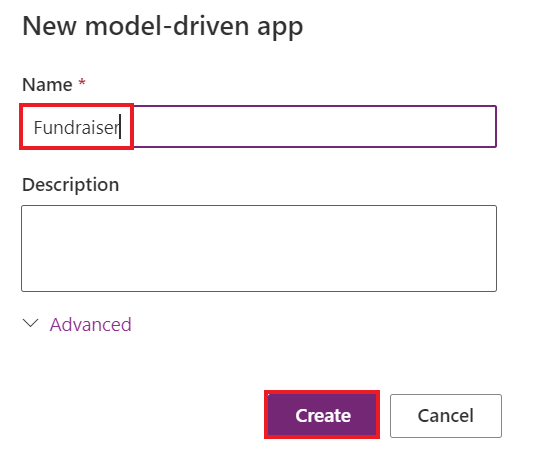
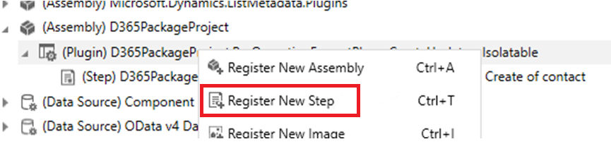

**實驗 6 - 編寫您的第一個插件**

**預計持續時間：** 30 分鐘

**目標：**在這種情況下，組織需要確保以一致的格式輸入電話號碼數據。為了實現此目標，您將創建一個在創建/更新時運行的插件，該插件在保存到
Dataverse 之前從電話號碼中去除所有非數字字符。

在本實驗中，您將學習如何創建將在 create 和 update
上運行的插件。此插件將從電話號碼中刪除所有非數字字符。

**任務 1：創建新解決方案和模型驅動應用**

1.  使用 +++<https://make.powerapps.com/>+++ 導航到 Power
    Apps。確保您處於 **Dev One** 環境中。

> 

2.  在左側導航窗格中，選擇 “**Solutions**” ，然後選擇 “**New solution**”
    。

> 

3.  在彈出對話框中，指定 **顯示名稱** – +++Plugin Lab+++， **名稱** –
    +++PluginLab+++， **發佈者** – CDS 默認發佈者 ，然後選擇
    **Create**。

> 

4.  若要在解決方案中創建新的模型驅動應用，請選擇 **New** | **App** | **Model-driven
    app**。

> 

5.  將 **名稱** 為您的模型驅動應用指定為 +++**Fundraiser**+++，然後選擇
    **Create**。

> 

6.  在模型驅動應用中，選擇 **+Add page**。

> 

7.  在出現的彈出窗口中選擇 **Dataverse table**。

> 

8.  選擇 **Contact** 表 ，然後選擇 **Add**。

> 
>
> **注意：**在本實驗中，我們使用連絡人表。

9.  現在，名為 'Funraiser' 的模型驅動應用已準備就緒。

> 

10. 選擇 **Save** 從右上角。

> 

11. 選擇 **Publish**。

> 

12. 單擊**後退箭頭**返回您的解決方案。

> 

13. 單擊**後退箭頭**，您將進入列出所有解決方案的解決方案頁面。

> 

**任務 2：創建插件**

1.  啟動 **Visual Studio 2022**。要打開它，請單擊 VM 的 Start
    菜單，在搜索框中鍵入 Visual Studio，然後選擇 **Open**。

> 

2.  選擇 **File | New | Project**。

> 

3.  選擇 **Class Library（.NET Framework）**，然後選擇 **Next**。

> 

4.  輸入 **D365PackageProject** 作為**項目名稱**，選擇保存項目的位置，

> 

5.  為 **Framework** 選擇 **.NET Framework 4.7.1**，然後選擇
    **Create**。

> 

6.  右鍵單擊項目，然後選擇 **Manage NuGet Packages**。

> 

7.  選擇 **Browse** 選項卡，搜索並選擇
    **microsoft.crmsdk.coreassemblies**，然後選擇 **Install**。

> 

8.  在 “預覽更改” 窗口中，選擇 “**Apply**” 以允許 Visual Studio
    對解決方案進行更改。

> 

9.  選擇 **I Accept** （我接受） 以接受許可條款。

> 

10. 關閉 NuGet 包管理器。

> 

11. 右鍵單擊 **Class1.cs** 和 **Delete**。

> 

12. 選擇 **OK** 永久刪除Class1.cs。.

> 

13. 右鍵單擊項目，然後選擇 **Add | Class**。

> 

14. 將新類命名為 **PreOperationFormatPhoneCreateUpdate**，然後選擇
    **Add**。

> 

15. 將 using 語句添加到新類中，如下所示：

> using Microsoft.Xrm.Sdk;
>
> using System.Text.RegularExpressions;
>
> 

16. 要將類設為公共類，請將 internal 替換為
    **public**，並在步驟結束時鍵入 ： **IPlugin** 以添加 IPlugin
    接口，如下圖所示。

> 

17. 將鼠標懸停在 IPlugin 界面上，單擊出現的快速作圖標，然後選擇
    **Implement interface**。

> 
>
> 您的類現在應如下圖所示。
>
> 

**任務 3：設置電話號碼的格式**

1.  從服務提供商處獲取執行上下文。將 Execute 方法中的 exception
    替換為以下代碼段。

> IPluginExecutionContext context =
>
> (IPluginExecutionContext)serviceProvider.GetService(typeof(IPluginExecutionContext));
>
> 

2.  檢查 Target 的輸入參數。將以下代碼段添加到 Execute 方法中。

> if (!context.InputParameters.ContainsKey("Target"))
>
> throw new InvalidPluginExecutionException("No target found");
>
> 

3.  將以下代碼段添加到 Execute
    方法中。此代碼段將從輸入參數中獲取目標實體，然後檢查其屬性是否包含
    telephone1（連絡人的商務電話、客戶的電話）。

> var entity = context.InputParameters\["Target"\] as Entity;
>
> if (!entity.Attributes.Contains("telephone1"))
>
> return;
>
> 

4.  將以下代碼段添加到 Execute
    函數中。此代碼段將從用戶提供的電話號碼中刪除所有非數字字符。

> string phoneNumber = (string)entity\["telephone1"\];
>
> var formattedNumber = Regex.Replace(phoneNumber, @"\[^\d\]", "");
>
> 

5.  將 telephone1 設置為格式化的電話號碼。將以下代碼段添加到 Execute
    方法中。

> entity\["telephone1"\] = formattedNumber;
>
> 
>
> Execute 方法現在應如下圖所示。
>
> 

6.  右鍵單擊項目，然後選擇 **Properties** （屬性）。

> 

7.  選擇 **Signing** 選項卡，然後選擇 \<**New...**\> Key File。

> 

8.  在 **密鑰文件名** 字段中輸入 +++**contoso.snk**+++，清除
    **使用密碼保護我的密鑰文件** 複選框，然後選擇 **OK**。

> 

9.  關閉 **Properties** 選項卡。

> 

10. 選擇 **Build** 選項卡，然後單擊 **Build Project**。

> 

11. 確保構建成功。

> 

**任務 4：註冊插件和步驟**

1.  轉到 VM 的 **Start** 菜單，在搜索框中鍵入 plug-in registration
    tool，然後單擊 **Open**。

> 

2.  選擇 **Create New Connection** （創建新連接）。

> 

3.  選擇 **Office 365**，選中 **Show Advanced** 複選框，在 在線區域
    字段中，選擇 **Don’t Know**，提供您的憑據 （M365
    管理員租戶），然後選擇 **Login**。

> 

4.  選擇 **Register** （註冊），然後選擇 **Register New Assembly**
    （註冊新程序集）。

> 

5.  選擇。。。，然後瀏覽到 **Bin | Debug** 您創建的類庫的文件夾。

> 

6.  選擇 **D365PackageProject.dll**，然後選擇 **Open**。

> 

7.  選擇 **Register Selected Plugins**（註冊所選插件）。

> 

8.  選擇 **OK**。

> 

9.  展開新註冊的程序集 – **(Assembly) D365PackageProject**。

> 

10. 右鍵單擊該插件，然後選擇 **Register New Step** （註冊新步驟）。

> 

11. 為 **Message** 選擇 **Create** （創建），然後為 **Primary Entity**
    （主要實體） 選擇 **contact** （連絡人）。

> 

12. 為 **Event Pipeline Stage of Execution** （事件管道執行階段） 選擇
    **PreOperation** （預作），然後選擇 **Register New Step**
    （註冊新步驟）。

> 

13. 在 Warning （警告） 頁面上選擇 **Close**
    （關閉），該頁面指出未檢測到屬性上的過濾器。

> 

14. 如果您收到錯誤消息，即註冊步驟時發生錯誤，請選擇 **No**
    查看詳細信息。

> 

15. 檢查是否已在插件下創建創建步驟。

> 

16. 右鍵單擊該插件，然後再次選擇 **Register New Step** （註冊新步驟）。

> 

17. 為 **Message** 選擇 **Update**，為 **Primary Entity** 選擇
    **contact**，然後選擇 **Attributes** 查找。

> 

18. 清除 “**Select All**” 複選框，選中 “**Business Phone**”
    複選框，然後選擇 “**OK**” 。

> 

19. 為 **Event Pipeline Stage of Execution** （事件管道執行階段） 選擇
    **PreOperation** （預作），然後選擇 **Register New Step**
    （註冊新步驟）。

> 

20. 如果您收到錯誤消息，即註冊步驟時發生錯誤，請選擇 **No**
    查看詳細信息。

> 

21. 檢查是否已在插件下創建創建步驟。

> 

**任務 5：測試插件**

1.  轉到您的製作者門戶 +++<https://make.powerapps.com/>+++，並確保你處於選中的
    **Dev One** 環境中。

2.  選擇 **Apps** 並啟動 **Fundraiser** 應用程序。

> 

3.  選擇 **+ New**。

> 

4.  輸入 +++**Test**+++ 作為**名字**，輸入 +++**Contact**+++
    作為**姓氏**，輸入 +++**（123）-555-0100**+++ 作為**Business
    Phone** ，然後選擇 **Save**。

> 
>
> 應保存記錄，並且 **Business Phone** 應僅顯示數值。
>
> 

5.  將 **Business Phone** 更改為 **001-123-555-0100**，然後單擊
    **Save**。應更新記錄，並且 **Business Phone** 應僅顯示數值。

> 

**摘要：**在本實驗中，您學習了如何創建將在 create 和 update
上運行的插件，以及如何使用此插件從電話號碼中去除所有非數字字符。
