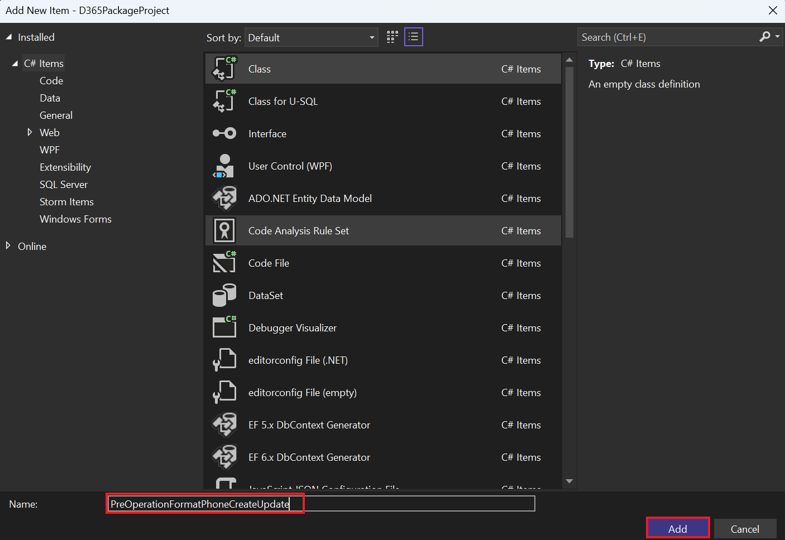
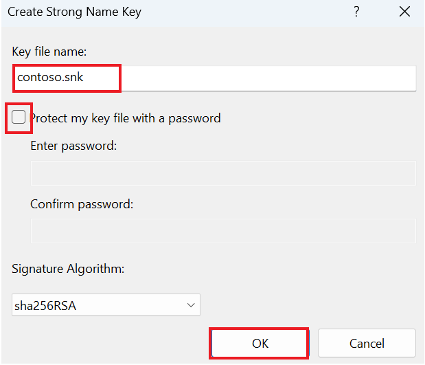
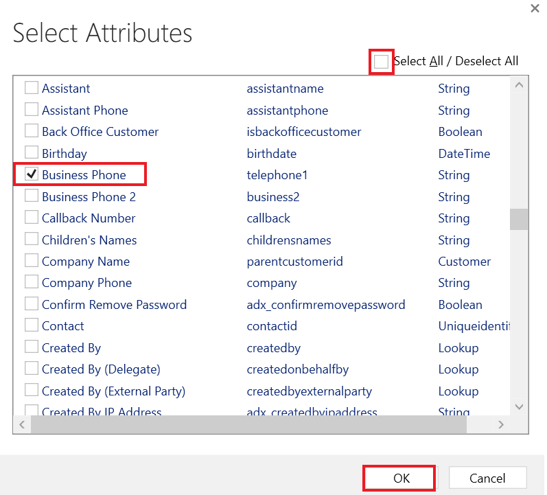

**Atelier 6 - Écriture de votre premier plug-in**

**Durée estimée :** 30 min

**Objectif :** Dans ce scénario, une organisation doit s'assurer que les
données du numéro de téléphone sont saisies dans un format cohérent.
Pour atteindre cet objectif, vous allez créer un plug-in à exécuter lors
de la création/mise à jour qui supprime tous les caractères non
numériques d'un numéro de téléphone avant de l'enregistrer dans
Dataverse.

Dans cet atelier, vous allez apprendre à créer un plug-in qui
s'exécutera lors de la création et de la mise à jour. Ce plug-in
supprimera tous les caractères non numériques d'un numéro de téléphone.

**Tâche 1 : Créer une solution et une application pilotée par modèle**

1.  Accédez à [Power Apps](https://make.powerapps.com/) à l'aide de
    +++<https://make.powerapps.com/>+++. Assurez-vous que vous êtes dans
    l' environnement **Dev One**.

> 

2.  Dans le volet de navigation de gauche, sélectionnez **Solutions**,
    puis sélectionnez **Nouvelle** **solution**.

> 

3.  Dans la boîte de dialogue contextuelle, spécifiez **Display name** –
    +++Plugin Lab+++, **Name** – +++PluginLab+++, **PUblisher** – CDS
    Éditeur par défaut, puis sélectionnez **Create**.

> 

4.  Pour créer une application pilotée par modèle dans votre solution,
    sélectionnez **New** | **App** | **Model-driven app.**

> 

5.  Donnez le **name** à votre application pilotée par modèle sous la
    forme +++Fundraiser+++, puis sélectionnez **Create**.

> 

6.  Dans l'application pilotée par modèle, sélectionnez **+Add page**.

> 

7.  Sélectionnez **Dataverse** **Table** dans la fenêtre contextuelle
    qui s'affiche.

> 

8.  Sélectionnez Table des **contact**, puis Sélectionnez Add.

> 
>
> **Remarque :** Pour cet atelier, nous utilisons la table Contact.

9.  Maintenant, votre application pilotée par modèle, nommée
    ‘Funraiser’, est prête.

> 

10. Sélectionnez **Save** dans le coin supérieur droit.

> 

11. Sélectionnez **Publish**.

> 

12. Cliquez sur **back arrow** pour revenir dans votre solution.

> 

13. Cliquez sur **back arrow** et vous serez sur la page de la solution
    où toutes les solutions sont répertoriées.

> 

**Tâche 2 : Créer un plug-in**

1.  Démarrez **Visual Studio 2022**. Pour l'ouvrir, cliquez sur le menu
    Démarrer de la machine virtuelle, tapez Visual Studio dans la zone
    de recherche et sélectionnez **Open**.

> 

2.  Sélectionnez Fichier **| New | Project.**

> 

3.  Sélectionnez **Class Library (.NET Framework)** puis Sélectionnez
    **Next**.

> 

4.  Entrez **D365PackageProject** Pour **Project Name**, sélectionnez un
    emplacement pour enregistrer le projet,

> 

5.  sélectionnez **.NET Framework 4.7.1** pour **Framework**, puis
    sélectionnez **Create**.

> 

6.  Cliquez avec le bouton droit sur le projet et sélectionnez **Manage
    NuGet Packages**

> 

7.  Sélectionnez l' onglet **Browse**, recherchez et sélectionnez
    **microsoft.crmsdk.coreassemblies**, puis sélectionnez **Install**.

> 

8.  Dans la fenêtre Aperçu des modifications, sélectionnez **Apply**
    pour permettre à Visual Studio d'apporter des modifications à la
    solution.

> 

9.  Sélectionnez **I accepte** pour accepter les termes du contrat de
    licence.

> 

10. Fermez le gestionnaire de packages NuGet.

> 

11. Cliquez avec le bouton droit **Class1.cs** et **Delete**.

> 

12. Sélectionnez **OK** pour Class1.cs supprimer définitivement.

> 

13. Cliquez avec le bouton droit sur le projet, puis sélectionnez **Add
    | Class**.

> 

14. Nommez la nouvelle classe **PreOperationFormatPhoneCreateUpdate** et
    sélectionnez **Add**.

> 

15. Ajoutez les instructions using à la nouvelle classe comme suit :

> using Microsoft.Xrm.Sdk;
>
> using System.Text.RegularExpressions;
>
> 

16. Pour rendre la classe **public**, remplacez l'interne par public et
    tapez **: IPlugin** à la fin de l'étape pour ajouter l'interface
    IPlugin comme indiqué dans l'image ci-dessous.

> 

17. Passez la souris sur l'interface IPlugin, cliquez sur l'icône
    d'action rapide qui apparaît, puis sélectionnez **Implement
    interface**.

> 
>
> Votre classe doit maintenant ressembler à l'image suivante.
>
> 

**Tâche 3 : Mettre en forme un numéro de téléphone**

1.  Obtenez le contexte d'exécution auprès du fournisseur de services.
    Remplacez l'exception dans la méthode Execute par l'extrait de code
    suivant.

> IPluginExecutionContext context =
>
> (IPluginExecutionContext)serviceProvider.GetService(typeof(IPluginExecutionContext)) ;
>
> 

2.  Vérifiez le paramètre d'entrée pour Target. Ajoutez l'extrait de
    code suivant à la méthode Execute.

> if (!context.InputParameters.ContainsKey("Target"))
>
> throw new InvalidPluginExecutionException("No target found");
>
> 

3.  Ajoutez l'extrait de code suivant à la méthode Execute. Cet extrait
    de code va récupérer l'entité cible à partir du paramètre d'entrée,
    puis vérifier si ses attributs contiennent telephone1 (Business
    Phone pour les contacts, Phone pour les comptes).

> var entity = context.InputParameters\["Target"\] as Entity;
>
> if (!entity.Attributes.Contains("telephone1"))
>
> return;
>
> 

4.  Ajoutez l'extrait de code suivant à la fonction Exécuter. Cet
    extrait de code supprimera tous les caractères non numériques du
    numéro de téléphone fourni par l'utilisateur.

> string phoneNumber = (string)entity\["telephone1"\];
>
> var formattedNumber = Regex.Replace(phoneNumber, @"\[^\d\]", "");
>
> 

5.  Définissez telephone1 sur le numéro de téléphone formaté. Ajoutez
    l'extrait de code suivant à la méthode Execute.

> entity\["telephone1"\] = formattedNumber;
>
> 
>
> La méthode Execute doit maintenant ressembler à l'image suivante.
>
> 

6.  Cliquez avec le bouton droit sur le projet et sélectionnez
    **Properties**.

> 

7.  Sélectionnez l' onglet **Signing** et sélectionnez \<**New... \>**
    fichier clé.

> 

8.  Entrez +++**contoso.snk**+++ dans le champ **Key file name** ,
    désactivez la case **Protect my key file with a password**  puis
    sélectionnez **OK**.

> 

9.  Fermez l' onglet **Properties.**

> 

10. Sélectionnez l'onglet **Build** et cliquez sur **Build Project**

> 

11. Assurez-vous que la build réussit.

> 

**Tâche 4 : Enregistrer un plug-in et étapes**

1.  Allez dans le menu **Start** de la machine virtuelle, tapez outil
    d'enregistrement de plug-in dans la zone de recherche et cliquez sur
    **Open**.

> 

2.  Sélectionnez **Create New connection**.

> 

3.  Sélectionnez **Office 365,** cochez la case **Show Advanced** , dans
    le champ Région en ligne, sélectionnez **Don’t know** , fournissez
    vos informations d'identification (M365 Admin tenant), puis
    sélectionnez **Login**.

> 

4.  Sélectionnez **Register**, puis Sélectionnez **Register New
    Assembly**

> 

5.  Sélectionnez **...** à l'étape 1, puis accédez à la **Bin |
    Debug** de la bibliothèque de classes que vous avez créée.

> 

6.  Sélectionnez **D365PackageProject.dll**, puis Sélectionnez **Open**.

> 

7.  Sélectionnez **Register Selected Plugins**

> 

8.  Sélectionnez **OK**.

> 

9.  Développez l'assembly nouvellement enregistré – **(Assembly)
    D365PackageProject**.

> 

10. Cliquez avec le bouton droit de la souris sur le plug-in et
    sélectionnez **Register New Step**

> 

11. Sélectionnez **Create** pour **Message** et sélectionnez **Contact**
    pour **Primary Entity**.

> 

12. Sélectionnez **PreOperation** pour **Event Pipeline Stage of
    Execution**  puis sélectionnez **Register New Step**.

> 

13. Sélectionnez **Close** sur la page Avertissement qui indique
    qu'aucun filtre sur les attributs n'a été détecté.

> 

14. Si vous obtenez un message d'erreur, c'est-à-dire qu'une erreur
    s'est produite lors de l'enregistrement de l'étape, sélectionnez
    **No** pour afficher les détails.

> 

15. Vérifiez que l'étape de création a été créée sous le plugin.

> 

16. Cliquez avec le bouton droit sur le plug-in et sélectionnez à
    nouveau **Register New Step** .

> 

17. Sélectionnez **Update** pour **Message**, sélectionnez **Contact**
    pour **Primary Entity** ,puis sélectionnez la recherche
    **Attributs.**

> 

18. Décochez la case **Select All**, cochez la case **Business phone**,
    puis sélectionnez **OK**.

> 

19. Sélectionnez **PreOperation**  pour **Event Pipeline Stage of
    Execution**  puis sélectionnez **Register New Step**.

> 

20. Si vous obtenez un message d'erreur, c'est-à-dire qu'une erreur
    s'est produite lors de l'enregistrement de l'étape, sélectionnez
    **No** pour afficher les détails.

> 

21. Vérifiez que l'étape de création a été créée sous le plugin.

> 

**Tâche 5 : Tester le plug-in**

1.  Accédez à votre Maker Portal +++<https://make.powerapps.com/>+++ et
    assurez-vous que vous êtes dans l' environnement **Dev One**
    sélectionné.

2.  Sélectionnez **Apps** et lancez l' application **Fundraiser**.

> 

3.  Sélectionnez **+ New**.

> 

4.  Entrez +++**Test+++** pour **first name** , +++**Contact+++** pour
    **last name**, +++**(123)-555-0100+++** pour **Business Phone**,
    puis sélectionnez **Save**.

> 
>
> L'enregistrement doit être sauvegardé et le **t Business Phone** ne
> doit afficher que les valeurs numériques.
>
> 

5.  Changez le **Business Phone** pour **001-123-555-0100** et cliquez
    sur **Save**. L'enregistrement doit être mis à jour et le **Business
    Phone** ne doit afficher que les valeurs numériques.

> 

**Résumé :** Dans cet atelier, vous avez appris à créer un plug-in qui
s'exécutera lors de la création et de la mise à jour, ainsi qu'à
supprimer tous les caractères non numériques d'un numéro de téléphone à
l'aide de ce plug-in.
