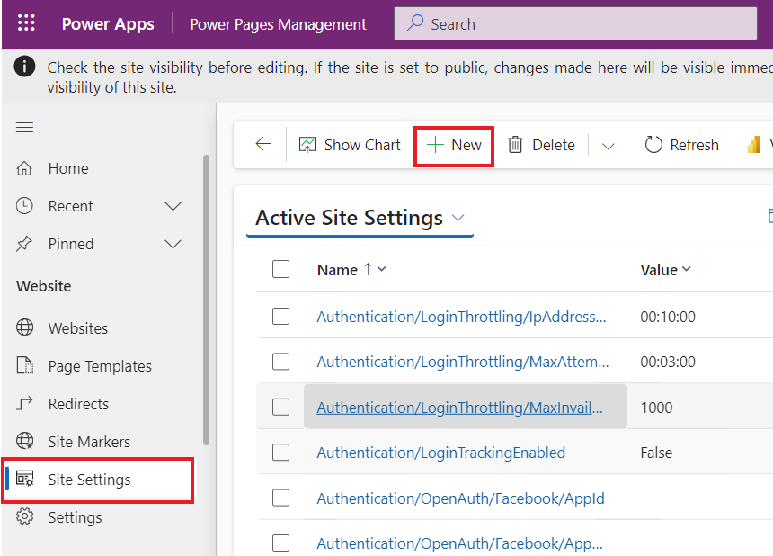

# **실습 7: 사이트에 고급 클라이언트 측 기능을 추가하기**

**예상 소요 시간:** 35분

**목표:** 이 실습에서는 페이지에 JavaScript 코드를 추가하여 Microsoft
Dataverse의 데이터를 차트로 렌더링하는 방법을 알아볼 것입니다.

### **작업 1: AI를 사용하여 사이트를 생성하기**

1.  +++<https://make.powerpages.microsoft.com/>+++를 사용하여 Power
    Pages로 이동하세요. **Dev One** 환경에 있는지 확인하세요.

> 

2.  **Tell us about yourself** 페이지에서 **Skip**를 선택하세요.

> 

3.  주어진 설명을 입력하여 사이트를 생성한 후 **generate** 아이콘을
    클릭하세요.

> +++**Create a site for customers to find financial advisors at a bank
> based on their qualifications, and areas of expertise**+++
>
> 

4.  Copilot은 설명을 기반으로 사이트 이름과 웹 주소를 생성합니다. 이
    경우 사이트 이름은 ‘**Finance Advisor Search’**입니다. 생성한 사이트
    이름과 주소를 유지하고 **Next**를 선택하세요.

> 

5.  Copilot은 생성된 페이지를 스크롤하고 찾아볼 수 있는 홈페이지
    레이아웃을 생성합니다. 제안된 레이아웃을 수락하기 위해 **Next**를
    선택하세요.

> **참고:** 새 레이아웃을 생성하기 위해 **Try again**을 선택할 수
> 있습니다.
>
> 

6.  Copilot은 설명을 기반으로 사이트에서 사용할 수 있는 더 많은 페이지를
    생성합니다. In this example,이 예제에서는 Contact us, Advisor
    search, Advisor profile 및 Advisor contact pages를 선택한 후 생성을
    완료하기 위해 **Done**을 선택하세요.

> **참고:** Copilot이 위에 언급된 페이지와 다른 사이트 페이지를 생성하는
> 경우 그 중 일부를 선택할 수 있습니다.
>
> 

7.  사이트를 생성하는 데 몇 분 정도 걸릴 수 있습니다. 완료되면 디자인
    스튜디오에 열린 사이트로 리디렉션되어 추가로 사용자 지정할 수
    있습니다.

> 

### **작업 2: 사이트 설정을 생성하기**

사이트 설정을 생성하기 위해 다음 단계를 수행하세요.

1.  줄임표 (**...**) 메뉴를 선택한 후 **Portal management**를
    선택하세요.

> Portal Management 앱은 새 탭에서 열립니다.
>
> 

2.  **Site Settings**를 선택하세요. **+ New**를 선택하세요. 

> 

3.  다음 정보를 입력하고 **Save**를 선택하세요.

    - **Name** - +++Webapi/account/enabled+++

    &nbsp;

    - **Website** – 웹사이트를 선택하세요

    &nbsp;

    - **Value** - +++true+++

> 

4.  **+ New**를 선택하세요. 

> 

5.  다음 정보를 입력하고 **Save & Close**를 선택하세요.

    - **Name** - +++Webapi/account/fields+++

    &nbsp;

    - **Website** - 웹사이트를 선택하세요

    &nbsp;

    - **Value** - +++name,numberofemployees,revenue+++

> 

### **작업 3: 테이블 권한을 생성하기**

테이블 권한을 생성하기 위해 다음 단계를 수행하세요.

1.  새로 생성한 웹 사이트가 열리는 Power Pages design studio로
    전환하세요.

> **참고:** 더 나은 가시성을 위해 Copilot 창을 닫을 수 있습니다.
>
> 

2.  **Security** 작업 공간을 선택하고 **Table permissions**를
    선택하세요.

> 

3.  **+ New permission**을 선택하세요.

>  

4.  다음 정보를 입력하세요:

    - **Name** - +++Account+++

    &nbsp;

    - **Table** - +++Account (account)+++

    &nbsp;

    - **Access type** - Global

    &nbsp;

    - **Permission to** – Read

> 

5.  Select **Add roles**를 선택하고**Anonymous
    Users** 및 **Authenticated Users**를 추가하세요.

> 

6.  **Save**를 선택하세요.

> 

7.  이 데이터를 모든 사람이 보기 위해 **Save**를 선택하세요.

> 

8.  ‘The table permission ‘Account’ have successfully been saved’라는
    메시지를 볼 수 있습니다.

> 

### **작업 4: Web API를 테스트하기**

1.  To test the Web API를 테스트하기 위해 웹사이트 주소를 추가한 후 다음
    URL을 여세요
    +++[https://**yourwebsite**.powerappsportals.com/\_api/accounts?$select=name,numberofemployees,revenue](https://yourwebsite.powerappsportals.com/_api/accounts?$select=name,numberofemployees,revenue)+++

2.  권한 요청 대화 상자가 나타나면 **Accept**을 선택하세요.

> 

3.  출력은 다음 이미지와 유사해야 합니다.

> 

### **작업 5: 콘텐츠 페이지를 생성하고 데이터를 검색하기**

콘텐츠 페이지를 생성하고 데이터를 검색하고 변화하는 JavaScript 코드를
추가하려면 다음 단계를 수행하세요:

1.  디자인 스튜디오에서 **Pages** 작업 공간을 선택한 후 **+ Page**를
    선택하세요.

> 

2.  **Page name**로 +++**Chart**+++를 입력하세요.

3.  **Add page to main navigation** 옵션이 선택되어 있는지 확인하세요.

4.  **Start from blank** 레이아웃을 선택하세요.

5.  **Add**를 선택하세요.

> 

6.  **Edit code**를 선택하세요.

> 

7.  팝업 대화상자에서 **Open Visual Studio Code**를 선택하세요.

> 

8.  Allow the extension Power Platform tool to sign in using
    Microsoft라는 팝업이 표시되면 **Allow**를 선택하세요.

> 

9.  데이터를 가져올 것입니다.

> 

10. Visual Studio Code editor에서 **Chart.en-US.customjs.js** 파일을
    선택하세요.

> 

11. 다음 스크립트를 추가하세요:

> function makeChart(rawData) {
>
> // transform raw data into plotting array
>
> var rData = rawData.value.map(({
>
> name,
>
> revenue,
>
> numberofemployees
>
> }) =\> ({
>
> "x": numberofemployees,
>
> "y": revenue,
>
> "z": (!revenue) ? 1 : numberofemployees / revenue,
>
> "name": name
>
> }));
>
> console.log(rData);
>
> }
>
> // retrieve accounts data using portals Web API
>
> $(document).ready(function() {
>
> $.get('/\_api/accounts?$select=name,numberofemployees,revenue',
> makeChart, 'json');
>
> });

12. 파일을 저장하기 위해 **Ctrl + S** 키보드 단축키 (Mac의 경우 **⌘ +
    S**)를 누르세요.

> 

13. **Visual Studio Code** 탭을 닫으세요. 변경 사항을 동기화하라는
    메시지가 표시되면 **Sync**를 선택하세요.

> 

14. **Preview | Desktop**을 선택하세요.

> 

15. 페이지가 표시되면 브라우저 개발자 도구를 표시하기 위해 **F12** 키를
    누르세요.

> 
>
> 

16. **Console** 탭을 선택하세요.

> 

17. 콘솔 출력에 이전에 검색된 것과 동일한 데이터가 포함되어 있는지
    확인하세요 (이제 변환된 것으로 표시되는 경우 제외).

> 

18. 이제 데이터 구조가 플로팅할 준비가 되었습니다. 데이터 포인트에
    적절한 레이블 할당하세요:

    - **name** – 회사 이름

    &nbsp;

    - **x** – 직원 수

    &nbsp;

    - **y** – 회사 매출 (단위: 천)

    &nbsp;

    - **z** – 각 직원의 수익 (계산됨)

### **작업 6: 외부 라이브러리 기능을 추가하기**

이 연습에서는 Highcharts.js 라이브러리(개인이나 비영리 용도로 무료)를
사용하여 데이터를 기반으로 거품형 차트를 생성할 것입니다.

1.  디자인 스튜디오를 전환하세요.

> 

2.  Page footer를 선택하고 **Edit code**를 선택하세요.

> 

3.  팝업 대화상자에서 **Open Visual Studio Code**를 선택하세요.

> 

4.  파일 끝에 다음 코드를 추가하세요.

> \<script src="https://code.highcharts.com/highcharts.js"\>\</script\>
>
> \<script
> src="https://code.highcharts.com/highcharts-more.js"\>\</script\>
>
> 

5.  **Ctrl + S** 키보드 단축키 (Mac의 경우 **⌘ + S**)를 눌러 파일을
    저장하세요.

6.  **Visual Studio Code** 탭을 닫으세요.

7.  페이지에 대한 Visual Studio Code를 열기 위해 도구 모음에서 **Edit
    code**를 선택하세요.

> 

8.  웹용 Visual Studio Code 팝업에서 편집에서 **Open Visual Studio
    Code**를 선택하세요.

> 

9.  **Chart.en-US.customjs.js** 파일을 선택하세요.

> 

10. 다음과 같이 **makeChart** 함수를 변경하기 위해 파일을 바꾸세요:

> 참고: 여기서 파일을 바꾼다는 것은 기존 파일만 수정하는 것을
> 의미합니다.
>
> function makeChart(data) {
>
> console.log(data);
>
> var rData = data.value.map(({
>
> name,
>
> revenue,
>
> numberofemployees
>
> }) =\> ({
>
> "x": numberofemployees,
>
> "y": revenue,
>
> "z": (!revenue) ? 1 : numberofemployees / revenue,
>
> "name": name
>
> }));
>
> console.log(rData);
>
> // new code to plot the data
>
> Highcharts.chart($('.mychart')\[0\], {
>
> title: {
>
> text: "Customers efficiency"
>
> },
>
> legend: {
>
> enabled: false
>
> },
>
> xAxis: {
>
> title: {
>
> text: "Number of employees"
>
> }
>
> },
>
> yAxis: {
>
> title: {
>
> text: "Turnover ($K)"
>
> }
>
> },
>
> tooltip: {
>
> pointFormat: '\<strong\>{point.name}\</strong\>\<br/\>Employed:
> {point.x}\<br\>Turnover ($K): ${point.y}',
>
> headerFormat: ''
>
> },
>
> series: \[{
>
> type: 'bubble',
>
> data: rData
>
> }\]
>
> });
>
> }
>
> // retrieve accounts data using portals Web API
>
> $(document).ready(function() {
>
> $.get('/\_api/accounts?$select=name,numberofemployees,revenue',
> makeChart, 'json');
>
> });
>
> 

11. **Ctrl + S** 키보드 단축키(Mac의 경우 ⌘ + **S**)를 눌러 파일을
    저장하새요.

12. **Chart.en-US.webpage.copy.html** 파일을 선택하세요.

> 

13. 내부 \<div\> 요소에 다음 코드를 삽입하세요:

> \<figure\>
>
> \
\</div\>
>
> \</figure\>
>
> 

14. **Ctrl + S** 키보드 단축키(Mac의 경우 ⌘ + **S**)를 눌러 파일을
    저장하새요.

15. **Visual Studio Code** 탭을 닫고 변경을 동기화하기 위해 **Sync**를
    선택하세요.

> 

16. **Preview | Desktop**을 선택하세요.

> 

17. 이 출력에 거품형 차트가 포함되어야 합니다. 데이터를 확인하기 위해
    거품 위에 커서를 올려 놓으세요.

> 

**요약:** 이 실습에서는 포털 웹 API를 사용하여 Dataverse에서 검색된
데이터와 함께 외부 차트 라이브러리를 사용하여 Microsoft Dataverse의
데이터를 차트로 렌더링하기 위해 페이지에 JavaScript 코드를 추가하는
방법을 배웠습니다.
