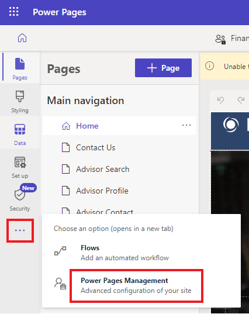

# **Lab 7: Fügen Sie Ihrer Website erweiterte client-seitige Funktionen hinzu**

**Geschätzte Dauer:**35 Minuten

**Ziele:** In diese Lab lernen Sie, wie Sie JavaScript-Code zu einer
Seite hinzufügen, um Daten aus Microsoft Dataverse als Diagramm
darzustellen.

### **Aufgabe 1: Erstellen Sie eine Site mit Hilfe von AI**

1.  Gehen Sie zu Power Pages mit +++
    https://make.powerpages.microsoft.com/+++. Stellen Sie sicher, dass
    Sie sich in der **Dev One**-Umgebung befinden.

> 

2.  Wählen Sie auf der Seite „**Tell us about yourself**“ die Option
    „**Skip**“ aus.

> 

3.  Geben Sie die angegebene Beschreibung ein, um eine Site zu
    erstellen, und klicken Sie dann auf das Symbol „**generate**“.

> +++**Create a site for customers to find financial advisors at a bank
> based on their qualifications, and areas of expertise**+++
>
> 

4.  Copilot generiert basierend auf Ihrer Beschreibung einen Site-Namen
    und eine Webadresse. In diesem Fall lautet der Site-Name „**Finance
    Advisor Search**“. Behalten Sie den generierten Site-Namen und die
    Adresse bei und klicken Sie anschließend auf „**Next**“.

> 

5.  Copilot erstellt ein Startseitenlayout, das Sie durchblättern und
    durchsuchen können. Wählen Sie „**Next**“, um das vorgeschlagene
    Layout zu akzeptieren.

> **Notiz:** Sie können „**Try again**“ auswählen, um ein neues Layout
> zu generieren.
>
> 

6.  Copilot generiert basierend auf der Beschreibung weitere Seiten, die
    auf der Website verwendet werden können. In diesem Beispiel werden
    die Seiten „Contact us, Advisor search, Advisor profile und Advisor
    contact“ ausgewählt. Anschließend wird die Websiteerstellung mit
    „**Done**“ abgeschlossen.

> **Notiz:** Wenn Ihr Copilot andere Seiten für Ihre Site generiert als
> die oben genannten Seiten, können Sie einige davon auswählen.
>
> 

7.  Die Erstellung der Website kann einige Minuten dauern. Anschließend
    werden Sie zur geöffneten Website im Designstudio weitergeleitet, wo
    Sie weitere Anpassungen vornehmen können.

> 

### **Aufgabe 2: Site-Einstellungen erstellen**

Um Site-Einstellungen zu erstellen, befolgen Sie diese Schritte.

1.  Wählen Sie das Auslassungsmenü (**...**) und dann **Portal
    management** aus.

> Die Portal Management-App wird in einem neuen Tab geöffnet.
>
> 

2.  Wählen Sie „**Site Settings**“. Wählen Sie „**+ New**“.

> 

3.  Geben Sie die folgenden Informationen ein und wählen Sie dann
    **Save**.

    - **Name** - +++Webapi/account/enabled+++

    &nbsp;

    - **Website** - Wählen Sie Ihre Website

    &nbsp;

    - **Value** - +++true+++

> 

4.  Wählen Sie **+ New**.

> 

5.  Geben Sie die folgenden Informationen ein und wählen Sie dann **Save
    & Close**.

    - **Name** - +++Webapi/account/fields+++

    &nbsp;

    - **Website** - Wählen Sie Ihre Website

    &nbsp;

    - **Value** - +++name,numberofemployees,revenue+++

> 

### **Aufgabe 3: Tabellenberechtigungen erstellen**

Um Tabellenberechtigungen zu erstellen, befolgen Sie diese Schritte.

1.  Wechseln Sie zum Power Pages design studio, wo die neu erstellte
    Website geöffnet wird.

> **Notiz:** Sie können den Copilot-Bereich für eine bessere
> Sichtbarkeit schließen.
>
> 

2.  Wählen Sie den workspace als „**Security**“ und dann „**Table
    permissions**“ aus.

> 

3.  Wählen Sie **+ New permission**.

> 

4.  Geben Sie die folgenden Informationen ein:

    - **Name** - +++Account+++

    &nbsp;

    - **Table** - +++Account (account)+++

    &nbsp;

    - **Access type** - Global

    &nbsp;

    - **Permission to** – Read

> 

5.  Wählen Sie „**Add roles**“ und fügen Sie dann „**Anonymous Users**“
    und „**Authenticated Users**“ hinzu.

> 

6.  Wählen Sie **Save** aus.

> 

7.  Wählen Sie „**Save**“, damit diese Daten für alle sichtbar bleiben.

> 

8.  Sie sehen die Meldung „The table permission ‘Account’ have
    successfully been saved“.

> 

### **Aufgabe 4: Testen der Web-API**

1.  Um die Web-API zu testen, öffnen Sie die folgende URL, nachdem Sie
    Ihre Website-Adresse hinzugefügt haben
    +++<https://yourwebsite.powerappsportals.com/_api/accounts?$select=name,numberofemployees,revenue>+++

2.  Wenn das Dialogfeld „permission requested“ angezeigt wird, wählen
    Sie „**Accept**“ aus.

> 

3.  Ihre Ausgabe sollte dem folgenden Bild ähneln.

> 

### **Aufgabe 5: Eine Inhaltsseite erstellen und Daten abrufen**

Um eine Inhaltsseite zu erstellen und JavaScript-Code hinzuzufügen, der
die Daten abruft und umwandelt, folgen Sie diesen Schritten:

1.  Wählen Sie im Designstudio den workspace als „**Pages**“ und dann
    **+ Page**“ aus.

> 

2.  Geben Sie +++**Chart**+++ als **Page name** ein.

3.  Stellen Sie sicher, dass die Option „**Add page to main
    navigation**“ ausgewählt ist.

4.  Wählen Sie das Layout „**Start from blank**“ aus.

5.  Wählen Sie **Add**.

> 

6.  Wählen Sie **Edit code**.

> 

7.  Wählen Sie im Popup-Dialogfeld „**Open Visual Studio Code**“ aus.

> 

8.  Wenn ein Popup angezeigt wird und Sie aufgefordert werden, dem
    extension Power Platform tool, die Anmeldung über Microsoft zu
    gestatten, wählen Sie „**Allow**“ aus.

> 

9.  Es ruft Ihre Daten ab.

> 

10. Wählen Sie im Visual Studio Code editor, die Datei
    **Chart.en-US.customjs.js** aus.

> 

11. Fügen Sie das folgende Skript an:

> function makeChart(rawData) {
>
> // transform raw data into plotting array
>
> var rData = rawData.value.map(({
>
> name,
>
> revenue,
>
> numberofemployees
>
> }) =\> ({
>
> "x": numberofemployees,
>
> "y": revenue,
>
> "z": (!revenue) ? 1 : numberofemployees / revenue,
>
> "name": name
>
> }));
>
> console.log(rData);
>
> }
>
> // retrieve accounts data using portals Web API
>
> $(document).ready(function() {
>
> $.get('/\_api/accounts?$select=name,numberofemployees,revenue',
> makeChart, 'json');
>
> });

12. Drücken Sie die Tastenkombination **Ctrl + S** (**⌘+ S** auf dem
    Mac), um die Datei zu speichern.

> 

13. Schließen Sie die Registerkarte „**Visual Studio Code**“. Wählen Sie
    „**Sync**“ aus, wenn Sie zum Synchronisieren der Änderungen
    aufgefordert werden.

> 

14. Wählen Sie **Preview | Desktop**.

> 

15. Wenn die Seite angezeigt wird, drücken Sie die Taste **F12**, um die
    Browser-Entwicklertools anzuzeigen.

> 
>
> 

16. Wählen Sie die Registerkarte „**Console**“.

> 

17. Überprüfen Sie, ob die Console Ausgabe dieselben Daten enthält wie
    zuvor abgerufen, mit der Ausnahme, dass sie jetzt als transformiert
    angezeigt werden.

> 

18. Die Datenstruktur ist nun für die Darstellung vorbereitet. Weisen
    Sie den Datenpunkten die entsprechenden Beschriftungen zu:

    - **Name**- Name der Firma

    &nbsp;

    - **X**- Anzahl der Mitarbeiter

    &nbsp;

    - **y**- Unternehmensumsatz in Tausend

    &nbsp;

    - **z**- Umsatz pro Mitarbeiter (berechnet)

### **Aufgabe 6: External library funktionalität hinzufügen**

Diese Übung verwendet library Highcharts.js (kostenlos für den
persönlichen oder gemeinnützigen Gebrauch), um basierend auf den Daten
ein Blasendiagramm zu erstellen.

1.  Wechseln Sie design studio.

> 

2.  Wählen Sie die Seitenfußzeile aus und wählen Sie dann **Edit code**.

> 

3.  Wählen Sie im Popup-Dialogfeld „**Open Visual Studio Code**“ aus.

> 

4.  Fügen Sie den folgenden Code am Ende der Datei an.

> \<script src="https://code.highcharts.com/highcharts.js"\>\</script\>
>
> \<script
> src="https://code.highcharts.com/highcharts-more.js"\>\</script\>
>
> 

5.  Drücken Sie die Tastenkombination **Ctrl + S** (**⌘+ S** auf dem
    Mac), um die Datei zu speichern.

6.  Schließen Sie die Registerkarte „**Visual Studio Code**“.

7.  Wählen Sie in der Symbolleiste „**Edit code**“ aus, um Visual Studio
    Code für die Seite zu öffnen.

> 

8.  Wählen Sie im Popup „Edit in Visual Studio Code for the Web“, die
    Option „**Open Visual Studio Code**“ aus.

> 

9.  Wählen Sie die Datei **Chart.en-US.customjs.js** aus.

> 

10. Ersetzen Sie die Datei, um die Funktion **makeChart** wie folgt zu
    ändern:

> Hinweis: Wenn Sie die Datei ersetzen, ändern Sie lediglich die
> vorhandene Datei.
>
> function makeChart(data) {
>
> console.log(data);
>
> var rData = data.value.map(({
>
> name,
>
> revenue,
>
> numberofemployees
>
> }) =\> ({
>
> "x": numberofemployees,
>
> "y": revenue,
>
> "z": (!revenue) ? 1 : numberofemployees / revenue,
>
> "name": name
>
> }));
>
> console.log(rData);
>
> // new code to plot the data
>
> Highcharts.chart($('.mychart')\[0\], {
>
> title: {
>
> text: "Customers efficiency"
>
> },
>
> legend: {
>
> enabled: false
>
> },
>
> xAxis: {
>
> title: {
>
> text: "Number of employees"
>
> }
>
> },
>
> yAxis: {
>
> title: {
>
> text: "Turnover ($K)"
>
> }
>
> },
>
> tooltip: {
>
> pointFormat: '\<strong\>{point.name}\</strong\>\<br/\>Employed:
> {point.x}\<br\>Turnover ($K): ${point.y}',
>
> headerFormat: ''
>
> },
>
> series: \[{
>
> type: 'bubble',
>
> data: rData
>
> }\]
>
> });
>
> }
>
> // retrieve accounts data using portals Web API
>
> $(document).ready(function() {
>
> $.get('/\_api/accounts?$select=name,numberofemployees,revenue',
> makeChart, 'json');
>
> });
>
> 

11. Drücken Sie die Tastenkombination **Ctrl + S** (**⌘+ S** auf dem
    Mac), um die Datei zu speichern.

12. Wählen Sie die Datei **Chart.en-US.webpage.copy.html** aus.

> 

13. Fügen Sie den folgenden Code in das inner \<div\> element:

> \<figure\>
>
> \
\</div\>
>
> \</figure\>
>
> 

14. Drücken Sie die Tastenkombination **Ctrl + S**  (**⌘+ S** auf dem
    Mac), um die Datei zu speichern.

15. Schließen Sie die Registerkarte „**Visual Studio Code**“ und wählen
    Sie „**Sync**“ aus, um die Änderungen zu synchronisieren.

> 

16. Wählen Sie „**Preview | Desktop**“.

> 

17. Die Ausgabe sollte nun das Blasendiagramm enthalten. Bewegen Sie den
    Cursor über die Blasen, um die Daten zu überprüfen.

> 

**Zusammenfassung:** In dieses Lab, haben Sie gelernt, wie man
JavaScript-Code zu einer Seite hinzufügt, um Daten aus Microsoft
Dataverse als Diagramm darzustellen, indem man eine externe charting
library mit den Daten verwendet, die von Dataverse über die Web-API des
Portals abgerufen werden.
