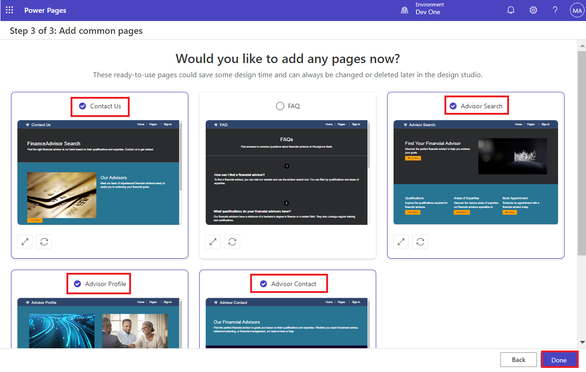
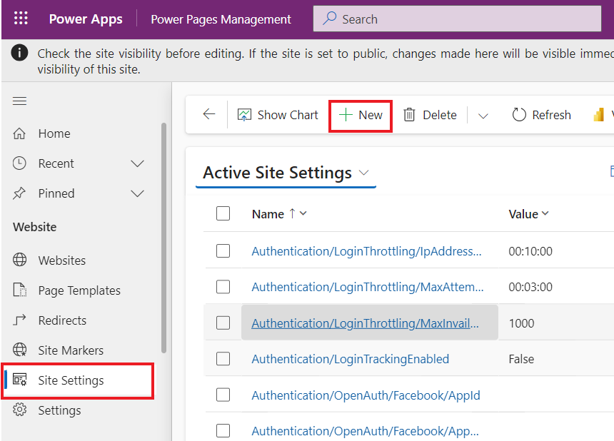
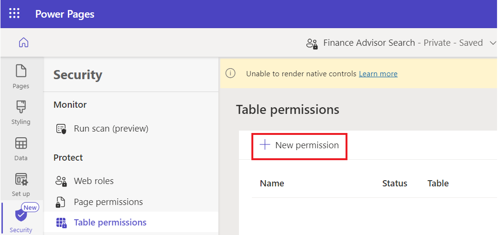
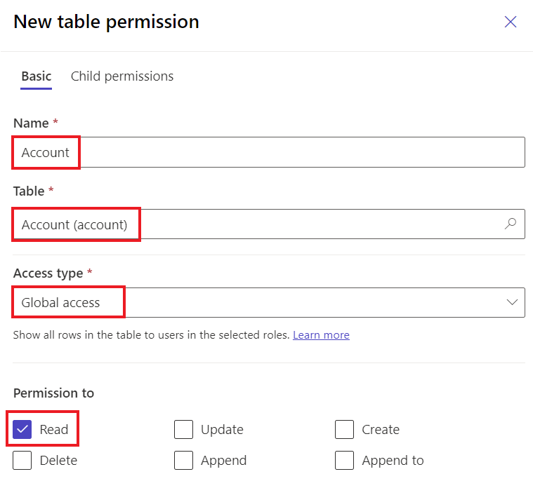
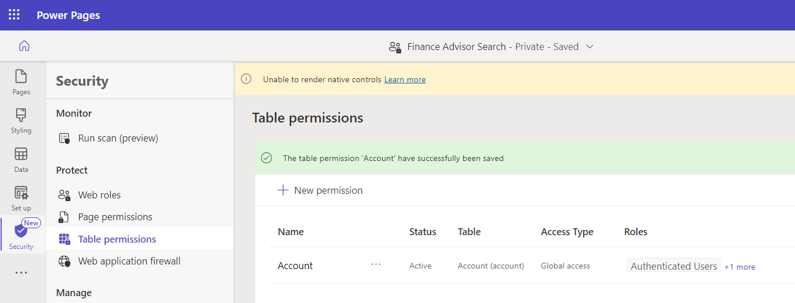
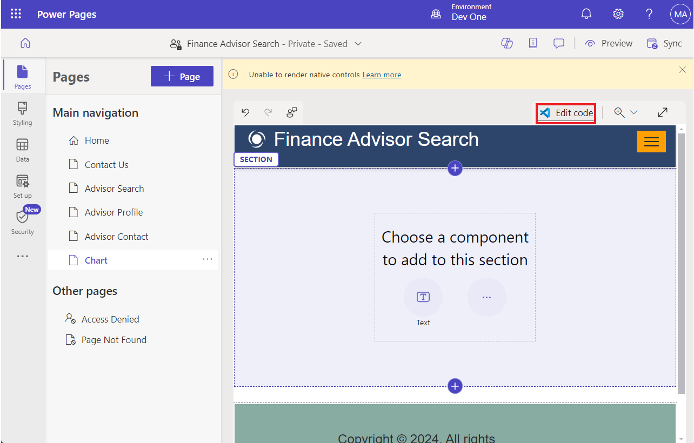
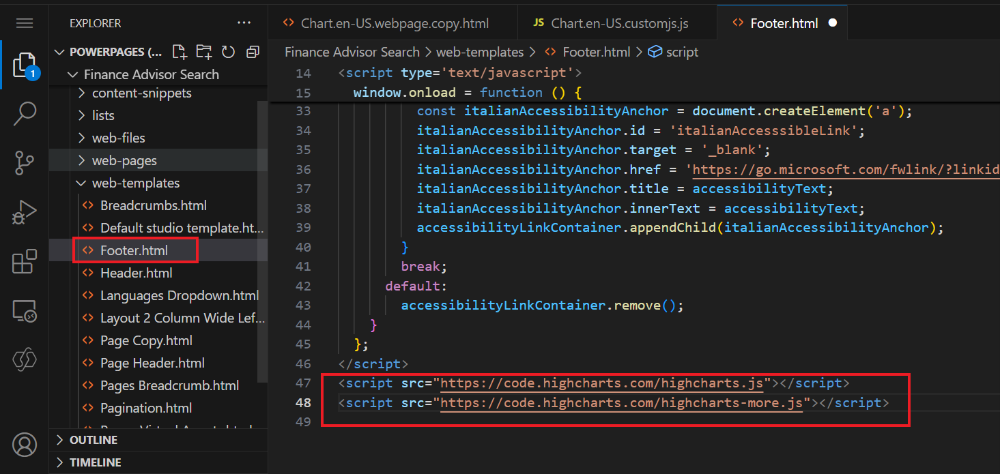

# **ラボ７：サイトに高度なクライアントサイド機能を追加する**

**所要時間：**35 分

**目的：** このラボでは、Microsoft Dataverse
のデータを図表として表示するために、JavaScript
コードをページに追加する方法を学習します。

### **タスク1：AIを使ってサイトを作成する**

1.  +++<https://make.powerpages.microsoft.com/>+++でPower
    Pagesににアクセスし、**Dev One**環境にいることを確認します。

> 

2.  **Tell us about yourself** というページで**Skip**に選択します。

> 

3.  以下の説明を入力し、**generate**アイコンをクリックしてサイトを作成します。

> +++**Create a site for customers to find financial advisors at a bank
> based on their qualifications, and areas of expertise**+++
>
> 

4.  Copilot
    が説明に基づいてサイト名とWebアドレスを生成します。この例では、サイト名が**「Finance
    Advisor
    Search」**となっています。生成されたサイト名とアドレスをそのまま使用し、**Next**をクリックします。

> 

5.  Copilotがホームページのレイアウトを生成します。そのページをスクロールしてレイアウトを閲覧し、**Next**をクリックして提案されたレイアウトを受け入れます。

> **注意：**新しいレイアウトを生成するため**Try
> again**にクリックてください。
>
> 

6.  Copilot
    は説明に基づいて、サイトで使用される追加のページも生成します。この例としては「お問い合わせ」「アドバイザー検索」「アドバイザープロファイル」「アドバイザー連絡先」などを選択します。**Done**をクリックしてサイト作成を完了します。 

> **注意：**もしCopilotがサイトのため上記より異なるページを提案した場合は、いくつかを選択できます。
>
> 

7.  サイトの作成には数分かかります。完了すると、デザインスタジオでサイトが開かれ、カスタマイズ可能になります。

> 

### **タスク2：サイト設定を作成する**

サイト設定を作成するには、以下の手順に従います。

1.  メニューから省略記号「**...**」を選択し、**Portal
    management**をクリックします。

> Portal Managementアプリが新しいタブで開きます。
>
> 

2.  **Site Settings**を選択し、**+ New**を選択します。 

> 

3.  以下の情報を入力し、**Save**をクリックしま。

    - **Name** - +++Webapi/account/enabled+++

    &nbsp;

    - **Website** - Select your website

    &nbsp;

    - **Value** - +++true+++

> 

4.   **+ New**にクリックします。 

> 

5.  以下の情報を入力し、**Save & Close**をクリックします。

    - **Name** - +++Webapi/account/fields+++

    &nbsp;

    - **Website** - Select your website

    &nbsp;

    - **Value** - +++name,numberofemployees,revenue+++

> 

### **タスク3：テーブル権限を作成する**

テーブル権限を作成するには、以下の手順に従います。

1.  Power Pages
    のデザインスタジオに切り替えて、新しく作成されたWebサイトを開きます。

> **注意：**見やすくするために、Copilotパネルを閉じることができます。
>
> 

2.  **Security** ワークスペースを選択し、**Table
    permissions**をクリックします。

> 

3.  **+ New permission**を選択します。

>  

4.  以下の情報を入力します：

    - **Name** - +++Account+++

    &nbsp;

    - **Table** - +++Account (account)+++

    &nbsp;

    - **Access type** - Global

    &nbsp;

    - **Permission to** – Read

> 

5.  **Add roles** を選択し、**Anonymous Users** と**Authenticated
    Users**を追加します。

> 

6.   **Save**を選択します。.

> 

7.  データを誰でも閲覧可能にするために、もう一度**Save**を選択します。

> 

8.  「The table permission 「Account」have successfully been
    saved」というメッセージが表示されます。

> 

### **タスク４：Web APIのテスト**

1.  Web
    APIをテストするには、以下のURLに自身のWebサイトアドレスを加えて開きます。
    +++[https://**yourwebsite**.powerappsportals.com/\_api/accounts?$select=name,numberofemployees,revenue](https://yourwebsite.powerappsportals.com/_api/accounts?$select=name,numberofemployees,revenue)+++

2.  アクセス許可を求めるダイアログが表示された場合は、**Accept**を選択してください。

> 

3.  出力結果は次の画像のようになります。

> 

### **タスク５：コンテンツページの作成とデータ取得**

コンテンツページを作成し、データを取得・変換するJavaScriptコードを追加するには、以下の手順に従います：

1.  design studioで、**Pages** ワークスペースを選択し、**+
    Page**を選択します。

> 

2.  **Page name**に+++**Chart**+++ を入力します。

3.  **Add page to main
    navigation**オプションが選択されていることを確認します。

4.  **Start from blank** レイアウトにクリックします。

5.  **Add**を選択します。

> 

6.  **Edit code**を選択します。

> 

7.  ポップアップダイアログで **Open Visual Studio Code**を選択します。

> 

8.  ポップアップが表示され、Power
    Platform拡張機能がMicrosoftアカウントでサインインを求める場合は、**Allow**を選択します。

> 

9.  データが取得されます。

> 

10. Visual Studio Code
    で**Chart.en-US.customjs.js** ファイルを開きます。

> 

11. 以下のスクリプトを追記します：

> function makeChart(rawData) {
>
> // transform raw data into plotting array
>
> var rData = rawData.value.map(({
>
> name,
>
> revenue,
>
> numberofemployees
>
> }) =\> ({
>
> "x": numberofemployees,
>
> "y": revenue,
>
> "z": (!revenue) ? 1 : numberofemployees / revenue,
>
> "name": name
>
> }));
>
> console.log(rData);
>
> }
>
> // retrieve accounts data using portals Web API
>
> $(document).ready(function() {
>
> $.get('/\_api/accounts?$select=name,numberofemployees,revenue',
> makeChart, 'json');
>
> });

12. **Ctrl + S** (Macで**⌘ + S**) を押して、ファイルを保存します。

> 

13. **Visual Studio Code**タブ
    を閉じて、変更を同期するかどうかを尋ねるポップアップが出たら**Sync** を選択します。

> 

14. **Preview | Desktop**を選択します。

> 

15. ページが表示されたら**F12** キーを押してブラウザの開発者ツールが表示されます。

> 
>
> 

16. **Console**タブを選択します。

> 

17. コンソールに出力に、以前取得したデータが含まれていることを確認します。ただし、変換されたデータとして表示されます。

> 

18. データ構造はプロットの準備が整いました。各データポイントに適切なラベルを割り当てます：

    - **name** - Company name

    &nbsp;

    - **x** - Number of employees

    &nbsp;

    - **y** - Company revenue in thousands

    &nbsp;

    - **z** - Revenue for each employee (calculated)

### **タスク６：外部ライブラリの機能追加**

この演習は、Highcharts.js library (個人または非営利利用は無料)
を使用して、データに基づいてバブルチャートを作成します。

1.  design studioに戻ります。

> 

2.  ページのフッターを選択し、**Edit code**を選択します。

> 

3.  ポップアップダイアログで**Open Visual Studio Code**を選択します。

> 

4.  ファイル末尾に以下のコードを追記します。

> \<script src="https://code.highcharts.com/highcharts.js"\>\</script\>
>
> \<script
> src="https://code.highcharts.com/highcharts-more.js"\>\</script\>
>
> 

5.  **Ctrl + S** (Macで**⌘ + S**) を押して、ファイルを保存します。

6.  **Visual Studio Code** タブを閉じます。

7.  ツールバーの**Edit code** を選択し、ページのVisual Studio
    Codeを開始します。

> 

8.  ウェブポップアップ用Visual Studio CodeのEdit内に **Open Visual
    Studio Code** を選択します。

> 

9.  **Chart.en-US.customjs.js** ファイルを選択します。

> 

10. ファイルを置き換えて、**makeChart** function
    を次のように変更します：

> 注意：
> ここで、ファイルを置き換えるということは、既存のファイルのみを変更することを意味します。
>
> function makeChart(data) {
>
> console.log(data);
>
> var rData = data.value.map(({
>
> name,
>
> revenue,
>
> numberofemployees
>
> }) =\> ({
>
> "x": numberofemployees,
>
> "y": revenue,
>
> "z": (!revenue) ? 1 : numberofemployees / revenue,
>
> "name": name
>
> }));
>
> console.log(rData);
>
> // new code to plot the data
>
> Highcharts.chart($('.mychart')\[0\], {
>
> title: {
>
> text: "Customers efficiency"
>
> },
>
> legend: {
>
> enabled: false
>
> },
>
> xAxis: {
>
> title: {
>
> text: "Number of employees"
>
> }
>
> },
>
> yAxis: {
>
> title: {
>
> text: "Turnover ($K)"
>
> }
>
> },
>
> tooltip: {
>
> pointFormat: '\<strong\>{point.name}\</strong\>\<br/\>Employed:
> {point.x}\<br\>Turnover ($K): ${point.y}',
>
> headerFormat: ''
>
> },
>
> series: \[{
>
> type: 'bubble',
>
> data: rData
>
> }\]
>
> });
>
> }
>
> // retrieve accounts data using portals Web API
>
> $(document).ready(function() {
>
> $.get('/\_api/accounts?$select=name,numberofemployees,revenue',
> makeChart, 'json');
>
> });
>
> 

11. **Ctrl + S** (Macで**⌘ + S**) を押して、ファイルを保存します。

12. **Chart.en-US.webpage.copy.html** ファイルを選択します。

> 

13. 内部の \<div\> 要素に以下のコードを挿入します：

> \<figure\>
>
> \
\</div\>
>
> \</figure\>
>
> 

14. **Ctrl + S** (Macで**⌘ + S**) を押して、ファイルを保存します。

15. **Visual Studio
    Code**タブを閉じて、**Sync** を選択して変更を同期します。

> 

16. **Preview | Desktop**を選択します。

> 

17. 出力にバブルチャートが表示されていることを確認します。バブルにカーソルを合わせてデータが正しく表示されているか確認してください。

> 

**まとめ：**このラボでは、ポータルのWeb
APIを使用してDataverseから取得したデータを外部のグラフライブラリを使用してグラフとしてレンダリングするために、ページにJavaScriptコードを追加する方法を学びました。
