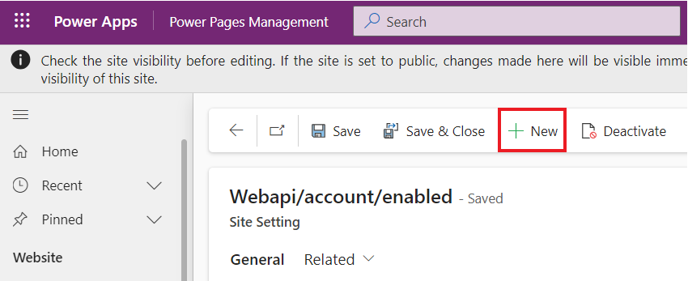

# **Lab 7: Aggiungere funzionalità avanzate lato client al sito**

**Durata stimata:** 35 min

**Obiettivo:** In questo laboratorio imparerai come aggiungere codice
JavaScript a una pagina per eseguire il rendering dei data da Common
Data Service come grafico.

### **Compito 1: creare un sito con l'aiuto dell'intelligenza artificiale**

1.  Vai a Power Pages usando
    +++<https://make.powerpages.microsoft.com/>+++. Assicurati di essere
    nell' ambiente **Dev One**.

> 

2.  Seleziona **Skip** nella pagina **Tell us about yourself**.

> 

3.  Immettere la descrizione fornita per creare un sito, quindi fare
    clic sull' icona di **generate**.

> +++**Create a site for customers to find financial advisors at a bank
> based on their qualifications, and areas of expertise**+++
>
> 

4.  Copilot genera un nome di sito e un indirizzo Web in base alla
    descrizione. In questo caso, il nome del sito è "**Finance Advisor
    Search".** Mantieni il nome e l'indirizzo del sito generati, quindi
    seleziona **Next**.

> 

5.  Copilot genera un layout di home page, che è possibile scorrere e
    sfogliare la pagina generata. Selezionare **Next** per accettare il
    layout suggerito.

> **Nota:** È possibile selezionare **Try again** per generare un nuovo
> layout.
>
> 

6.  Copilot genera più pagine che potrebbero essere utilizzate nel sito
    in base alla descrizione. In questo esempio, vengono selezionate le
    pagine Contattaci, Ricerca consulente, Profilo consulente e Contatto
    consulente, quindi selezionare **Done** per completare la creazione
    del sito.

> **Nota:** se il copilota genera pagine diverse per il suoi sito
> rispetto alle pagine sopra menzionate, puoi selezionarne alcune.
>
> 

7.  La creazione del sito può richiedere alcuni minuti. Al termine, si
    viene reindirizzati al sito aperto nello studio di progettazione che
    è possibile personalizzare ulteriormente.

> 

### **Attività 2: Creare le impostazioni del sito**

Per creare le impostazioni del sito, segui questi passaggi.

1.  Seleziona i puntini di sospensione (**...**), quindi selezionare
    **Portal management**.

> L'app Gestione portale si aprirà in una nuova scheda.
>
> 

2.  Seleziona **Site Settings**. Seleziona **+ New.**

> 

3.  Immettere le informazioni seguenti e quindi selezionare **Save**.

    - **Name** - +++Webapi/account/enabled+++

    &nbsp;

    - **Website** - Seleziona il suoi sito web

    &nbsp;

    - **Value** - +++true+++

> 

4.  Seleziona **+ New.**

> 

5.  Immettere le informazioni seguenti, quindi selezionare **Save &
    Close**.

    - **Name** - +++Webapi/account/fields+++

    &nbsp;

    - **Website** - Seleziona il suoi sito web

    &nbsp;

    - **Value** - +++name,numberofemployees,revenue+++

> 

### **Attività 3: Creare le autorizzazioni per le tabelle**

Per creare le autorizzazioni per le tabelle, attenersi alla seguente
procedura.

1.  Passa allo studio di progettazione di Power Pages, dove viene aperto
    il sito Web appena creato.

> **Nota:** È possibile chiudere il riquadro Copilot per una migliore
> visibilità.
>
> 

2.  Selezionare l' area di lavoro **Security** e quindi selezionare
    **Table permissions.**

> 

3.  Seleziona **+ New permission.**

>  

4.  Compila le seguenti informazioni:

    - **Name** - +++Account+++

    &nbsp;

    - **Table** - +++Account (account)+++

    &nbsp;

    - **Access type** – Global access

    &nbsp;

    - **Permission to**– Read

> 

5.  Selezionare **Add roles**, quindi aggiungere **Anonymous Users** e
    **Authenticated Users**.

> 

6.  Seleziona **Save**.

> 

7.  Scegli **Save** per mantenere questi data visibili a chiunque.

> 

8.  Puoi vedere il messaggio che dice che l'autorizzazione della tabella
    'Account' è stata salvata con successo'.

> 

### **Attività 4: Testare l'API Web**

1.  Per testare l'API Web, apri il seguente URL dopo aver aggiunto
    l'indirizzo del suoi sito Web +++[https://
    **yourwebsite.**powerappsportals.com/\_api/accounts?$select=name,numberofemployees,revenue](https://yourwebsite.powerappsportals.com/_api/accounts?$select=name,numberofemployees,revenue)+++

2.  Se viene visualizzata la finestra di dialogo Richiesta
    autorizzazione, selezionare **Accept**.

> 

3.  L'output dovrebbe essere simile all'immagine seguente.

> 

### **Attività 5: Creare una pagina di contenuto e recuperare i data**

Per creare una pagina di contenuto e aggiungere codice JavaScript che
recupera e trasforma i data, procedi nel seguente modo:

1.  In Design Studio, seleziona l' area di lavoro **Pages**, quindi
    seleziona **+ Page**.

> 

2.  Inserisci +++**Chart**+++ come della **Page name**.

3.  Assicurati che l' opzione **Add page to main navigation** sia
    selezionata.

4.  Selezionare il layout **Start from blank**.

5.  Seleziona **Add**.

> 

6.  Seleziona **Edit** **code**.

> 

7.  Nella finestra di dialogo popup selezionare **Open** **Visual Studio
    Code**.

> 

8.  Se viene visualizzata una finestra popup che ti chiede di consentire
    **The extension Power Platform tool to sign in using Microsoft**,
    seleziona **Allow**.

> 

9.  Recupererà i suoii data.

> 

10. Nell'editor di Visual Studio Code selezionare il file
    **Chart.en-US.customjs.js**.

> 

11. Aggiungere lo script seguente:

> function makeChart(rawData) {
>
> //transform raw data into plotting array
>
> var rData = rawData.value.map(({
>
> name
>
> revenue
>
> numberofemployees
>
> }) =\> ({
>
> "x": numberofemployees,
>
> "y": revenue,
>
> "z": (!revenue) ? 1 : numberofemployees / revenue,
>
> "name": name
>
> }));
>
> console.log(rData);
>
> }
>
> //retrieve accounts data using portals Web API
>
> $(document).ready(function() {
>
> $.get('/\_api/account?$select=name,numberofemployees,revenue',
> makeChart, 'json');
>
> });

12. Premi la scorciatoia da tastiera **Ctrl + S** (**⌘ + S** su Mac) per
    salvare il file.

> 

13. Chiudere la scheda **Visual Studio Code**. Selezionare **Sync**
    quando viene richiesto di sincronizzare le modifiche.

> 

14. Seleziona **Preview | Desktop**.

> 

15. Quando viene visualizzata la pagina, premere il tasto **F12** per
    visualizzare gli strumenti di sviluppo del browser.

> 
>
> 

16. Selezionare la scheda **Console**.

> 

17. Verificare che l'output della console contenga gli stessi data
    recuperati in precedenza, ad eccezione del fatto che ora viene
    visualizzato come trasformato.

> 

18. La struttura dei data è ora pronta per la tracciatura. Assegna le
    etichette appropriate ai punti data:

    - **name** - Nome dell'azienda

    &nbsp;

    - **x** - Numero di dipendenti

    &nbsp;

    - **y** - Fatturato aziendale in migliaia

    &nbsp;

    - **z** - Entrate per ogni dipendente (calcolate)

### **Attività 6: Aggiungere la funzionalità della libreria esterna**

Questo esercizio utilizza Highcharts.js libreria (gratuita per uso
personale o senza scopo di lucro) per creare un grafico a bolle basato
sui data.

1.  Passa a Design Studio.

> 

2.  Seleziona il piè di pagina e quindi seleziona **Edit code**.

> 

3.  Nella finestra di dialogo popup selezionare **Open Visual Studio
    Code**.

> 

4.  Aggiungere il codice seguente alla fine del file.

> \<script src="https://code.highcharts.com/highcharts.js"\>\</script\>
>
> \<script
> src="https://code.highcharts.com/highcharts-more.js"\>\</script\>
>
> 

5.  Premi la scorciatoia da tastiera **Ctrl + S** (**⌘ + S** su Mac) per
    salvare il file.

6.  Chiudere la scheda **Visual Studio Code**.

7.  Selezionare **Edit code** sulla barra degli strumenti per aprire
    Visual Studio Code per la pagina.

> 

8.  Selezionare **Open Visual Studio Code** in Modifica in Visual Studio
    Code per il popup Web.

> 

9.  Seleziona il file **Chart.en-US.customjs.js**.

> 

10. Sostituire il file per modificare la funzione **makeChart** come
    indicato di seguito:

> Nota: in questo caso, la sostituzione del file significa modificare
> solo il file esistente.
>
> function makeChart(data) {
>
> console.log(data);
>
> var rData = data.value.map(({
>
> name
>
> revenue
>
> numberofemployees
>
> }) =\> ({
>
> "x": numberofemployees,
>
> "y": revenue,
>
> "z": (!revenue) ? 1 : numberofemployees /revenue,
>
> "name": name
>
> }));
>
> console.log(rData);
>
> // new code to plot the data
>
> Highcharts.chart($('.mychart')\[0\], {
>
> title: {
>
> text: "Customers efficiency"
>
> },
>
> legend: {
>
> enabled: false
>
> },
>
> xAxis: {
>
> title: {
>
> text: "Number of employees"
>
> }
>
> },
>
> yAxis: {
>
> title: {
>
> text: "Turnover ($K)"
>
> }
>
> },
>
> tooltip: {
>
> pointFormat: '\<strong\>{point.name}\</strong\>\<br/\>Employed:
> {point.x}\<br\>Turnover ($K): ${point.y}',
>
> headerFormat: ''
>
> },
>
> series: \[{
>
> type: 'bubble',
>
> data: rData
>
> }\]
>
> });
>
> }
>
> //retrieve accounts data using portals Web API
>
> $(document).ready(function() {
>
> $.get('/\_api/accounts?$select=name,numberofemployees,revenue',
> makeChart, 'json');
>
> });
>
> 

11. Premi la scorciatoia da tastiera **Ctrl + S** (**⌘ + S** su Mac) per
    salvare il file.

12. Seleziona il file **Chart.en-US.webpage.copy.html**.

> 

13. Inserire il codice seguente nell' elemento \<div\> interno :

> \<figure\>
>
> \
\</div\>
>
> \</figure\>
>
> 

14. Premi la scorciatoia da tastiera **Ctrl + S** (**⌘ + S** su Mac) per
    salvare il file.

15. Chiudere la scheda **Visual Studio Code**, quindi selezionare
    **Sync** per sincronizzare le modifiche.

> 

16. Seleziona **Preview | Desktop**.

> 

17. L'output dovrebbe ora includere il grafico a bolle. Passa il cursore
    sulle bolle per verificare i data.

> 

**Riepilogo:** in questo laboratorio hai appreso come aggiungere codice
JavaScript a una pagina per eseguire il rendering dei data da Common
Data Service come grafico utilizzando una libreria di grafici esterna
con i data recuperati da Common Data Service utilizzando l'API Web dei
portali.
