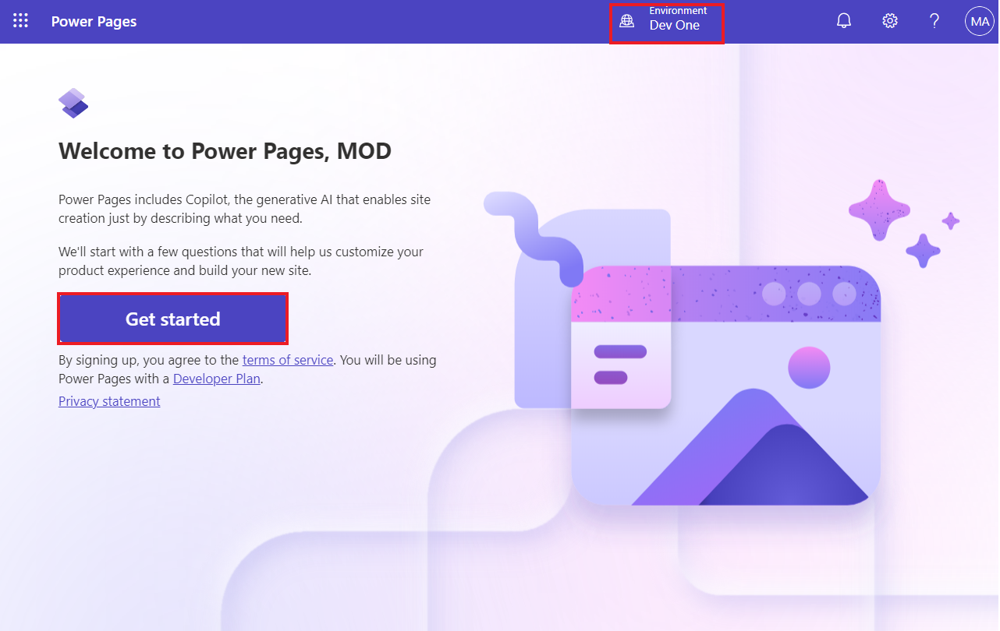

# **實驗 7：向站點添加高級客戶端功能**

**預計持續時間：** 35 分鐘

**目標：**在本實驗中，您將學習如何將 JavaScript 代碼添加到頁面，以將
Microsoft Dataverse 中的數據呈現為圖表。

### **任務 1：在 AI 的幫助下創建站點**

1.  使用 +++<https://make.powerpages.microsoft.com/>+++轉到 Power
    Pages。確保您處於 **Dev One** 環境中。.

> 

2.  選擇 **Skip** on **Tell us about yourself**
    page（告訴我們關於您自己的頁面）。

> 

3.  輸入給定的描述以創建站點，然後單擊 **generate** 圖標。

> +++**Create a site for customers to find financial advisors at a bank
> based on their qualifications, and areas of expertise**+++
>
> 

4.  Copilot 會根據您的描述生成站點名稱和 Web 地址。在本例中，站點名稱為
    **'Finance Advisor Search'**。保留生成的站點名稱和地址，然後選擇
    **Next**。

> 

5.  Copilot 會生成一個主頁佈局，您可以滾動瀏覽和瀏覽生成的頁面。選擇
    **Next** 接受建議的佈局。

> **注：** 您可以選擇 **Try again** （重試） 以生成新佈局。
>
> 

6.  Copilot 會根據描述生成更多可在站點中使用的頁面。在此示例中，選中了
    Contact us， Advisor search， Advisor profile 和 Advisor contact
    pages，然後選擇 **Done** 以完成站點創建。

> **請注意：** 如果您的 copilot
> 為您的網站生成的頁面與上述頁面不同，那麼您可以選擇其中的一些頁面。
>
> 

7.  站點創建可能需要幾分鐘時間。完成後，您將被重定向到在設計工作室中打開的站點，您可以進一步自定義該站點。

> 

### **任務 2：創建站點設置**

要創建站點設置，請執行以下步驟。

1.  選擇省略號 （...） 菜單，然後選擇 **Portal management**。

> 門戶管理應用程序將在新選項卡中打開。
>
> 

2.  選擇 **Site Settings**（站點設置）。選擇 **+ New**。**.**

> 

3.  輸入以下信息，然後選擇 **Save** （保存）。

    - **名稱 -** +++Webapi/account/enabled+++

    &nbsp;

    - **網站 -** 選擇您的網站

    &nbsp;

    - **值**- +++true+++

> 

4.  選擇 **+ New。**

> 

5.  輸入以下信息，然後選擇 **Save & Close**。

    - **名稱 -** +++Webapi/account/fields+++

    &nbsp;

    - **網站 -** 選擇您的網站

    &nbsp;

    - **值 -** +++name,numberofemployees,revenue+++

> 

### **任務 3：創建表權限**

要創建表權限，請執行以下步驟。

1.  切換到 Power Pages 設計工作室，新創建的網站將在其中打開。

> **注意：**您可以關閉 Copilot 窗格以獲得更好的可見性。
>
> 

2.  選擇 **Security** workspace，然後選擇 **Table permissions**。

> 

3.  選擇 **+ New permission。**

>  

4.  填寫以下信息：

    - **名稱 -** +++Account+++

    &nbsp;

    - **表** - +++Account (account)+++

    &nbsp;

    - **訪問類型 -** Global

    &nbsp;

    - **權限 –** Read

> 

5.  選擇 **Add roles**（添加角色），然後添加 **Anonymous
    Users**（匿名用戶）和 **Authenticated
    Users**（經過身份驗證的用戶）。

> 

6.  選擇 **Save** （保存）。

> 

7.  選擇 **Save** （保存） 以使此數據對任何人可見。

> 

8.  您可以看到 ‘The table permission ‘Account’ have successfully been
    saved’。

> 

### **任務 4：測試 Web API** 

1.  要測試 Web API，請在添加網站地址後打開以下 URL
    +++[https://**yourwebsite**.powerappsportals.com/\_api/accounts?$select=name,numberofemployees,revenue](https://yourwebsite.powerappsportals.com/_api/accounts?$select=name,numberofemployees,revenue)+++

2.  如果出現 IF permission requested 對話框，請選擇 **Accept** 。

> 

3.  您的輸出應類似於下圖。

> 

### **任務 5：創建內容頁面並檢索數據**

若要創建內容頁並添加用於檢索和轉換數據的 JavaScript
代碼，請執行以下步驟：

1.  在 design studio 中，選擇 **Pages** 工作區，然後選擇 **+ Page**。

> 

2.  輸入 +++**Chart**+++ 作為**頁面名稱**。

3.  確保 **Add page to main navigation** （將頁面添加到主導航） 選項。

4.  選擇 **Start from blank** （從空白開始） 佈局。

5.  選擇 **Add**。

> 

6.  選擇 **Edit code** （編輯代碼）。

> 

7.  在彈出對話框中，選擇 **Open Visual Studio Code**。

> 

8.  如果出現彈出窗口並要求您允許擴展 Power Platform 工具使用 Microsoft
    登錄，請選擇 **Allow**。

> 

9.  它將獲取您的數據。

> 

10. 在 Visual Studio Code 編輯器中，選擇 **Chart.en-US.customjs.js**
    文件。

> 

11. 附加以下腳本：

> function makeChart(rawData) {
>
> // transform raw data into plotting array
>
> var rData = rawData.value.map(({
>
> name,
>
> revenue,
>
> numberofemployees
>
> }) =\> ({
>
> "x": numberofemployees,
>
> "y": revenue,
>
> "z": (!revenue) ? 1 : numberofemployees / revenue,
>
> "name": name
>
> }));
>
> console.log(rData);
>
> }
>
> // retrieve accounts data using portals Web API
>
> $(document).ready(function() {
>
> $.get('/\_api/accounts?$select=name,numberofemployees,revenue',
> makeChart, 'json');
>
> });

12. 按 **Ctrl + S** 鍵盤快捷鍵（在 Mac 上為 **⌘ + S**）保存文件。

> 

13. 關閉 **Visual Studio Code** 選項卡。當系統提示同步更改時，選擇
    **Sync** （同步）。

> 

14. 選擇 **Preview | Desktop**。

> 

15. 顯示頁面時，按 **F12** 鍵可顯示瀏覽器開發人員工具。

> 
>
> 

16. 選擇 **Console** （控制台） 選項卡。

> 

17. 驗證控制台輸出是否包含與之前檢索的數據相同的數據，只是它現在顯示為已轉換。

> 

18. 現在，數據結構已準備好進行繪圖。為數據點分配適當的標簽：

    - **name** - 公司名稱

    &nbsp;

    - **x** - 員工人數

    &nbsp;

    - **y** - 公司收入（單位：千）

    &nbsp;

    - **z** - 每個員工的收入（計算）

### **任務 6：添加外部庫功能**

本練習使用 Highcharts.js
庫（免費供個人或非營利組織使用）根據數據創建氣泡圖。

1.  切換到 design studio。

> 

2.  選擇頁腳，然後選擇 **Edit code** （編輯代碼）。

> 

3.  在彈出對話框中，選擇 **Open Visual Studio Code**。

> 

4.  將以下代碼附加到文件末尾。

> \<script src="https://code.highcharts.com/highcharts.js"\>\</script\>
>
> \<script
> src="https://code.highcharts.com/highcharts-more.js"\>\</script\>
>
> 

5.  按 **Ctrl + S** 鍵盤快捷鍵（在 Mac 上為 **⌘ + S**）保存文件。

6.  關閉 **Visual Studio Code** 選項卡。

7.  選擇工具欄上的 **Edit code** （編輯代碼） 以打開頁面的 Visual Studio
    Code。

> 

8.  在 Visual Studio Code for the Web 彈出窗口中選擇 “編輯時 **Open
    Visual Studio Code**” 。

> 

9.  選擇 **Chart.en-US.customjs.js** 文件。

> 

10. 替換文件以更改 **makeChart** 函數，如下所示：

> 備註：此處，替換文件意味著您僅修改現有文件。.
>
> function makeChart(data) {
>
> console.log(data);
>
> var rData = data.value.map(({
>
> name,
>
> revenue,
>
> numberofemployees
>
> }) =\> ({
>
> "x": numberofemployees,
>
> "y": revenue,
>
> "z": (!revenue) ? 1 : numberofemployees / revenue,
>
> "name": name
>
> }));
>
> console.log(rData);
>
> // new code to plot the data
>
> Highcharts.chart($('.mychart')\[0\], {
>
> title: {
>
> text: "Customers efficiency"
>
> },
>
> legend: {
>
> enabled: false
>
> },
>
> xAxis: {
>
> title: {
>
> text: "Number of employees"
>
> }
>
> },
>
> yAxis: {
>
> title: {
>
> text: "Turnover ($K)"
>
> }
>
> },
>
> tooltip: {
>
> pointFormat: '\<strong\>{point.name}\</strong\>\<br/\>Employed:
> {point.x}\<br\>Turnover ($K): ${point.y}',
>
> headerFormat: ''
>
> },
>
> series: \[{
>
> type: 'bubble',
>
> data: rData
>
> }\]
>
> });
>
> }
>
> // retrieve accounts data using portals Web API
>
> $(document).ready(function() {
>
> $.get('/\_api/accounts?$select=name,numberofemployees,revenue',
> makeChart, 'json');
>
> });
>
> 

11. 按 **Ctrl + S** 鍵盤快捷鍵（在 Mac 上為 **⌘ + S**）保存文件。

12. 選擇 **Chart.en-US.webpage.copy.html** 文件。

> 

13. 將以下代碼插入內部\<div\>元素：

> \<figure\>
>
> \
\</div\>
>
> \</figure\>
>
> 

14. 按 **Ctrl + S** 鍵盤快捷鍵（在 Mac 上為 **⌘ + S**）保存文件。

15. 關閉 **Visual Studio Code** 選項卡，然後選擇 **Sync** 同步更改。

> 

16. 選擇 **Preview | Desktop**。

> 

17. 輸出現在應包含氣泡圖。將光標懸停在氣泡上以驗證數據。

> 

**摘要：**在本實驗中，您學習了如何將 JavaScript
代碼添加到頁面，以使用外部圖表庫將 Microsoft Dataverse
中的數據呈現為圖表，其中包含使用門戶 Web API 從 Dataverse 檢索的數據。
