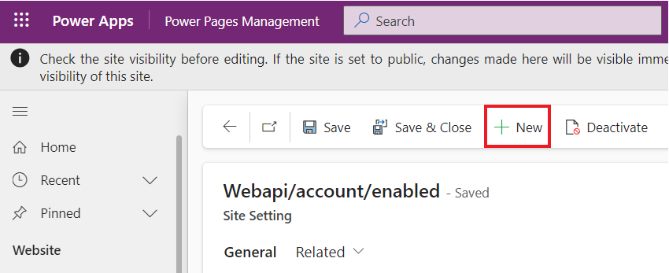
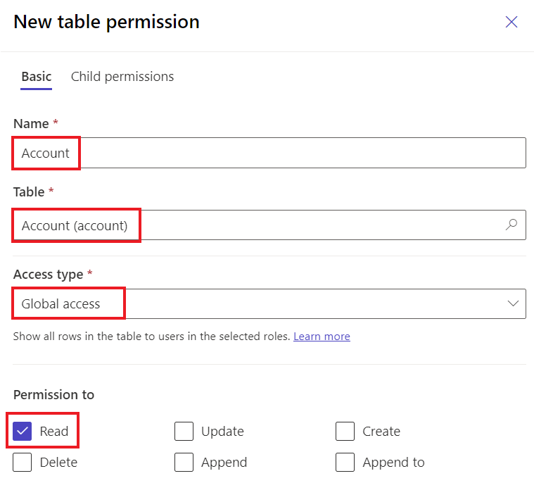
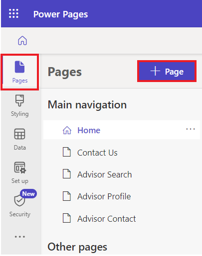
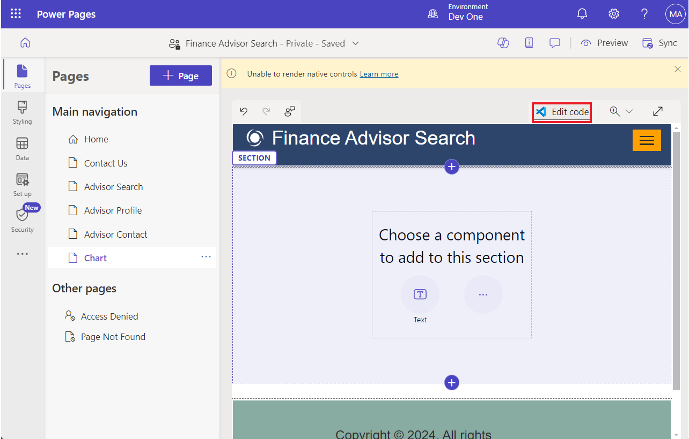
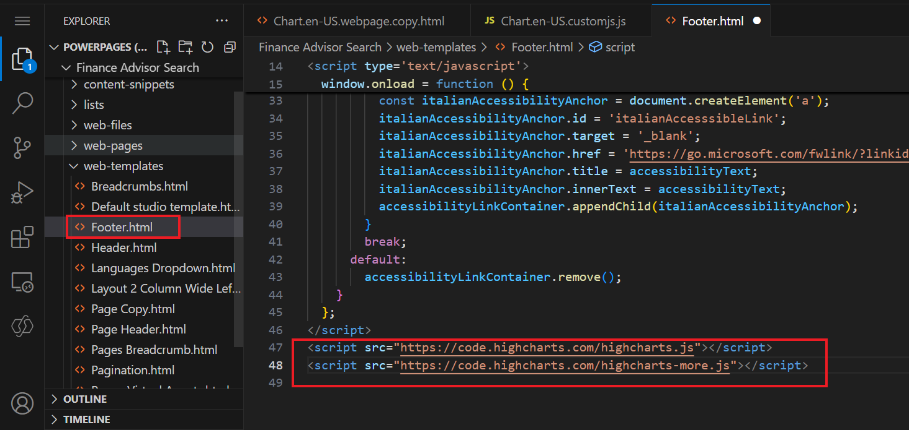

# **Atelier 7 : Ajouter des fonctionnalités avancées côté client à votre site**

**Durée estimée :** 35 min

**Objectif :** Dans cet atelier, vous allez apprendre à ajouter du code
JavaScript à une page pour afficher les données de Microsoft Dataverse
sous forme de graphique.

### **Tâche 1 : Créer un site à l'aide de l'IA**

1.  Accédez à Power Pages à l'aide de
    +++<https://make.powerpages.microsoft.com/>+++. Assurez-vous que
    vous êtes dans l' environnement **Dev One**.

> 

2.  Sélectionnez **Skip** à la **Tell us about yourself**.

> 

3.  Entrez la description donnée pour créer un site, puis cliquez sur l'
    icône **generate**.

> +++**Create a site for customers to find financial advisors at a bank
> based on their qualifications, and areas of expertise**+++
>
> 

4.  Copilot génère un nom de site et une adresse Web en fonction de
    votre description. Dans ce cas, le nom du site est ‘**Finance
    Advisor Search’**. Conservez le nom et l'adresse du site générés,
    puis sélectionnez **Next**.

> 

5.  Copilot génère une mise en page de page d'accueil, que vous pouvez
    faire défiler et parcourir la page générée. Sélectionnez **Next**
    pour accepter la mise en page suggérée.

> **Remarque :** Vous pouvez sélectionner **Try again**  pour générer
> une nouvelle mise en page.
>
> 

6.  Copilot génère plus de pages qui pourraient être utilisées dans le
    site en fonction de la description. Dans cet exemple, les pages
    Contactez-nous, Recherche de conseiller, Profil de conseiller et
    Contacts du conseiller sont sélectionnées, puis sélectionnez
    **Done** pour terminer la création du site.

> **Remarque :** Si vous copilot génère des pages différentes pour votre
> site que les pages mentionnées ci-dessus, vous pouvez en sélectionner
> certaines.
>
> 

7.  La création d'un site peut prendre quelques minutes. Une fois
    terminé, vous êtes redirigé vers le site ouvert dans le studio de
    design que vous pouvez personnaliser davantage.

> 

### **Tâche 2 : Créer les paramètres du site**

Pour créer des paramètres de site, procédez comme suit.

1.  Sélectionnez les points de suspension (**...**), puis sélectionnez
    **Portal management**.

> L'application Gestion du portail s'ouvre dans un nouvel onglet.
>
> 

2.  Sélectionnez **Site Settings**.. Sélectionnez **+ New.**

> 

3.  Entrez les informations suivantes, puis sélectionnez **Save**.

    - **Name** - +++Webapi/account/enabled+++

    &nbsp;

    - **Website** - Sélectionnez votre site Web

    &nbsp;

    - **Valeu**- +++true+++

> 

4.  Sélectionnez **+ New.**

> 

5.  Entrez les informations suivantes, puis sélectionnez **Save &
    Close**.

    - **Name** - +++Webapi/compte/champs+++

    &nbsp;

    - **Website** - Sélectionnez votre site Web

    &nbsp;

    - **Valeu** - +++nom,nombred'employés,chiffre d'affaires+++

> 

### **Tâche 3 : Créer des autorisations de table**

Pour créer des autorisations de table, procédez comme suit.

1.  Passez au studio de design Power Pages, où le site Web nouvellement
    créé est ouvert.

> **Remarque :** Vous pouvez fermer le volet Copilot pour une meilleure
> visibilité.
>
> 

2.  Sélectionnez l' espace **Security** , puis Autorisations **Table
    permissions**..

> 

3.  Sélectionnez **+ New permission.**

>  

4.  Remplissez les informations suivantes :

    - **Name** - +++Compte+++

    &nbsp;

    - **Table** - +++Compte (compte)+++

    &nbsp;

    - **Access type**  - Global

    &nbsp;

    - **Permission to** – Lire

> 

5.  Sélectionnez **Add roles** , puis Ajouter **Anonymous Users**  et
    **Authenticated Users**

> 

6.  Sélectionnez **Save**.

> 

7.  Choisissez **Save** pour que ces données restent visibles par tous.

> 

8.  Vous pouvez voir le message indiquant que 'L'autorisation de table
    'Compte' a été enregistrée avec succès'.

> 

### **Tâche 4 : Tester l'API Web**

1.  Pour tester l'API Web, ouvrez l'URL suivante après avoir ajouté
    l'adresse de votre site Web +++[https://
    **votresiteweb.powerappsportals.com/\_api/accounts?$select=name,numberofemployees,revenue**](https://yourwebsite.powerappsportals.com/_api/accounts?$select=name,numberofemployees,revenue)+++

2.  SI la boîte de dialogue Autorisation demandée s'affiche,
    sélectionnez **Accept**.

> 

3.  Votre sortie doit ressembler à l'image suivante.

> 

### **Tâche 5 : Créer une page de contenu et récupérer des données**

Pour créer une page de contenu et ajouter du code JavaScript qui
récupère et transforme les données, procédez comme suit :

1.  Dans Design Studio, sélectionnez l'espace de travail **Pages**, puis
    **+ Page**.

> 

2.  Entrez +++**Chart**+++ comme **nom de** **page**.

3.  Assurez-vous que l' option **Add page to main navigation**  est
    sélectionnée.

4.  Sélectionnez la **Start from blank**  Démarrer à partir de zéro.

5.  Sélectionnez **Add**.

> 

6.  Sélectionnez **Edit code**.

> 

7.  Dans la boîte de dialogue contextuelle, sélectionnez **Open Visual
    Studio Code**.

> 

8.  Si une fenêtre contextuelle s'affiche et vous demande d'autoriser
    l'extension Power Platform Tool à se connecter à l'aide de
    Microsoft, sélectionnez **Allow**.

> 

9.  Il récupérera vos données.

> 

10. Dans l'éditeur Visual Studio Code, sélectionnez le
    **Chart.en-US.customjs.js** 

> 

11. Ajoutez le script suivant :

> function makeChart(rawData) {
>
> // transform raw data into plotting array
>
> var rData = rawData.value.map(({
>
> name,
>
> revenue,
>
> numberofemployees
>
> }) =\> ({
>
> "x": numberofemployees,
>
> "y": revenue,
>
> "z": (!revenue) ? 1 : numberofemployees / revenue,
>
> "name": name
>
> }));
>
> console.log(rData);
>
> }
>
> // retrieve accounts data using portals Web API
>
> $(document).ready(function() {
>
> $.get('/\_api/accounts?$select=name,numberofemployees,revenue',
> makeChart, 'json');
>
> });

12. Appuyez sur le raccourci clavier **Ctrl + S** (**⌘ + S** sur Mac)
    pour enregistrer le fichier.

> 

13. Fermez l' onglet **Visual Studio Code**. Sélectionnez **Sync**
    lorsque vous êtes invité à synchroniser les modifications.

> 

14. Sélectionnez **Preview | Desktop**.

> 

15. Lorsque la page s'affiche, appuyez sur la touche **F12** pour
    afficher les outils de développement du navigateur.

> 
>
> 

16. Sélectionnez l'onglet **Console.**

> 

17. Vérifiez que la sortie de la console contient les mêmes données que
    celles précédemment récupérées, sauf qu'elles s'affichent maintenant
    comme transformées.

> 

18. La structure de données est maintenant préparée pour le traçage.
    Attribuez les étiquettes appropriées aux points de données :

    - **name** - Nom de l'entreprise

    &nbsp;

    - **x** - Nombre d'employés

    &nbsp;

    - **y** - Chiffre d'affaires de l'entreprise en milliers

    &nbsp;

    - **z** - Chiffre d'affaires par employé (calculé)

### **Tâche 6 : Ajouter une fonctionnalité de bibliothèque externe**

Cet exercice utilise Highcharts.js bibliothèque (gratuite pour un usage
personnel ou à but non lucratif) pour créer un graphique à bulles basé
sur les données.

1.  Passez au design studio.

> 

2.  Sélectionnez le pied de page, puis sélectionnez **Edit code**.

> 

3.  Dans la boîte de dialogue contextuelle, sélectionnez **Open Visual
    Studio Code**.

> 

4.  Ajoutez le code suivant à la fin du fichier.

> \<script src="https://code.highcharts.com/highcharts.js"\>\</script\>
>
> \<script
> src="https://code.highcharts.com/highcharts-more.js"\>\</script\>
>
> 

5.  Appuyez sur le raccourci clavier **Ctrl + S** (**⌘ + S** sur Mac)
    pour enregistrer le fichier.

6.  Fermez l' onglet **Visual Studio Code**.

7.  Sélectionnez **Edit code**  dans la barre d'outils pour ouvrir
    Visual Studio Code pour la page.

> 

8.  Sélectionnez **Open Visual Studio Code** sur Modifier dans la
    fenêtre contextuelle Visual Studio Code pour le Web.

> 

9.  Sélectionnez le fichier **Chart.en-US.customjs.js**.

> 

10. Remplacez le fichier pour modifier la fonction **makeChart** comme
    suit :

> Remarque : Ici, le remplacement du fichier signifie que vous ne
> modifiez que le fichier existant.
>
> function makeChart(data) {
>
> console.log(data);
>
> var rData = data.value.map(({
>
> name,
>
> revenue,
>
> numberofemployees
>
> }) =\> ({
>
> "x": numberofemployees,
>
> "y": revenue,
>
> "z": (!revenue) ? 1 : numberofemployees / revenue,
>
> "name": name
>
> }));
>
> console.log(rData);
>
> // new code to plot the data
>
> Highcharts.chart($('.mychart')\[0\], {
>
> title: {
>
> text: "Customers efficiency"
>
> },
>
> legend: {
>
> enabled: false
>
> },
>
> xAxis: {
>
> title: {
>
> text: "Number of employees"
>
> }
>
> },
>
> yAxis: {
>
> title: {
>
> text: "Turnover ($K)"
>
> }
>
> },
>
> tooltip: {
>
> pointFormat: '\<strong\>{point.name}\</strong\>\<br/\>Employed:
> {point.x}\<br\>Turnover ($K): ${point.y}',
>
> headerFormat: ''
>
> },
>
> series: \[{
>
> type: 'bubble',
>
> data: rData
>
> }\]
>
> });
>
> }
>
> // retrieve accounts data using portals Web API
>
> $(document).ready(function() {
>
> $.get('/\_api/accounts?$select=name,numberofemployees,revenue',
> makeChart, 'json');
>
> });
>
> 

11. Appuyez sur le raccourci clavier **Ctrl + S** (**⌘ + S** sur Mac)
    pour enregistrer le fichier.

12. Sélectionnez le fichier **Chart.en-US.webpage.copy.html**.

> 

13. Insérez le code suivant dans l' élément \<div\> interne :

> \<figure\>
>
> \
\</div\>
>
> \</figure\>
>
> 

14. Appuyez sur le raccourci clavier **Ctrl + S** (**⌘ + S** sur Mac)
    pour enregistrer le fichier.

15. Fermez l' onglet **Visual Studio Code**, puis sélectionnez **Sync**
    pour synchroniser les modifications.

> 

16. Sélectionnez **Preview | Desktop**.

> 

17. La sortie doit maintenant inclure le graphique à bulles. Passez
    votre curseur sur les bulles pour vérifier les données.

> 

**Résumé :** Dans cet atelier, vous avez appris à ajouter du code
JavaScript à une page pour afficher des données de Microsoft Dataverse
sous forme de graphique à l'aide d'une bibliothèque de graphiques
externe avec les données récupérées de Dataverse à l'aide de l'API Web
du portail.
