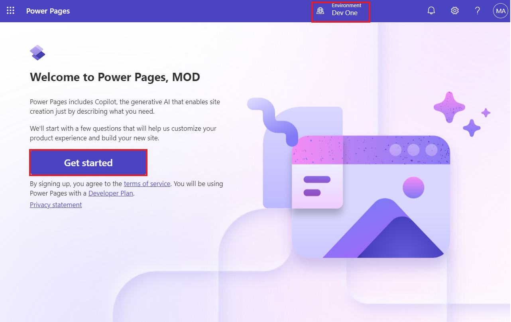
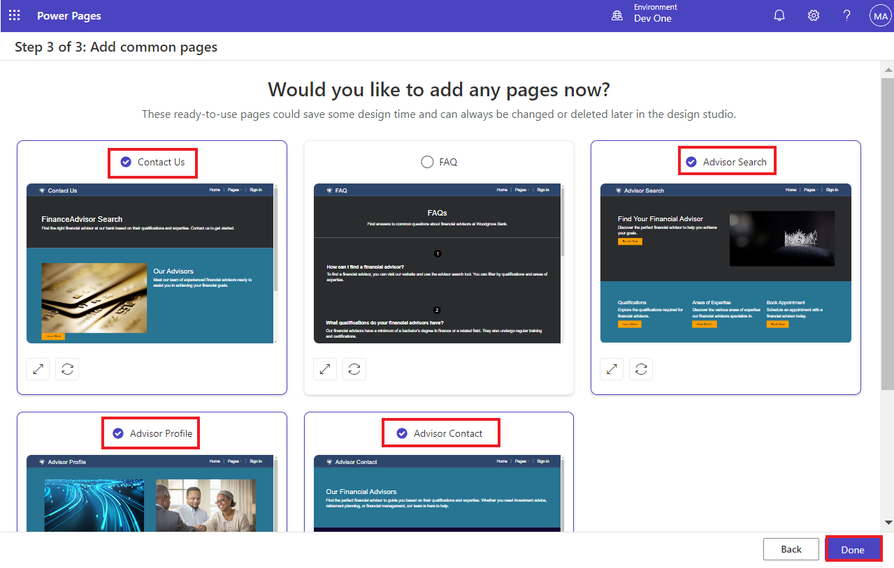
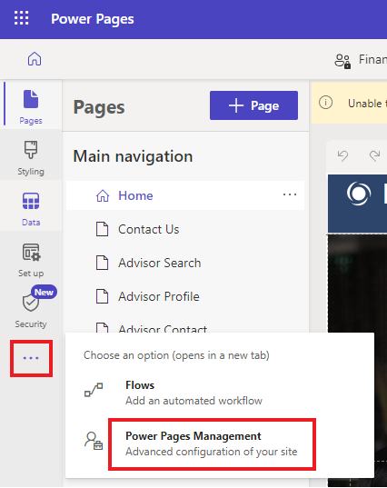
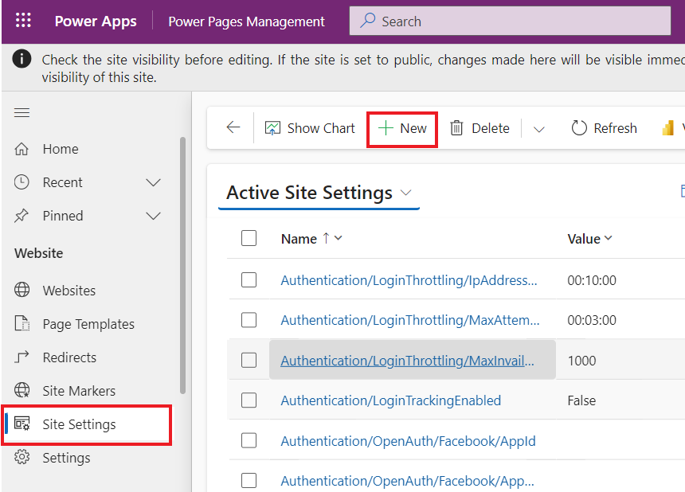
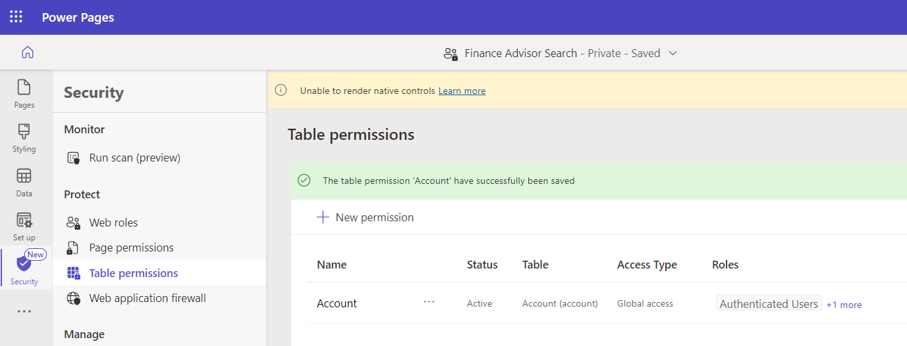

# **Lab 7: Add advanced client-side functionality to your site using Visual Studio Code for the Web** 

**Estimated Duration:** 35 min

**Objective:** In this lab, you will learn how to add JavaScript code to
a page to render data from Microsoft Dataverse as a chart.

### **Task 1: Create a site with the help of AI**

1.  Go to Power Pages using
    +++<https://make.powerpages.microsoft.com/>+++. Make sure that you
    are in **Dev One** environment.

> 

2.  Select **Skip** on **Tell us about yourself** page.

> 

3.  Enter the given description to create a site and then click on the
    **generate** icon.

> +++**Create a site for customers to find financial advisors at a bank
> based on their qualifications, and areas of expertise**+++
>
> 

4.  Copilot generates a site name and a web address based on your
    description. In this case, the site name is ‘**Finance Advisor
    Search’**. Keep the generated site name and address and then
    select **Next**.

> 

5.  Copilot generates a home page layout, which you can scroll through
    and browse the page generated. Select **Next** to accept the
    suggested layout.

> **Note:** You can select **Try again** to generate a new layout.
>
> 

6.  Copilot generates more pages that could be used in the site based on
    the description. In this example, Contact us, Advisor search,
    Advisor profile and Advisor contact pages are selected and then
    select **Done** to complete the site creation.

> **Note:** If you copilot generates different pages for your site than
> the above mentioned pages then you can select some of them.
>
> 

7.  Site creation can take a few minutes. When finished, you're
    redirected to the site opened in the design studio that you can
    customize further.

> 

### **Task 2: Create site settings**

To create site settings, follow these steps.

1.  Select the ellipsis (**...**) menu and then select **Portal
    management**.

> The Portal Management app will open in a new tab.
>
> 

2.  Select **Site Settings**. Select **+ New.** 

> 

3.  Enter the following information and then select **Save**.

    - **Name** - +++Webapi/account/enabled+++

    &nbsp;

    - **Website** - Select your website

    &nbsp;

    - **Value** - +++true+++

> 

4.  Select **+ New.** 

> 

5.  Enter the following information and then select **Save & Close**.

    - **Name** - +++Webapi/account/fields+++

    &nbsp;

    - **Website** - Select your website

    &nbsp;

    - **Value** - +++name,numberofemployees,revenue+++

> 

### **Task 3: Create table permissions**

To create table permissions, follow these steps.

1.  Switch to Power Pages design studio, where the newly created website
    is opened.

> **Note:** You can close the Copilot pane for better visibility.
>
> 

2.  Select the **Security** workspace and then select **Table
    permissions**.

> 

3.  Select **+ New permission.**

>  

4.  Fill in the following information:

    - **Name** - +++Account+++

    &nbsp;

    - **Table** - +++Account (account)+++

    &nbsp;

    - **Access type** - Global

    &nbsp;

    - **Permission to** – Read

> 

5.  Select **Add roles** and then add **Anonymous
    Users** and **Authenticated Users**.

> 

6.  Select **Save**.

> 

7.  Choose **Save** to keep this data visible to anyone.

> 

8.  You can see the message that ‘The table permission ‘Account’ have
    successfully been saved’.

> 

### **Task 4: Test the Web API**

1.  To test the Web API, open the following URL after adding your
    website address
    +++[https://**yourwebsite**.powerappsportals.com/\_api/accounts?$select=name,numberofemployees,revenue](https://yourwebsite.powerappsportals.com/_api/accounts?$select=name,numberofemployees,revenue)+++

2.  IF permission requested dialog appears, select **Accept**.

> 

3.  Your output should resemble the following image.

> 

### **Task 5: Create a content page and retrieve data**

To create a content page and add JavaScript code that retrieves and
transforms the data, follow these steps:

1.  In design studio, select the **Pages** workspace then select **+
    Page**.

> 

2.  Enter +++**Chart**+++ as the **Page name**.

3.  Make sure that the **Add page to main navigation** option is
    selected.

4.  Select the **Start from blank** layout.

5.  Select **Add**.

> 

6.  Select **Edit code**.

> 

7.  In the pop-up dialog, select **Open Visual Studio Code**.

> 

8.  If pop-up appears and ask you to allow the extension Power Platform
    tool to sign in using Microsoft, select **Allow**.

> 

9.  It will fetch your data.

> 

10. In the Visual Studio Code editor, select
    the **Chart.en-US.customjs.js** file.

> 

11. Append the following script:

> function makeChart(rawData) {
>
> // transform raw data into plotting array
>
> var rData = rawData.value.map(({
>
> name,
>
> revenue,
>
> numberofemployees
>
> }) =\> ({
>
> "x": numberofemployees,
>
> "y": revenue,
>
> "z": (!revenue) ? 1 : numberofemployees / revenue,
>
> "name": name
>
> }));
>
> console.log(rData);
>
> }
>
> // retrieve accounts data using portals Web API
>
> $(document).ready(function() {
>
> $.get('/\_api/accounts?$select=name,numberofemployees,revenue',
> makeChart, 'json');
>
> });

12. Press the **Ctrl + S** keyboard shortcut (**⌘ + S** on Mac) to save
    the file.

> 

13. Close the **Visual Studio Code** tab. Select **Sync** when prompted
    to synchronize the changes.

> 

14. Select **Preview | Desktop**.

> 

15. When the page is displayed, press the **F12** key to display browser
    developer tools.

> 
>
> 

16. Select **Console** tab.

> 

17. Verify that the console output contains the same data as previously
    retrieved, except that it's now showing as transformed.

> 

18. The data structure is now prepared for plotting. Assign the
    appropriate labels to data points:

    - **name** - Company name

    &nbsp;

    - **x** - Number of employees

    &nbsp;

    - **y** - Company revenue in thousands

    &nbsp;

    - **z** - Revenue for each employee (calculated)

### **Task 6: Add external library functionality**

This exercise uses Highcharts.js library (free for personal or
non-profit use) to create a bubble chart based on the data.

1.  Switch to design studio.

> 

2.  Select the page footer and then select **Edit code**.

> 

3.  In the pop-up dialog, select **Open Visual Studio Code**.

> 

4.  Append the following code at the end of the file.

> \<script src="https://code.highcharts.com/highcharts.js"\>\</script\>
>
> \<script
> src="https://code.highcharts.com/highcharts-more.js"\>\</script\>
>
> 

5.  Press the **Ctrl + S** keyboard shortcut (**⌘ + S** on Mac) to save
    the file.

6.  Close the **Visual Studio Code** tab.

7.  Select **Edit code** on the toolbar to open Visual Studio Code for
    the page.

> 

8.  Select **Open Visual Studio Code** on Edit in Visual Studio Code for
    the Web pop-up.

> 

9.  Select the **Chart.en-US.customjs.js** file.

> 

10. Replace the file to change the **makeChart** function as follows:

> Note: Here, replacing the file means your modifying the existing file
> only.
>
> function makeChart(data) {
>
> console.log(data);
>
> var rData = data.value.map(({
>
> name,
>
> revenue,
>
> numberofemployees
>
> }) =\> ({
>
> "x": numberofemployees,
>
> "y": revenue,
>
> "z": (!revenue) ? 1 : numberofemployees / revenue,
>
> "name": name
>
> }));
>
> console.log(rData);
>
> // new code to plot the data
>
> Highcharts.chart($('.mychart')\[0\], {
>
> title: {
>
> text: "Customers efficiency"
>
> },
>
> legend: {
>
> enabled: false
>
> },
>
> xAxis: {
>
> title: {
>
> text: "Number of employees"
>
> }
>
> },
>
> yAxis: {
>
> title: {
>
> text: "Turnover ($K)"
>
> }
>
> },
>
> tooltip: {
>
> pointFormat: '\<strong\>{point.name}\</strong\>\<br/\>Employed:
> {point.x}\<br\>Turnover ($K): ${point.y}',
>
> headerFormat: ''
>
> },
>
> series: \[{
>
> type: 'bubble',
>
> data: rData
>
> }\]
>
> });
>
> }
>
> // retrieve accounts data using portals Web API
>
> $(document).ready(function() {
>
> $.get('/\_api/accounts?$select=name,numberofemployees,revenue',
> makeChart, 'json');
>
> });
>
> 

11. Press the **Ctrl + S** keyboard shortcut (**⌘ + S** on Mac) to save
    the file.

12. Select the **Chart.en-US.webpage.copy.html** file.

> 

13. Insert the following code into the inner \<div\> element:

> \<figure\>
>
> \
\</div\>
>
> \</figure\>
>
> 

14. Press the **Ctrl + S** keyboard shortcut (**⌘ + S** on Mac) to save
    the file.

15. Close the **Visual Studio Code** tab then select **Sync** to
    synchronize the changes.

> 

16. Select **Preview | Desktop**.

> 

17. The output should now include the bubble chart. Hover your cursor
    over the bubbles to verify the data.

> 

**Summary:** In this lab, you have learnt how to add JavaScript code to
a page to render data from Microsoft Dataverse as a chart by using an
external charting library with the data that's retrieved from Dataverse
by using portals Web API.
