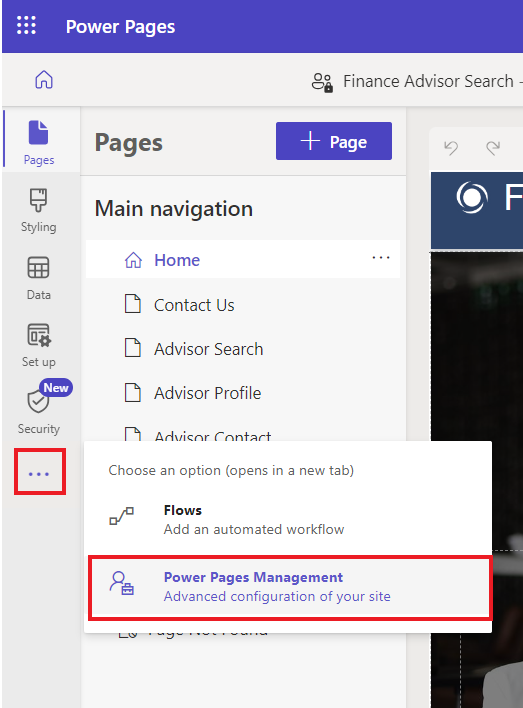

# **실습 8: 확장 가능한 웹 템플릿을 생성하기**

**예상 소요 시간:** 25분

**목표:** 이 실습에서는 extend 및 block 태그를 사용하여 Liquid 템플릿을
확장하는 방법, include 태그를 사용하여 Liquid 템플릿을 재사용하는 방법
및 새 템플릿의 결과에 테이블 권한을 적용하는 방법을 알아볼 것입니다.

**작업 1: 부분 템플릿을 생성하기**

첫 번째 작업은 페이지를 렌더링하는 데 사용되지 않고 대신 다른 템플릿에
삽입되는 부분 템플릿을 생성할 것입니다.

1.  Power Pages +++<https://make.powerpages.microsoft.com/>+++로
    로그인하세요.

2.  오른쪽 위 모서리에서 대상 환경 **Dev One**을 선택하세요.

> 

3.  **Active sites** 탭에서 **Finance Advisor Search** 사이트를 볼 수
    있습니다. **Edit**을 선택하세요.

> 

4.  확장 메뉴 (줄임표)를 확장한 후 **Portal management를** 선택하여
    Portal management 앱을 여세요.

> 

5.  **Web Templates**을 선택하세요.

> 

6.  \+**New**를 선택하세요.

> 

7.  다음 값을 입력하세요:

    - **Name** - +++Directory+++

    &nbsp;

    - **Website** – 현재 웹 사이트를 선택하세요 - Finance Advisor Search

    &nbsp;

    - **Source** – 다음 내용을 입력하세요:

> 
>
> \<fetch\>
>
> \<entity name="account"\>
>
> \<attribute name="name" /\>
>
> \</entity\>
>
> \</fetch\>
>
> 
>
> 
>
> \<ul\>
>
> 
>
> \<li\>{{ account.name }}\</li\>
>
> 
>
> \</ul\>
>
> 
>
> \
You do not have permissions to
> access the directory.\</div\>
>
> 
>
> 

8.  **Save & Close**를 선택하세요.

> 

**작업 2: 기존 템플릿을 확장하기**

다음으로, 기존 Liquid 템플릿을 확장하는 새 템플릿을 생성한 후 이전에
만든 템플릿을 삽입하세요.

1.  왼쪽 탐색 창에서 **Web Templates**을 선택하세요. +**New**를
    선택하세요.

> 

2.  다음 값을 입력하세요:

    - **Name** - +++Directory Template+++

    &nbsp;

    - **Website** – 현재 웹 사이트를 선택하세요 - Finance Advisor Search

    &nbsp;

    - **Source** – 다음 내용을 입력하세요:

> 
>
> 
>
> \<h2\>Directory\</h2\>
>
> 
>
> 
>
> 

3.  **Save & Close**를 선택하세요.

> 

**작업 3: 페이지 템플릿을 생성하고 해당 페이지와 연결하기**

이 작업에서는 새 웹 템플릿을 사용하고 Directory 출력을 포함하는 페이지
템플릿을 생성할 것입니다.

1.  왼쪽 탐색 창에서 **Page Templates**을 선택하세요. +**New**를
    선택하세요.

> 

2.  다음 값을 입력하세요:

    - **Name** - +++Directory Page Template+++

    &nbsp;

    - **Website** – 현재 웹 사이트를 선택하세요 - Finance Advisor Search

    &nbsp;

    - **Type** - **Web Template**을 선택하세요

    &nbsp;

    - **Web Template** - **Directory Template**을 선택하세요

    &nbsp;

    - **Table Name** - **Web Page**를 선택하세요

3.  **선택적:** 페이지 내용에 텍스트 요소를 추가한 후 원하는 텍스트를
    입력하세요.

4.  **Save & Close**를 선택하세요.

> 

**작업 4: 페이지 템플릿을 테스트하기**

다음 단계는 새 템플릿이 적동하는지 테스트하는 것입니다:

1.  Power Pages design studio Home tab으로 돌아가세요.

2.  변경을 동기화하기 위해 **Sync**를 선택하세요.

> 

3.  **Pages** 작업 공간을 선택하세요. **+ Page**를 선택하세요.

> 

4.  **Add a page** 대화상자에서 다음 단계를 완료하세요:

    1.  페이지 이름을 +++**Directory**+++로 입력하세요.

    &nbsp;

    1.  **Custom layouts**을 선택하고 **Directory Page Template**을
        선택하세요.

    &nbsp;

    1.  **Add**를 선택하세요.

> 
>
> 빈 페이지의 오른쪽 패널에 "You don't have permissions to access the
> directory"라는 메시지가 표시됩니다.
>
> 

**작업 5: 테이블 권한을 추가하기**

**경고:** 익명 사용자에게 전역 읽기 권한을 부여하는 것은 설명 목적으로만
사용됩니다. 과도한 권한을 부여하고 보기 또는 FetchXML 식에 적절한 필터를
포함하지 않음으로써 중요한 정보가 의도치 않게 노출되지 않도록 주의해야
합니다.

테이븡 권한을 추가하려면 다음 단계를 수행하세요.

1.  **Security workspace**를 선택하고 **Table Permissions**을
    선택하세요.

> 

2.  **+ New permission**을 선택하세요.

> 

3.  다음 값을 입력하세요:

    - **Name** - +++Account Directory+++

    &nbsp;

    - **Table** - **Account (account)** 테이블을 선택하세요

    &nbsp;

    - **Access type** - **Global access**를 선택하세요

    &nbsp;

    - **Permission to** – **Read**를 선택하세요

> 

4.  **Add roles**을 선택하세요.

5.  **Anonymous users** 및 **Authenticated users**를 선택하세요.

> 

6.  **Save**를 선택하세요.

> 

7.  **Save**를 선택하세요.

> 

**작업 6: 템플릿을 테스트하기**

마지막 작업은 새 템플릿을 테스트하는 것입니다:

1.  **Pages** 작업 공간은 선택하고 **Directory** 페이지를 선택하세요.

> 

2.  **Preview | Desktop**을 선택하세요.

> 
>
> **참고:** 간단한 브라우저 페이지 새로 고침만으로는 데이터를
> 업데이트하기에 충분하지 않습니다. 대신 이 명령을 사용하면 사이트
> 케시가 다시 빌드됩니다.
>
> 이제 페이지가 표시되고 오른쪽 패널에 계정 목록이 포함됩니다.
>
> 

**요약:** 이 실습에서는 Liquid 템플릿을 구축하고 확장하는 방법을
배웠습니다. Dataverse의 모든 계정을 나열하는 측면 패널을 포함하는 새
페이지 템플릿을 구축했습니다.
