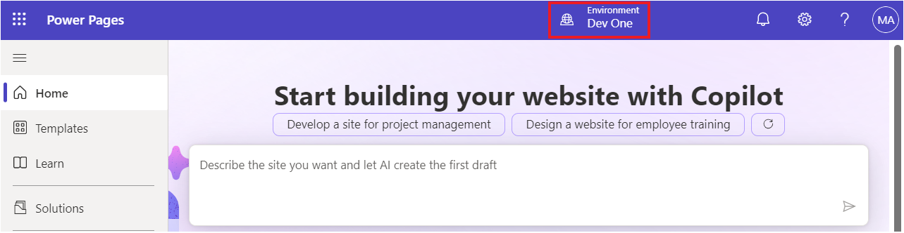

# **Lab 8: Erstellen einer erweiterbaren Webvorlage**

**Geschätzte Dauer:**25 Minuten

**Ziele:** In diesem Lab lernen Sie, wie Sie Liquid-Vorlagen mithilfe
von Extend- und Block-Tags erweitern, wie Sie Liquid-Vorlagen mithilfe
des Include-Tags wiederverwenden und wie Sie Tabellenberechtigungen auf
die Ergebnisse der neuen Vorlage anwenden.

**Aufgabe 1: Erstellen einer Teilvorlage**

Ihre erste Aufgabe besteht darin, eine Teilvorlage zu erstellen, die
nicht zum Rendern einer Seite verwendet, sondern in eine andere Vorlage
eingefügt wird.

1.  Melden Sie sich bei Power Pages an
    +++<https://make.powerpages.microsoft.com/>+++.

2.  Wählen Sie oben rechts die Zielumgebung **Dev One** aus.

> 

3.  Unter der Registerkarte **Active sites** wird Ihre Website –
    **Finance Advisor Search** – angezeigt. Wählen Sie „**Edit**“ aus.

> 

4.  Erweitern Sie das Erweiterungsmenü (Auslassungspunkte) und wählen
    Sie dann **Portal management** aus, um die Portal Management App zu
    öffnen.

> 

5.  Wählen Sie **Web Templates** aus.

> 

6.  Wählen Sie +**New** aus.

> 

7.  Geben Sie die folgenden Werte ein:

    - **Name** - +++Directory+++

    &nbsp;

    - **Website** - Wählen Sie Ihre aktuelle Website- Finance Advisor
      Search

    &nbsp;

    - **Source** - Geben Sie den folgenden Inhalt ein:

> 
>
> \<fetch\>
>
> \<entity name="account"\>
>
> \<attribute name="name" /\>
>
> \</entity\>
>
> \</fetch\>
>
> 
>
> 
>
> \<ul\>
>
> 
>
> \<li\>{{ account.name }}\</li\>
>
> 
>
> \</ul\>
>
> 
>
> \
You do not have permissions to
> access the directory.\</div\>
>
> 
>
> 

8.  Wählen Sie **Save & Close**.

> 

**Aufgabe 2: Erweitern einer vorhandenen Vorlage**

Als Nächstes erstellen Sie eine neue Vorlage, die eine vorhandene
Liquid-Vorlage erweitert, und fügen dann die zuvor erstellte Vorlage
ein.

1.  Wählen Sie im linken Navigationsbereich **Web Templates** aus.
    Wählen Sie +**New** aus.

> 

2.  Geben Sie die folgenden Werte ein:

    - **Name** - +++Directory Template+++

    &nbsp;

    - **Website** - Wählen Sie Ihre aktuelle Website- Finance Advisor
      Search

    &nbsp;

    - **Source** - Geben Sie den folgenden Inhalt ein:

> 
>
> 
>
> \<h2\>Directory\</h2\>
>
> 
>
> 
>
> 

3.  Wählen Sie **Save & Close**.

> 

**Aufgabe 3: Erstellen Sie eine Seiten Vorlage und verknüpfen Sie sie
mit dieser Seite**

In dieser Aufgabe erstellen Sie eine Seitenvorlage, die Ihre neue
Webvorlage verwendet und die Verzeichnisausgabe enthält.

1.  Wählen Sie im linken Navigationsbereich **Page Templates** aus.
    Wählen Sie +**New** aus.

> 

2.  Geben Sie die folgenden Werte ein:

    - **Name** - +++Directory Page Template+++

    &nbsp;

    - **Website** - Wählen Sie die aktuelle Website- Finance Advisor
      Search

    &nbsp;

    - **Type** - Wählen Sie **Web Template**

    &nbsp;

    - **Web Template** - Wählen Sie **Directory Template**

    &nbsp;

    - **Table Name** - Wählen Sie **Web Page**

3.  **Optional:** Fügen Sie ein Text-Element zum Seiteninhalt hinzu und
    geben Sie dann einen Text Ihrer Wahl ein.

4.  Wählen Sie **Save & Close**.

> 

**Aufgabe 4: Testen der Seitenvorlage**

Ihr nächster Schritt besteht darin, zu testen, ob Ihre neue Vorlage
funktioniert:

1.  Kehren Sie zur Registerkarte „Home“ der Power Pages
    Designstudio-Seite zurück.

2.  Wählen Sie **Sync**, um die Änderungen zu synchronisieren.

> 

3.  Wählen Sie den Arbeitsbereich **Pages** aus. Wählen Sie + **Page**
    aus.

> 

4.  Führen Sie im Dialogfeld **Add a page** die folgenden Schritte aus:

    1.  Geben Sie als page name +++ **Directory** +++ ein.

    &nbsp;

    1.  Wählen Sie **Custom layouts** und dann **Directory Page
        Template** aus.

    &nbsp;

    1.  Wählen Sie **Add**.

> 
>
> Die leere Seite wird mit der Meldung „You don't have permissions to
> access the directory“ im rechten Bereich angezeigt.
>
> 

**Aufgabe 5: Berechtigungen für Tabellen hinzufügen**

**Warnung:** Die Gewährung einer globalen Leseberechtigung für anonyme
Benutzer dient nur zu Illustrationszwecken. Seien Sie vorsichtig, um zu
vermeiden, dass Sie unbeabsichtigt sensible Informationen preisgeben,
indem Sie übermäßige Berechtigungen gewähren und keine geeigneten Filter
in Ihre Ansichten oder FetchXML-Ausdrücke aufnehmen.

Befolgen Sie diese Schritte, um Tabellenberechtigungen hinzuzufügen.

1.  Wählen Sie den **Security workspace** und dann **Table Permissions**
    aus.

> 

2.  Wählen Sie + **New permission**.

> 

3.  Geben Sie die folgenden Werte ein:

    - **Name** - +++Account Directory+++

    &nbsp;

    - **Table** - Wählen Sie **Account (account)** Tabelle

    &nbsp;

    - **Access type** - Wählen Sie **Global access**

    &nbsp;

    - **Permission to** - Wählen Sie **Read**

> 

4.  Wählen Sie **Add roles** aus.

5.  Wählen Sie **Anonymous users** und **Authenticated users** aus.

> 

6.  Wählen Sie **Save** aus.

> 

7.  Wählen Sie **Save** aus.

> 

**Aufgabe 6: Testen der Vorlage**

Ihre letzte Aufgabe besteht darin, Ihre neue Vorlage zu testen:

1.  Wählen Sie den Arbeitsbereich „**Pages**“ und dann die Seite
    „**Directory**“ aus.

> 

2.  Wählen Sie **Preview | Desktop**.

> 
>
> **Notiz:** Ein einfaches Aktualisieren der Browserseite reicht nicht
> aus, um die Daten zu aktualisieren. Mit diesem Befehl wird stattdessen
> der Site-Cache neu erstellt.
>
> Die Seite sollte jetzt angezeigt werden und die Liste der Konten im
> rechten Bereich enthalten.
>
> 

**Zusammenfassung:** In diesem Lab haben Sie gelernt, Liquid-Vorlagen zu
erstellen und zu erweitern. Sie haben eine neue Seitenvorlage erstellt,
die ein Seitenfenster enthält, in dem alle Konten in Dataverse
aufgelistet sind.
