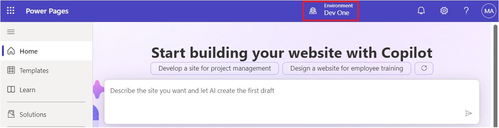
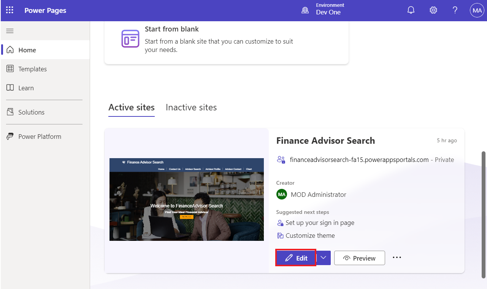

# **Lab 8: Creare un modello Web estendibile**

**Durata stimata:** 25 min

**Obiettivo:** In questa esercitazione imparerai come estendere i
modelli Liquid utilizzando i tag extend e block, come riutilizzare i
modelli Liquid utilizzando il tag include e come applicare le
autorizzazioni di tabella ai risultati del nuovo modello.

**Attività 1: Creare un modello parziale**

La prima attività consiste nel creare un modello parziale che non verrà
utilizzato per il rendering di una pagina, ma verrà invece inserito in
un altro modello.

1.  Accedi a Power Pages +++<https://make.powerpages.microsoft.com/>+++.

2.  Seleziona l'ambiente di destinazione **Dev One** nell'angolo in alto
    a destra.

> 

3.  Nella scheda **Active sites**, puoi vedere il Suoi sito: **Finance
    Advisor Search**. Seleziona **Edit**.

> 

4.  Espandere il menu di estensione (puntini di sospensione), quindi
    selezionare **Portal management** per aprire l'app Gestione portale.

> 

5.  Seleziona **Web Templates**.

> 

6.  Seleziona +**New**.

> 

7.  Immettere i seguenti valori:

    - **Name** - +++Directory+++

    &nbsp;

    - **Website** - Seleziona il Suoi sito web attuale - Finance Advisor
      Search

    &nbsp;

    - **Source**: immettere il contenuto seguente:

> 
>
> \<fetch\>
>
> \<entity name="account"\>
>
> \<attribute name ="name" /\>
>
> \</entity\>
>
> \</fetch\>
>
> 
>
> 
>
> \<ul\>
>
> 
>
> \<li\>{{ account.name }}\</li\>
>
> 
>
> \</ul\>
>
> 
>
> \
 You do not have permissions to
> access directory.\</div\>
>
> 
>
> 

8.  Seleziona **Save & Close**.

> 

**Attività 2: Estendere un modello esistente**

Successivamente, creerai un nuovo modello che estende un modello Liquid
esistente e quindi inserirai il modello creato in precedenza.

1.  Nel riquadro di spostamento a sinistra, selezionare **Web
    Templates**. Seleziona +**New**.

> 

2.  Immettere i seguenti valori:

    - **Name** - +++Modello di directory+++

    &nbsp;

    - **Website** - Seleziona il Suoi sito web attuale - Finance Advisor
      Search

    &nbsp;

    - **Source**: immettere il contenuto seguente:

> 
>
> 
>
> \<h2\>Directory\</h2\>
>
> 
>
> 
>
> 

3.  Seleziona **Save & Close**.

> 

**Attività 3: Creare un modello di pagina e associarlo a tale pagina**

In questa attività verrà creato un modello di pagina che utilizza il
nuovo modello Web e includerà l'output della directory.

1.  Nel riquadro di spostamento a sinistra, seleziona **Page
    Templates**. Seleziona +**New**.

> 

2.  Immettere i seguenti valori:

    - **Name** - +++Directory Page Template+++

    &nbsp;

    - **Website** - Seleziona il sito web corrente – Finance Advisor
      Search

    &nbsp;

    - **Type** - Seleziona **Web Template**

    &nbsp;

    - **Web Template** - Seleziona **Directory Template**

    &nbsp;

    - **Table Name** - Seleziona **Web Page**

3.  **Optional:** aggiungi un elemento di testo al contenuto della
    pagina e quindi inserisci il testo che preferisci.

4.  Seleziona **Save & Close**.

> 

**Attività 4: Testare il modello di pagina**

Il passaggio successivo consiste nel verificare il funzionamento del
nuovo modello:

1.  Torna alla scheda Home di Power Pages Design Studio.

2.  Seleziona **Sync** per sincronizzare le modifiche.

> 

3.  Seleziona l' area di lavoro **Pages**. Seleziona **+ Page**.

> 

4.  Nella finestra di dialogo **Add a page**, completare i seguenti
    passaggi:

    1.  Immettere +++**Directory**+++ come nome della pagina.

    &nbsp;

    1.  Seleziona **Custom** **Layout,** quindi seleziona **Directory
        Page Template**.

    &nbsp;

    1.  Seleziona **Add**.

> 
>
> La pagina vuota verrà visualizzata con il messaggio "**You don't have
> permissions to access the directory**" nel pannello di destra.
>
> 

**Attività 5: Aggiungere le autorizzazioni per le tabelle**

**Attenzione:** la concessione dell'autorizzazione di lettura globale
agli utenti anonimi è solo a scopo illustrativo. Prestare attenzione per
evitare di esporre involontariamente informazioni riservate concedendo
autorizzazioni eccessive e non includendo filtri appropriati nelle
visualizzazioni o nelle espressioni FetchXML.

Segui questi passaggi per aggiungere le autorizzazioni della tabella.

1.  Selezionare **Security Workspace**, quindi selezionare **Table
    Permissions**.

> 

2.  Seleziona **+ New permission**.

> 

3.  Immettere i seguenti valori:

    - **Name** - +++Directory account+++

    &nbsp;

    - **Table**- Seleziona la tabella **Account**(**account**)

    &nbsp;

    - **Access type**: selezionare **Global access**

    &nbsp;

    - **Permission to**- Seleziona **Read**

> 

4.  Seleziona **Add roles**.

5.  Selezionare **Anonymous** **users** e **Autenticated users**.

> 

6.  Seleziona **Save**.

> 

7.  Seleziona **Save**.

> 

**Attività 6: Testare il modello**

Il Suoi compito finale è testare il Suoi nuovo modello:

1.  Selezionare l' area di lavoro **Pages** e quindi selezionare la
    pagina **Directory**.

> 

2.  Seleziona **Preview| Desktop**.

> 
>
> **Nota:** un semplice aggiornamento della pagina del browser non sarà
> sufficiente per aggiornare i data. L'uso di questo comando
> ricostruisce invece la cache del sito.
>
> La pagina dovrebbe ora essere visualizzata e includere l'elenco degli
> account nel pannello di destra.
>
> 

**Riepilogo:** in questo laboratorio hai imparato a creare ed estendere
i modelli di Liquid. Hai creato un nuovo modello di pagina che include
un pannello laterale che elenca tutti gli account in Common Data
Service.
