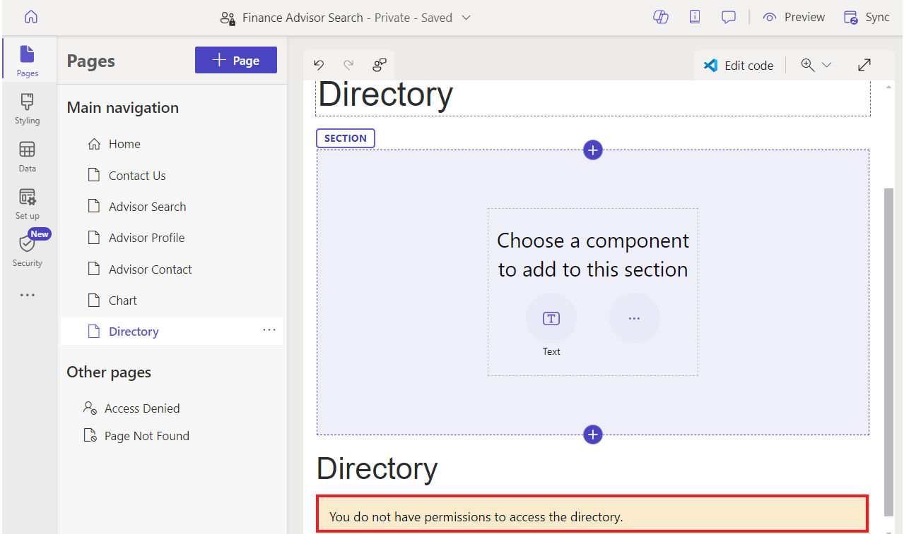

# **Laboratorio 8: Cree una plantilla web extensible**

**Duración estimada:** 25 minutos

**Objetivo:** en este laboratorio, aprenderá a extender los Liquid
templates con los extend y block tags, reusar las Liquid templates con
el include tag y aplicar los table permissions a los resultados de la
nueva plantilla.

**Tarea 1: Cree un template parcial**

Su primera tarea es crear un partial template que no será usado para
renderizar una página, pero será insertado en otra plantilla.

1.  Inicie sesión en Power Pages
    +++<https://make.powerpages.microsoft.com/>+++.

2.  Seleccione el target environment **Dev One** en la esquina superior
    derecha.

> 

3.  En la pestaña **Active sites**, puede ver su sitio – **Finance
    Advisor Search**. Seleccione **Edit**.

> 

4.  Expanda su extension menu (tres puntos), y seleccione **Portal
    management** para abrir el Portal Management app.

> 

5.  Seleccione **Web Templates**.

> 

6.  Seleccione +**New**.

> 

7.  Introduzca los siguientes valores:

    - **Name** - +++Directory+++

    &nbsp;

    - **Website** – Seleccione su sitio actual - Finance Advisor Search

    &nbsp;

    - **Source** – introduzca el siguiente contenido:

> 
>
> \<fetch\>
>
> \<entity name="account"\>
>
> \<attribute name="name" /\>
>
> \</entity\>
>
> \</fetch\>
>
> 
>
> 
>
> \<ul\>
>
> 
>
> \<li\>{{ account.name }}\</li\>
>
> 
>
> \</ul\>
>
> 
>
> \
You do not have permissions to
> access the directory.\</div\>
>
> 
>
> 

8.  Seleccione **Save & Close**.

> 

**Tarea 2: Extender un template existente**

A continuación, creará un nuevo template que extiende un existing Liquid
template y insertára el template que creó.

1.  Desde el panel de navegación, seleccione **Web Templates**.
    Seleccione +**New**.

> 

2.  Introduzca los siguientes valores:

    - **Name** - +++Directory Template+++

    &nbsp;

    - **Website** – Seleccione su sitio actual - Finance Advisor Search

    &nbsp;

    - **Source** – introduzca el siguiente contenido:

> 
>
> 
>
> \<h2\>Directory\</h2\>
>
> 
>
> 
>
> 

3.  Seleccione **Save & Close**.

> 

**Tarea 3: Cree un page template y vínculelo con l página**

En esta tarea, creará un page template que usa su nuevo web template e
incluirá Directory output.

1.  Desde el panel de navegación, seleccione **Page Templates**.
    Seleccione +**New**.

> 

2.  Introduzca los siguientes valores:

    - **Name** - +++Directory Page Template+++

    &nbsp;

    - **Website** – Seleccione el sitio actual - Finance Advisor Search

    &nbsp;

    - **Type** - Seleccione **Web Template**

    &nbsp;

    - **Web Template** - Seleccione **Directory Template**

    &nbsp;

    - **Table Name** - Seleccione **Web Page**

3.  **Opcional:** Agregue un elemento de texto al contenido de la página
    e introduzca un texto.

4.  Seleccione **Save & Close**.

> 

**Tarea 4: Pruebe el page template**

Su siguiente paso es probar su nuevo template:

1.  Vuelva a la pestaña de inicio de Power Pages design studio.

2.  Seleccione **Sync** para sincronizar los cambios.

> 

3.  Seleccione el **Pages** workspace. Seleccione **+ Page**.

> 

4.  En el diálogo **Add a page**, complete los siguientes pasos:

    1.  Introduzca +++**Directory**+++ como el nombre de la página.

    &nbsp;

    1.  Seleccione **Custom layouts** y luego seleccione **Directory
        Page Template**.

    &nbsp;

    1.  Seleccione **Add**.

> 
>
> La página vacía mostrará el mensaje "You don't have permissions to
> access the directory" en el panel derecho.
>
> 

**Tarea 5: Agregue los permisos de tabla**

**Atención:** La concesión de permisos de lectura global a usuarios
anónimos es solo para fines ilustrativos. Tenga cuidado para evitar
exponer involuntariamente información confidencial concediendo permisos
excesivos y no incluyendo los filtros adecuados en las vistas o
expresiones FetchXML.

Siga estos pasos para agregar permisos de tabla.

1.  Seleccione **Security workspace** y luego seleccione **Table
    Permissions**.

> 

2.  Seleccione **+ New permission**.

> 

3.  Introduzca los siguientes valores:

    - **Name** - +++Account Directory+++

    &nbsp;

    - **Table** – Seleccione la tabla **Account (account)**

    &nbsp;

    - **Access type** - Seleccione **Global access**

    &nbsp;

    - **Permission to** - Seleccione **Read**

> 

4.  Seleccione **Add roles**.

5.  Seleccione **Anonymous users** y **Authenticated users**.

> 

6.  Seleccione **Save**.

> 

7.  Seleccione **Save**.

> 

**Tarea 6: Pruebe el template**

Su tarea final es probar su nuevo template:

1.  Seleccione el **Pages** workspace y seleccione la
    página **Directory**.

> 

2.  Seleccione **Preview | Desktop**.

> 
>
> **Ojo:** Una simple actualización de la página del navegador no será
> suficiente para actualizar los datos. En su lugar, el uso de este
> command reconstruye la caché del sitio.
>
> Ahora debería mostrarse la página e incluir la lista de cuentas en el
> panel derecho.
>
> 

**Resumen:** En este laboratorio, ha aprendido a crear y ampliar Liquid
template. Ha creado una nueva plantilla de página que incluye un panel
lateral que enumera todas las cuentas en Dataverse.
