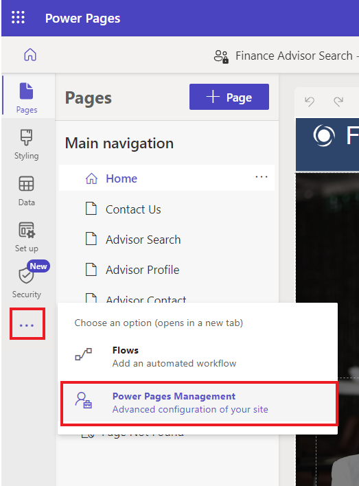

# **实验 8：创建可扩展的 Web 模板**

**预计持续时间：** 25 分钟

**目标：**在本实验中，您将学习如何使用 extend 和 block 标签扩展 Liquid
模板，如何使用 include 标签重复使用 Liquid
模板，以及如何将表权限应用于新模板的结果。

**任务 1：创建部分模板**

您的第一个任务是创建一个部分模板，该模板不会用于呈现页面，而是将插入到另一个模板中。

1.  登录到 Power Pages +++<https://make.powerpages.microsoft.com/>+++。

2.  在右上角选择目标环境 **Dev One**。

> 

3.  在 **Active sites** （活动站点） 选项卡下，您可以看到您的网站 –
    **Finance Advisor Search**（财务顾问搜索）。选择 **Edit**（编辑）。

> 

4.  展开 扩展 菜单（省略号），然后选择 **Portal management** 打开
    门户管理 应用。

> 

5.  选择 **Web Templates**。

> 

6.  选择 +**New**。

> 

7.  输入以下值：

    - **名称 -** +++Directory+++

    &nbsp;

    - **网站 -** 选择您当前的网站 - Finance Advisor Search

    &nbsp;

    - **源 -** 输入以下内容：

> 
>
> \<fetch\>
>
> \<entity name="account"\>
>
> \<attribute name="name" /\>
>
> \</entity\>
>
> \</fetch\>
>
> 
>
> 
>
> \<ul\>
>
> 
>
> \<li\>{{ account.name }}\</li\>
>
> 
>
> \</ul\>
>
> 
>
> \
You do not have permissions to
> access the directory.\</div\>
>
> 
>
> 

8.  选择 **Save & Close**。

> 

**任务 2：扩展现有模板**

接下来，您将创建一个扩展现有 Liquid
模板的新模板，然后插入您之前创建的模板。

1.  从左侧导航窗格中，选择 **Web Templates**。选择 **+New**。

> 

2.  输入以下值：

    - **名称 -** +++Directory Template+++

    &nbsp;

    - **网站 -** 选择您当前的网站 - Finance Advisor Search

    &nbsp;

    - **源 -** 输入以下内容：

> 
>
> 
>
> \<h2\>Directory\</h2\>
>
> 
>
> 
>
> 

3.  选择 **Save & Close**。

> 

**任务 3：创建页面模板并与该页面关联**

在此任务中，您将创建一个页面模板，该模板使用您的新 Web 模板，并将包含
Directory 输出。

1.  从左侧导航窗格中，选择 **Page Templates**。选择 **+New**。

> 

2.  输入以下值：

    - **名称 -** +++Directory Page Template+++

    &nbsp;

    - **网站 -** 选择当前网站 - Finance Advisor Search

    &nbsp;

    - **类型 -** 选择**Web Template**

    &nbsp;

    - **Web Template** – 选择**Directory Template**

    &nbsp;

    - **表名称 -** 选择 **网页**

3.  **可选：**将文本元素添加到页面内容中，然后输入您选择的文本。

4.  选择 **Save & Close**。

> 

**任务 4：测试页面模板**

下一步是测试新模板是否正常工作：

1.  返回到 Power Pages 设计工作室的主页选项卡。

2.  选择 **Sync** 以同步更改。

> 

3.  选择 **Pages** 工作区。选择 **+ Page**。

> 

4.  在 **Add a page** （添加页面） 对话框中，完成以下步骤：

    1.  输入 +++**Directory**+++ 作为页面名称。

    &nbsp;

    1.  选择 **Custom layouts** ，然后选择 **Directory Page Template**。

    &nbsp;

    1.  选择 **Add**。

> 
>
> 空页面将在右侧面板中显示消息 “You don't have permissions to access the
> directory” 。
>
> 

**任务 5：添加表权限**

**警告：**向匿名用户授予全局读取权限仅用于说明目的。请谨慎行事，以避免通过授予过多权限以及未在视图或
FetchXML 表达式中包含适当的筛选器来无意中暴露敏感信息。

按照以下步骤添加表权限。

1.  选择 “**Security workspace**” ，然后选择 “**Table Permissions**” 。

> 

2.  选择 **+ New permission**。

> 

3.  输入以下值：

    - **名称 -** +++Account Directory+++

    &nbsp;

    - **表 -** 选择 **Account (account)** 表

    &nbsp;

    - **访问类型 -** 选择 **Global access**

    &nbsp;

    - **权限 -** 选择 **Read**

> 

4.  选择 **Add roles**（添加角色）。

5.  选择 **Anonymous users** （匿名用户） 和 **Authenticated users**
    （经过身份验证的用户）。

> 

6.  选择 **Save** （保存）。

> 

7.  选择 **Save** （保存）。

> 

**任务 6：测试模板**

您的最后一项任务是测试您的新模板：

1.  选择 **Pages** 工作区，然后选择 **Directory** 页面。

> 

2.  选择 **Preview | Desktop**。

> 
>
> **注意：**简单的浏览器页面刷新不足以更新数据。请改用此命令重新构建站点缓存。
>
> 现在应显示该页面，并在右侧面板中包含帐户列表。
>
> 

**摘要：**在本实验中，您学习了构建和扩展 Liquid
模板。您构建了一个新的页面模板，其中包括一个列出 Dataverse
中所有客户的侧面板。
