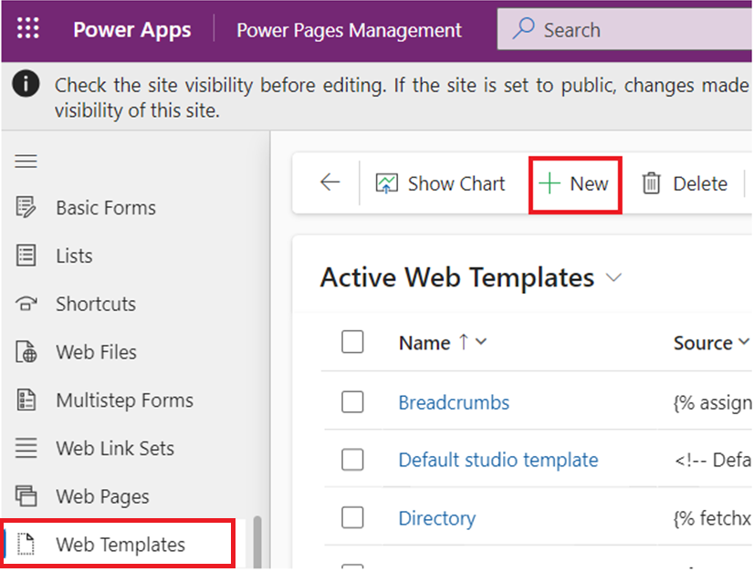

# **實驗 8：創建可擴展的 Web 模板**

**預計持續時間：** 25 分鐘

**目標：**在本實驗中，您將學習如何使用 extend 和 block 標簽擴展 Liquid
模板，如何使用 include 標簽重複使用 Liquid
模板，以及如何將表權限應用於新模板的結果。

**任務 1：創建部分模板**

您的第一個任務是創建一個部分模板，該模板不會用於呈現頁面，而是將插入到另一個模板中。

1.  登錄到 Power Pages +++<https://make.powerpages.microsoft.com/>+++。

2.  在右上角選擇目標環境 **Dev One**。

> 

3.  在 **Active sites** （活動站點） 選項卡下，您可以看到您的網站 –
    **Finance Advisor Search**（財務顧問搜索）。選擇 **Edit**（編輯）。

> 

4.  展開 擴展 菜單（省略號），然後選擇 **Portal management** 打開
    門戶管理 應用。

> 

5.  選擇 **Web Templates**。

> 

6.  選擇 +**New**。

> 

7.  輸入以下值：

    - **名稱 -** +++Directory+++

    &nbsp;

    - **網站 -** 選擇您當前的網站 - Finance Advisor Search

    &nbsp;

    - **源 -** 輸入以下內容：

> 
>
> \<fetch\>
>
> \<entity name="account"\>
>
> \<attribute name="name" /\>
>
> \</entity\>
>
> \</fetch\>
>
> 
>
> 
>
> \<ul\>
>
> 
>
> \<li\>{{ account.name }}\</li\>
>
> 
>
> \</ul\>
>
> 
>
> \
You do not have permissions to
> access the directory.\</div\>
>
> 
>
> 

8.  選擇 **Save & Close**。

> 

**任務 2：擴展現有模板**

接下來，您將創建一個擴展現有 Liquid
模板的新模板，然後插入您之前創建的模板。

1.  從左側導航窗格中，選擇 **Web Templates**。選擇 **+New**。

> 

2.  輸入以下值：

    - **名稱 -** +++Directory Template+++

    &nbsp;

    - **網站 -** 選擇您當前的網站 - Finance Advisor Search

    &nbsp;

    - **源 -** 輸入以下內容：

> 
>
> 
>
> \<h2\>Directory\</h2\>
>
> 
>
> 
>
> 

3.  選擇 **Save & Close**。

> 

**任務 3：創建頁面模板並與該頁面關聯**

在此任務中，您將創建一個頁面模板，該模板使用您的新 Web 模板，並將包含
Directory 輸出。

1.  從左側導航窗格中，選擇 **Page Templates**。選擇 **+New**。

> 

2.  輸入以下值：

    - **名稱 -** +++Directory Page Template+++

    &nbsp;

    - **網站 -** 選擇當前網站 - Finance Advisor Search

    &nbsp;

    - **類型 -** 選擇**Web Template**

    &nbsp;

    - **Web Template** – 選擇**Directory Template**

    &nbsp;

    - **表名稱 -** 選擇 **網頁**

3.  **可選：**將文本元素添加到頁面內容中，然後輸入您選擇的文本。

4.  選擇 **Save & Close**。

> 

**任務 4：測試頁面模板**

下一步是測試新模板是否正常工作：

1.  返回到 Power Pages 設計工作室的主頁選項卡。

2.  選擇 **Sync** 以同步更改。

> 

3.  選擇 **Pages** 工作區。選擇 **+ Page**。

> 

4.  在 **Add a page** （添加頁面） 對話框中，完成以下步驟：

    1.  輸入 +++**Directory**+++ 作為頁面名稱。

    &nbsp;

    1.  選擇 **Custom layouts** ，然後選擇 **Directory Page Template**。

    &nbsp;

    1.  選擇 **Add**。

> 
>
> 空頁面將在右側面板中顯示消息 “You don't have permissions to access the
> directory” 。
>
> 

**任務 5：添加表權限**

**警告：**向匿名用戶授予全域讀取權限僅用於說明目的。請謹慎行事，以避免通過授予過多權限以及未在視圖或
FetchXML 表達式中包含適當的篩選器來無意中暴露敏感信息。

按照以下步驟添加表權限。

1.  選擇 “**Security workspace**” ，然後選擇 “**Table Permissions**” 。

> 

2.  選擇 **+ New permission**。

> 

3.  輸入以下值：

    - **名稱 -** +++Account Directory+++

    &nbsp;

    - **表 -** 選擇 **Account (account)** 表

    &nbsp;

    - **訪問類型 -** 選擇 **Global access**

    &nbsp;

    - **權限 -** 選擇 **Read**

> 

4.  選擇 **Add roles**（添加角色）。

5.  選擇 **Anonymous users** （匿名用戶） 和 **Authenticated users**
    （經過身份驗證的用戶）。

> 

6.  選擇 **Save** （保存）。

> 

7.  選擇 **Save** （保存）。

> 

**任務 6：測試模板**

您的最後一項任務是測試您的新模板：

1.  選擇 **Pages** 工作區，然後選擇 **Directory** 頁面。

> 

2.  選擇 **Preview | Desktop**。

> 
>
> **注意：**簡單的瀏覽器頁面刷新不足以更新數據。請改用此命令重新構建站點緩存。
>
> 現在應顯示該頁面，並在右側面板中包含帳戶列表。
>
> 

**摘要：**在本實驗中，您學習了構建和擴展 Liquid
模板。您構建了一個新的頁面模板，其中包括一個列出 Dataverse
中所有客戶的側面板。
