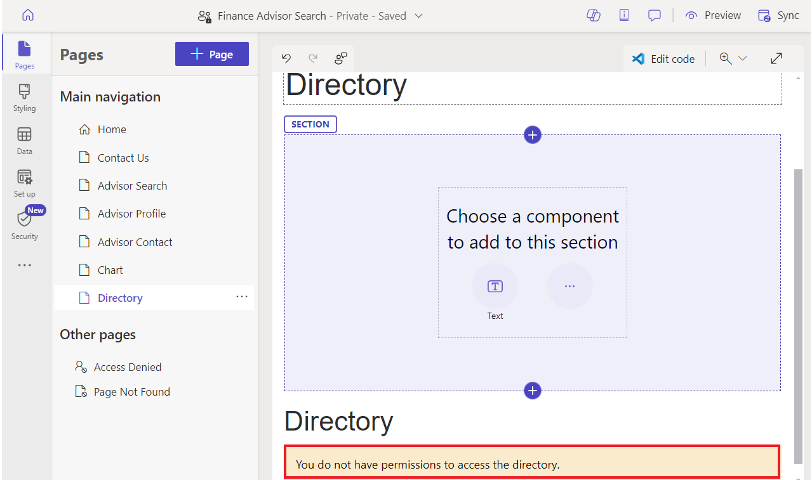

# **Atelier 8 : Création d'un modèle web extensible**

**Durée estimée :** 25 min

**Objectif :** Dans cet atelier, vous apprendrez à étendre les modèles
Liquid à l'aide des balises extend et block, à réutiliser les modèles
Liquid à l'aide de la balise include et à appliquer des autorisations de
table aux résultats du nouveau modèle.

**Tâche 1 : Créer un modèle partiel**

Votre première tâche consiste à créer un modèle partiel qui ne sera pas
utilisé pour afficher une page, mais qui sera inséré dans un autre
modèle.

1.  Connectez-vous à Power Pages
    +++<https://make.powerpages.microsoft.com/>+++.

2.  Sélectionnez l'environnement cible **Dev One** dans le coin
    supérieur droit.

> 

3.  Sous l'onglet **Active sites**, vous pouvez voir votre site –
    **Finance Advisor Search**. Sélectionnez **Edit**.

> 

4.  développez le menu d'extension (points de suspension), puis
    sélectionnez **Portal management**  pour ouvrir l'application
    Gestion du portail.

> 

5.  Sélectionnez **Web Templates**..

> 

6.  Sélectionnez +**New**.

> 

7.  Entrez les valeurs suivantes :

    - **Name** - +++Annuaire+++

    &nbsp;

    - **Website** - Sélectionnez votre site Web actuel - Recherche de
      conseillers financiers

    &nbsp;

    - **Source** : entrez le contenu suivant :

> 
>
> \<fetch\>
>
> \<entity name="account"\>
>
> \<attribute name="name" /\>
>
> \</entity\>
>
> \</fetch\>
>
> 
>
> 
>
> \<ul\>
>
> 
>
> \<li\>{{ account.name }}\</li\>
>
> 
>
> \</ul\>
>
> 
>
> \
You do not have permissions to
> access the directory.\</div\>
>
> 
>
> 

8.  Sélectionnez **Save & Close**

> 

**Tâche 2 : Étendre un modèle existant**

Ensuite, vous allez créer un nouveau modèle qui étend un modèle Liquid
existant, puis insérer le modèle que vous avez précédemment créé.

1.  Dans le volet de navigation de gauche, sélectionnez **Web
    Templates**.. Sélectionnez +**New**.

> 

2.  Entrez les valeurs suivantes :

    - **Name** - +++Modèle d'annuaire+++

    &nbsp;

    - **Website** - Sélectionnez votre site Web actuel - Recherche de
      conseillers financiers

    &nbsp;

    - **Source** : entrez le contenu suivant :

> 
>
> 
>
> \<h2\>Directory\</h2\>
>
> 
>
> 
>
> 

3.  Sélectionnez **Save & Close**.

> 

**Tâche 3 : Créer un modèle de page et l'associer à cette page**

Dans cette tâche, vous allez créer un modèle de page qui utilise votre
nouveau modèle Web et qui inclura la sortie du Répertoire.

1.  Dans le volet de navigation de gauche, sélectionnez **Page
    Templates**. Sélectionnez +**New**.

> 

2.  Entrez les valeurs suivantes :

    - **Name** - +++Modèle de page d'annuaire+++

    &nbsp;

    - **Website** - Sélectionnez le site Web actuel - Recherche de
      conseillers financiers

    &nbsp;

    - **Type** - Sélectionner **un modèle Web**

    &nbsp;

    - **Web Template**  - Sélectionnez **Directory Template**

    &nbsp;

    - **Nom de la table** - Sélectionner **Web page**

3.  **Facultatif :** Ajoutez un élément de texte au contenu de la page,
    puis saisissez le texte de votre choix.

4.  Sélectionnez **Save & Close**..

> 

**Tâche 4 : Tester le modèle de page**

L'étape suivante consiste à tester que votre nouveau modèle fonctionne :

1.  Revenez à l'onglet Accueil du studio de design Power Pages.

2.  Sélectionnez **Sync** pour synchroniser les modifications.

> 

3.  Sélectionnez l' espace de travail Pages. Sélectionnez **+ Page**.

> 

4.  Dans la boîte de dialogue **Add a page** , procédez comme suit :

    1.  Entrez +++**Directory+++** comme nom de page.

    &nbsp;

    1.  Sélectionnez **Custom layouts** , puis Sélectionnez Modèle
        **Directory Page Template**.

    &nbsp;

    1.  Sélectionnez **Add**.

> 
>
> La page vide s'affichera avec le message “Vous n'avez pas les
> autorisations pour accéder au repertoire” dans le panneau de droite.
>
> 

**Tâche 5 : Ajouter des autorisations de table**

**Avertissement :** L'octroi d'une autorisation de lecture globale à des
utilisateurs anonymes n'est fourni qu'à titre d'illustration. Faites
attention à ne pas exposer involontairement des informations sensibles
en accordant des autorisations excessives et en n'incluant pas les
filtres appropriés dans vos vues ou expressions FetchXML.

Suivez ces étapes pour ajouter des autorisations de table.

1.  Sélectionnez **Security workspace** , puis Autorisations **Table
    Permissions**.

> 

2.  Sélectionnez **+ New Permissions**.

> 

3.  Entrez les valeurs suivantes :

    - **Name**- +++Répertoire des comptes+++

    &nbsp;

    - **Table** - Sélectionnez la **Table** Compte (compte)

    &nbsp;

    - **Access Type** : sélectionnez **global Access**

    &nbsp;

    - **Permission to** - Sélectionnez **Read**

> 

4.  Sélectionnez **Add roles**.

5.  Sélectionnez **Anonymous users** et **Authenticated users**.

> 

6.  Sélectionnez **Save**.

> 

7.  Sélectionnez **Save**.

> 

**Tâche 6 : Tester le modèle**

Votre dernière tâche consiste à tester votre nouveau modèle :

1.  Sélectionnez l'espace de **t**ravail **Pages**, puis la page
    Sélectionnez **Directory**.

> 

2.  Sélectionnez **Preview | Desktop**.

> 
>
> **Remarque :** Une simple actualisation de la page du navigateur ne
> suffira pas à mettre à jour les données. L'utilisation de cette
> commande à la place reconstruit le cache du site.
>
> La page devrait maintenant s'afficher et inclure la liste des comptes
> dans le panneau de droite.
>
> 

**Résumé :** Dans cet atelier, vous avez appris à créer et à étendre des
modèles Liquid. Vous avez créé un nouveau modèle de page qui inclut un
panneau latéral qui répertorie tous les comptes dans Dataverse.
