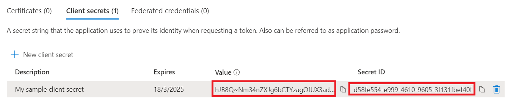
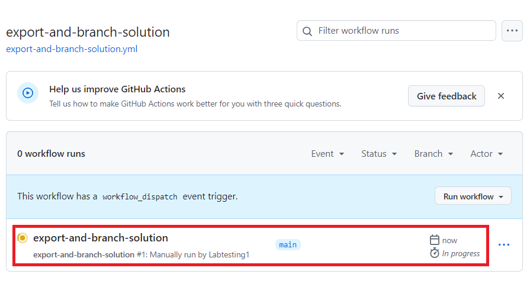

**실습 9: Microsoft Power Platform용 GitHub Actions를 사용하여 솔루션
배포를 자동화하기**

## **작업 1: 앱 동록을 생성하기**

1.  Office 365 테넌트 자격 증명으로 <https://portal.azure.com/#home>
    사용하여 Microsoft Azure portal에 로그인하세요.

2.  **Get started**를 선택하세요.

> 

3.  ‘How do you plan to use Azure’ 페이지에 대한 **Skip**를 선택하세요.

> 

4.  ‘Now, let’s show you around Azure’ 페이지에 대한 **Skip**를
    선택하세요.

> 

5.  포털의 **Home** 페이지에서 검색 상자에서 **Microsoft Entra ID**를
    입력허고 다음 제안된 서비스 목록에서 선택하세요.

> 

6.  왼쪽 탐색 창에서 **Manage**를 선택하고 **App registrations**을
    선택하세요.

> 

7.  **App registrations** 페이지에서 **+ New registration**를
    선택하세요.

> 

8.  On the **App registrations** 페이지에서 테이블에 설명된 대로
    애플리케이션 등록 정보를 입력하세요.

[TABLE]

> 

9.  애플리케이션 등록을 생성하기 위해 **Register**를 선택하세요.

> 

10. 앱 등록 개요 페이지가 표시됩니다. 왼쪽 탐색 차에서 **Certificates &
    secrets**를 선택하여 클라이언트 암호를 추가하세요. **Client
    secrets** 탭을 선택하고 **+New client secret**을 선택하세요.

> 

11. 클라이언트 암호에 대한 지정된 **description** – **My sample client
    secret**을 추가하세요. 암호에 대한 **expiration**를 **Recommended:
    180 days (6 months)**로 선택한 후 **Add**를 선택하세요.

> 

12. 클라이언트 애플리케이션 코드에서 사용할 수 있도록 메모장에
    **secret's value and ID**를 저장하세요. 이 암호 값은 이 페이지를
    떠난 후에는 다기 표시되지 않습니다.

> **중요:** 암호 값에 다시 액세스할 수 없으므로 암호 값 (ID 아님)을
> 복사할 때까지 클라이언트 암호 페이지에서 벗어나지 마세요.
>
> 

## **작업 2: 새 앱 사용자를 생성하기**

앱 사용자를 생성하고 앱 등록에 바인딩하기 위해 다음 단계를 수행하세요.

1.  Office 365 테넌트 자격 증명을 사용하여 Power Platform 관리 센터에
    <https://admin.powerplatform.microsoft.com/>로 로그인하세요.

2.  왼쪽 탐색 창에서 **Environments**를 선택하고 환경 정보를 표시하기
    위해 목록에서 **Dev One** 환경을 선택하세요.

> 

3.  페이지 오른쪽의 **S2S apps** 아래에서 **See all** 링크를 선택하세요.

> 

4.  \+ **New app user**를 선택하세요.

> 

5.  **Create a new app user** 슬라이드 아웃에서 **+ Add an app**을
    선택하세요.

> 

6.  검색 필드에 앱 등록 이름인 **Mytestingapp**을 입력하기 시작한 후
    결과 목록에서 선택(확인)하세요. **Add**를 선택하세요.

> 

7.  **Create a new app user** 슬라이드로 돌아가서 드롭다운에서
    **Business unit** 를 선택하세요. **Security roles** 앞에 있는
    **pencil icon**을 선택하고, 앱 사용자(서비스 원칙이라고도 함)에 대한
    **System Administrator**를 선택하고, **Save**을 선택하세요.

> 

8.  **Create**를 선택하세요.

> 

9.  표시된 애플리케이션 사용자 목록에 새 애플리케이션 사용자가
    표시됩니다.

> 

## **작업 3:** **Model-driven app을 빌드하기**

Model-driven app을 빌드하기 위해 다음 단계를 수행하세요.

1.  브라우저에서
    [https://make.powerapps.com](https://make.powerapps.com/) 로
    이동하여 자격 증명으로 로그인하세요. 헤더에서 환경 선택기 드롭다운을
    클릭하고 개발 환경을 선택하세요.

> 

2.  왼쪽 탐색에서 **Solutions** 영역을 클릭하고 새 솔루션을 생성하기
    위해 **New solution** 버튼을 클릭하세요.

> 

3.  솔루션의 **Display name**을 **GitHub Lab**으로 입력하세요, **Name**
    – **GitHubLab**. Publisher의 **+New publisher**를 선택하세요.

> 

4.  이 실습에서는 **display name**을 **'GitHub Lab'**, **name**을
    **'GitHubLab'**, **prefix**을 **‘gitlab’**로 입력하고 **Save** 및
    **Close**를 선택하세요.

> 

5.  새 솔루션 패널에서 방금 생성한 **publisher – GitHub Lab**을 선택하고
    환경에서 관리되지 않는 새 솔루션을 생성하기 위해 **Create**를
    클릭하세요.

> 

6.  새 솔루션은 비어 있으며 구성 요소를 추가해야 합니다. 이 실습에서는
    사용자 지정 테이블을 생성할 것입니다. 상단 탐색 메뉴에서 **+ New**
    드롭다운을 클릭하고 **Table \> Set advanced properties**을
    선택하세요.

> 

7.  **Display name – Time Off Request**를 입력하면 복수 이름이
    생성됩니다. 테이블을 생성하기 위해 **Save**를 클릭하세요.

> 

8.  보기로 돌아가서 다른 구성 요소를 추가하기 위해 테이블이 생성해지면
    이동 경로 탐색에서 테이블을 선택하세요.

> 

9.  **+ New** 드롭다운에서 **App**을 클릭하고 **Model-driven app**을
    클릭하세요.

> 

10. 앱 이름 – **Time Off Requests**을 입력하고 **Create** 버튼을
    클릭하세요.

> 

11. 애플리케이션 디자이너에서 **+ Add page**를 클릭하세요.

> 

12. **Dataverse table**을 선택하세요.

> 

13. **Time Off Request**을 선택하고 **Show in navigation**을 확인란을
    선택하세요. **Add**를 선택하세요.

> 

14. **Publish**를 클릭하고 게시 작업이 완료되면 **Play**를 클릭하세요.

> 

15. 그러면 애플리케이션이 어떻게 보이는지 볼 수 있도록 애플리케이션으로
    이동합니다. 애플리케이션을 사용하고 만족스러우면 탭을 닫을 수
    있습니다.

> 

## **작업 4: GitHub Account을 생성하기**

**참고:** 기존 GitHub Account이 있는 경우 이 작업을 건너뛰고 다음
작업으로 이동할 수 있습니다.

1.  [https://github.com](https://github.com/)로 이동하고 **Sign
    up** 또는 **Start a free trial**을 클릭하세요 (또는 기존 계정이 있는
    경우 로그인하세요).

> 

2.  **Email id**를 입력하고**Continue**을 클릭하세요.

> 

3.  자동으로 생성된 비밀번호를 유지하거나 자신의 비밀번호를 생성하고
    **Continue**를 클릭하세요.

> 

4.  **Username – Labtesting1**을 입력하고 **Continue**를 클릭하세요.
    지정된 사용자 이름을 사용할 수 없는 경우 다른 사용자 이름을
    입력하세요.

> 

5.  **Continue**를 선택하세요.

> 

6.  ‘Verify your account’ 페이지에서 **Verify**를 선택하세요.

> 

7.  확인 절차를 완료하고 이메일 ID로 받은 실행 코드를 사용하세요.

8.  나타내는 ‘Sign in to GitHub’ 창에서 **Sign in**을 선택하세요.

> 

9.  **Skip personalization**을 선택하세요.

> 

## **작업 5: Service Principal Authentication을 위한 새 암호를 생성하기**

1.  계정을 만든 후 Create repository를 선택하여 리포지토리를 생성하세요.

> 
>
> 다음과 같은 대체 랜딩 화면이 표시됩니다:
>
> 

2.  새 리포지토리를 생성하고 이름을 '**poweractionslab**'으로
    지정하세요. **Add a README file**을 선택하여 리포지토리를 시작하고
    **Create repository**를 선택하세요.

> 

3.  저장소로 이동하여 **Settings**을 클릭하세요.

> 

4.  왼쪽 옆 창에서 **Secrets and variables**을 확장하고 **Actions**을
    클릭하세요.

> 

5.  아래로 스크롤하여 **New repository secret**을 선택하세요.

> 

6.  비밀 페이지에서 비밀의 이름을 '**PowerPlatformSPN**'으로 지정하세요.
    Microsoft Entra에서 만든 애플리케이션 등록의 클라이언트 암호
    값(메모장에 저장)을 사용하고 **Secret **필드에 입력한 후 **Add
    secret**를 선택하세요. 클라이언트 암호는 이 랩의 뒷부분에서 GitHub
    워크플로를 정의하는 데 사용되는 YML 파일에서 참조됩니다.

> 

이제 클라이언트 암호가 GitHub 비밀로 안전하게 저장됩니다.

## **작업 6: 솔루션 파일을 새 분기로 내보내고 압축을 푸는 워크플로를 생성하기**

1.  위의 수평 팔레트에서 **Actions**를 클릭하세요.

> 

2.  Suggested for this repository 섹션 아래의 **Simple workflow**
    상자에서 **Configure**를 클릭하세요.

> 

3.  그러면 GitHub 작업을 시작하는 데 도움이 되는 기본 워크플로가 포함된
    새 YAML 파일이 시작됩니다.

> 

4.  미리 생성된 콘텐츠를 삭제하고
    [export-and-branch-solution-with-spn-auth.yml](https://github.com/microsoft/powerplatform-actions-lab/blob/main/sample-workflows/export-and-branch-solution-with-spn-auth.yml)
    파일에서 콘텐츠를 붙여넣으세요. VM의 새 탭에서 지정된 링크를 여세요.

> 

5.  파일을 **export-and-branch-solution.yml**로 **Rename**하세요.

> 

6.  28번 줄의 \<ENVIRONMENTURL\>을 내보내려는 개발 환경의 URL로
    업데이트하세요.

> 
>
> 환경 URL을 가져오려면 **Power Platform Admin center**로 이동하세요.
> 왼쪽 탐색 영역에서 **Environment**을 선택하고 **Dev One**을 클릭한 후
> 환경 URL을 복사하세요.
>
> 

7.  **Environment URL**을 yml 파일에 **Paste**하세요. https://를 꼭
    추가하세요. URL은 지정된 형식이어야 합니다 -
    https://orgfc5xxxfd.crm.dynamics.com

> 

8.  \<APPID\> 및 \<TENANT ID\>를 값으로 업데이트하세요. 이 두 값을
    얻으려면 Azure Portal로 이동한 후 **Home** \> **Microsoft Entra ID**
    \> **App** 등록을 선택한 후 **All applications** 탭을 선택한 후
    **Mytestingapp**을 선택하세요.

> 
>
> 

9.  29 번과 30 번 줄에 값을 붙여 넣으세요.

> 

10. 코드의 12번 줄에서 기본값 ALMLab을 이 경우 솔루션 이름인
    GitHubLab으로 변경하세요. 공백을 남기지 말고 주어진 대로 올바르게
    작성하세요. 솔루션에 다른 이름을 지정한 경우 여기에 작성하세요.

> 

11. 이제 변경 사항을 커밋할 준비가 되었습니다. **Commit changes**을
    선택한 후 열리는 Commit changes창에서 **Commit changes**을
    선택하세요.

> 
>
> 축하합니다, 다음 작업을 사용하여 첫 번째 GitHub 워크플로를
> 생성했습니다:

- **Who Am I**: 내보내는 환경에 성공적으로 연결할 수 있는지 확인합니다.

- **Export Solution**: 개발 환경에서 솔루션 파일을 내보냅니다.

- **Unpack Solution**: 서버에서 내보낸 솔루션 파일은 통합 구성 파일이
  있는 압축된(zip) 파일입니다. 이러한 초기 파일은 소스 코드 관리
  시스템이 파일에 대한 차이점 보관을 적절하게 수행하고 소스 제어에
  커밋하려는 변경 사항을 캡처할 수 있도록 구조화되어 있지 않기 때문에
  소스 코드 관리에 적합하지 않습니다. 솔루션 파일을 소스 컨트롤 저장 및
  처리에 적합하게 생성하기 위해 '압축을 풀어야 합니다'.

- **Branch Solution**: 내보낸 솔루션을 저장할 새 분기를 생성합니다.

## **작업 7: 내보내기 및 압축 풀기 워크플로우를 테스트하기**

1.  다음으로, 워크플로가 실행되는지 테스트하려면 위의 가로 팔레트에서
    **Actions**을 선택하고 왼쪽 창의 **All workflows**아래에 나열된
    **export-and-branch-solution** 워크플로를 선택하세요.

> 

2.  **Run workflow**를 선택하고 다시 **Run workflow**를 선택하세요.
    'GitHubLab'과 다른 솔루션 이름이 있는 경우 여기에서 값을 변경하고
    다른 값은 그대로 두세요.

> 

3.  5-10초 후에 워크플로가 시작되고 실행 중인 워크플로를 선택하여 진행
    상황을 모니터링할 수 있습니다.

> 
>
> 

4.  워크플로가 완료되면 솔루션의 압축을 풀고 **solutions/GitHubLab**
    폴더에 새 분기가 만들어졌는지 확인하세요. ***Code ***탭으로
    이동하세요. 

> 

5.  **Branches **드롭다운에서 확장하세요.

> 

6.  Select the branch – **GitHubLab-xxxx-xxxx** that was created by the
    action.

> 

7.  **solutions/GitHubLab** 폴더가 새 분기에 생성했는지 확인하세요.

> 

8.  끌어오기 요청을 생성하여 변경 내용을 주 분기에 병합하려면
    **Contribute **를 클릭하고 플라이아웃에서 *Open Pull request*를
    클릭하세요.

> 

9.  *Open a Pull request* 화면에서 제목을 그대로 유지하고 **Create pull
    request**를 클릭하세요.

> 

10. 새로 생성한 풀 리퀘스트를 보여 주는 화면이 업데이트됩니다. 풀
    리퀘스트가 생성되면 브랜치가 메인 브랜치와 충돌하지 않는다는 확인을
    제공합니다.

> 

11. 이 확인은 변경 사항을 주 분기에 자동으로 병합할 수 있음을
    의미합니다. **Merge pull request**를 클릭하세요 

> 

12. **Confirm merge**를 클릭하세요.

> 

13. 필요에 따라 현재 존재하지 않는 분기를 정리하기 위해 삭제 분기를
    클릭하세요.

> 

14. **Code**를 클릭하세요.

> 

15. 기본 분기로 다시 이동하고 이제 솔루션을 사용할 수 있는지 확인하세요.

> 
