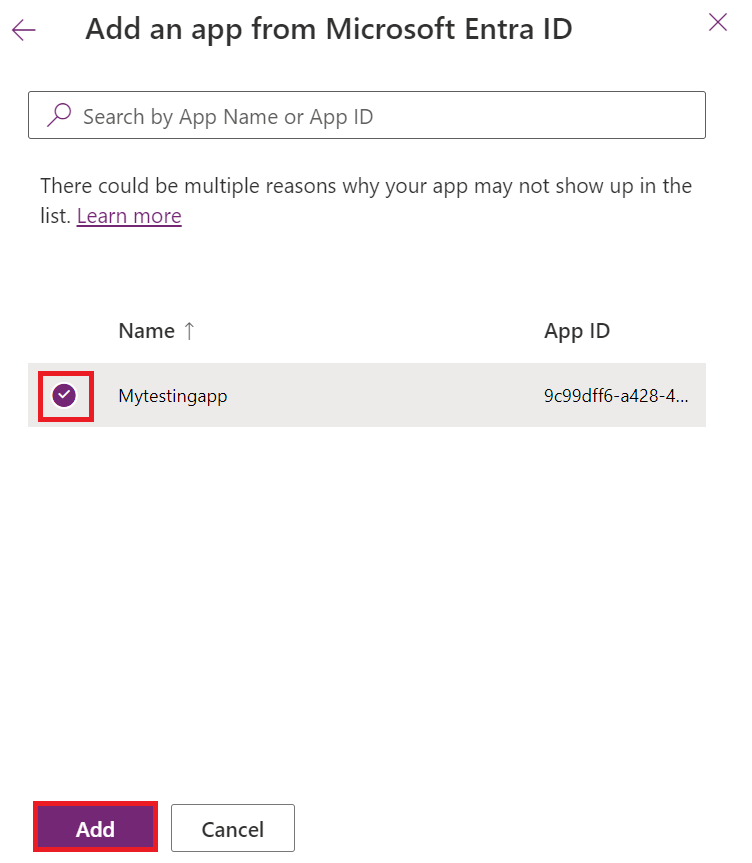
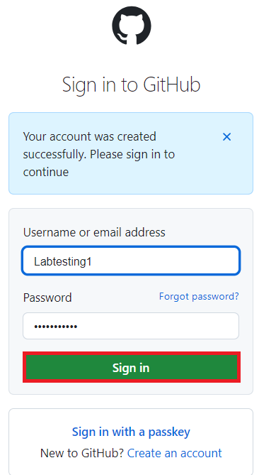
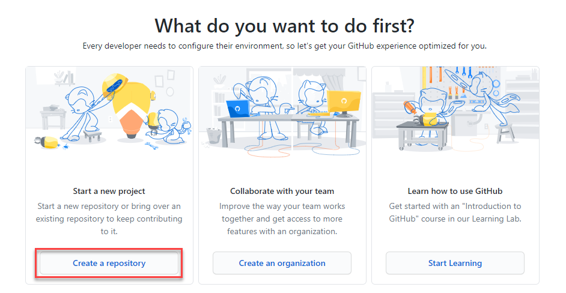
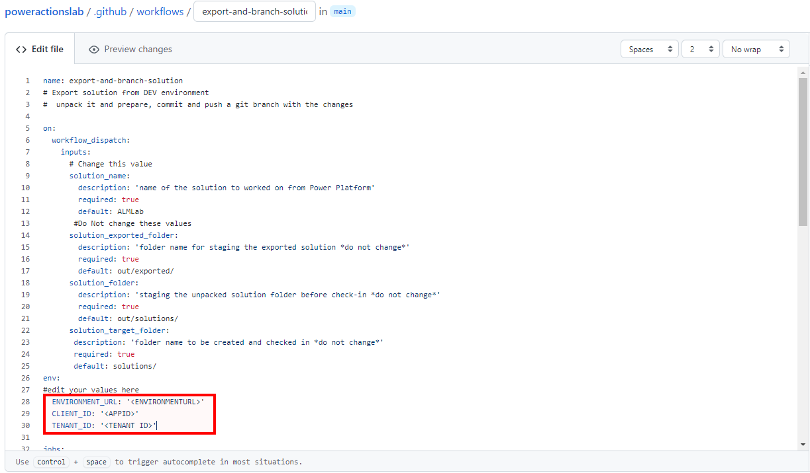
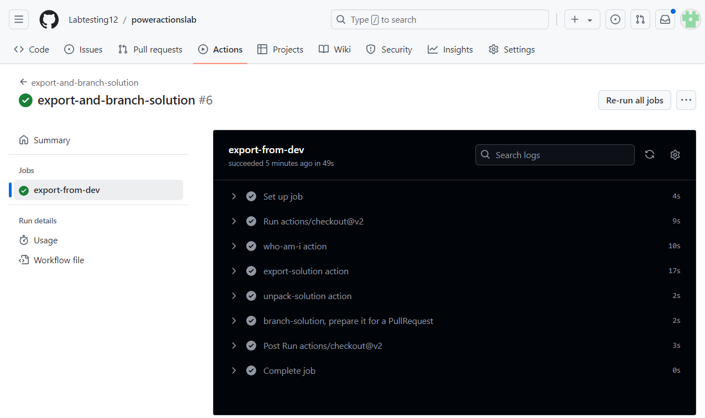
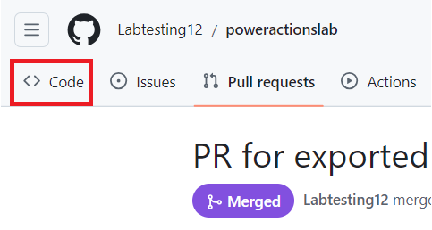

**Lab 9: Automatisieren Sie die Lösungsbereitstellung mit GitHub Actions
für Microsoft Power Platform**

## **Aufgabe 1: Erstellen der App-Registrierung**

1.  Melden Sie sich beim Microsoft Azure-Portal an, mit
    <https://portal.azure.com/#home> mit Ihren Office
    365-Mandanten-anmeldeinformationen.

2.  Wählen Sie **Get started** aus.

> 

3.  Wählen Sie auf der Seite „How do you plan to use Azure“ die Option
    **Skip** aus.

> 

4.  Wählen Sie auf der Seite „Now, let’s show you around Azure“ die
    Option **Skip** aus.

> 

5.  Geben Sie auf der **Home**  Seite des Portals „**Microsoft Entra
    ID**“ in das Suchfeld ein und wählen Sie es aus der unten
    vorgeschlagenen Liste von Diensten aus.

> 

6.  Erweitern Sie im linken Navigationsbereich **Manage** und wählen Sie
    dann **App registrations** aus.

> 

7.  Wählen Sie auf der Seite **App registrations** die Option **+ New
    registration** aus.

> 

8.  Geben Sie auf der Seite **App registrations,** die
    Registrierungsinformationen für Ihre Anwendung ein, wie in der
    Tabelle beschrieben.

[TABLE]

> 

9.  Wählen Sie **Register** aus, um die Anwendungsregistrierung zu
    erstellen.

> 

10. Die Übersichtsseite zur app registration Seite wird angezeigt. Fügen
    Sie client secret hinzu, indem Sie im linken Navigationsbereich
    „**Certificates & secrets**“ auswählen. Wählen Sie die Registerkarte
    „**Client secrets**“ und dann „**+New client secret**“ aus.

> 

11. Fügen Sie **description** für Ihr client secret hinzu – **My sample
    client secret**. Wählen Sie **expiration** für secret 
    **Recommended: 180 days (6 months)** und klicken Sie anschließend
    auf „**Add**“.

> 

12. Speichern Sie **secret's value and ID** im Notizblock zur Verwendung
    in Ihrem Client-Anwendungscode. Dieser **secret value** wird nach
    Verlassen dieser Seite nicht mehr angezeigt.

> **Wichtig:** Verlassen Sie nicht die Seite aus client secret, bevor
> Sie secret value (nicht die ID) kopiert haben, da Sie dann keinen
> Zugriff mehr auf secret value haben.
>
> 

## **Aufgabe 2: Erstellen Sie einen neuen App-Benutzer**

Befolgen Sie diese Schritte, um einen App-Benutzer zu erstellen und ihn
an Ihre App-Registrierung zu binden.

1.  Melden Sie sich bei der Power Platform Admin-Center an,
    <https://admin.powerplatform.microsoft.com/> mit Ihren Office
    365-Mandanten-anmeldeinformationen.

2.  Wählen Sie im linken Navigationsbereich „**Environments**“ und
    wählen Sie dann die **Dev One**-Umgebung in der Liste aus, um die
    Umgebungsinformationen anzuzeigen.

> 

3.  Wählen Sie unter **S2S-Apps** auf der rechten Seite der Seite den
    Link „**See all**“ aus.

> 

4.  Wählen Sie + **New app user**.

> 

5.  Wählen Sie im Slideout „**Create a new app user**“ die Option **+
    Add an app**“ aus.

> 

6.  Geben Sie den Namen Ihrer App-Registrierung – **Mytestingapp** – in
    das Suchfeld ein und wählen Sie ihn anschließend in der
    Ergebnisliste aus (markieren Sie ihn). Wählen Sie anschließend
    „**Add**“ aus.

> 

7.  Zurück im Slideout „**Create a new app user**“ wählen Sie die
    gewünschte **Business unit** aus der Dropdown-Liste aus. Wählen Sie
    **pencil icon** vor „**Security roles**“ aus, wählen Sie „**System
    Administrator**“ für den App-Benutzer (auch als Dienstprinzipal
    bezeichnet) und klicken Sie auf „**Save**“.

> 

8.  Wählen Sie **Create** aus.

> 

9.  Sie sollten Ihren neuen Anwendungsbenutzer in der angezeigten Liste
    der Anwendungsbenutzer sehen.

> 

## **Aufgabe 3: Erstellen einer modellgesteuerten App**

Befolgen Sie die folgenden Schritte, um eine modellgesteuerte App zu
erstellen.

1.  Navigieren Sie in Ihrem Browser zu
    [https://make.powerapps.com](https://make.powerapps.com/) und melden
    Sie sich mit Ihren Anmeldeinformationen an. Klicken Sie in der
    Kopfzeile auf das Dropdown-Menü zur environment selector und wählen
    Sie Ihre Entwicklungsumgebung aus.

> 

2.  Klicken Sie in der linken Navigation auf den Bereich „**Solutions**“
    und dann auf die Schaltfläche „**New solution**“, um eine neue
    Lösung zu erstellen.

> 

3.  Geben Sie solution’s **Display name** als „**GitHub Lab**, **Name**
    – **GitHubLab**“ ein. Wählen Sie unter „Publisher“ die Option
    „**+New publisher**“ aus.

> 

4.  Geben Sie für die Zwecke dieses Labs „**GitHub Lab**“ als **display
    name**, **'GitHubLab**“ als **name** und „**gitlab**“ als **prefix**
    ein und wählen Sie dann „**Save** und **Close**“.

> 

5.  Wählen Sie im **new solution** bereich, **publisher – GitHub Lab**–
    aus, den Sie gerade erstellt haben, und klicken Sie auf
    „**Create**“, um eine neue nicht-verwaltete Lösung in der Umgebung
    zu erstellen.

> 

6.  Ihre neue Lösung ist leer und Sie müssen Komponenten hinzufügen. In
    diesem Lab erstellen wir eine benutzerdefinierte Tabelle. Klicken
    Sie in der oberen Navigation auf das Dropdown-Menü **+ New** und
    wählen Sie **Table \> Set advanced properties**

> 

7.  Geben Sie **display name – Time Off Request**. Plural name wird
    automatisch generiert. Klicken Sie auf **Save**, um die Tabelle zu
    erstellen.

> 

8.  Sobald Ihre Tabelle erstellt ist, wählen Sie die Tabelle aus der
    Brotkrümelnavigation aus, um zur Lösungsansicht zurückzukehren und
    eine weitere Komponente hinzuzufügen.

> 

9.  Klicken Sie auf das Dropdown-Menü **+ New**, dann auf „**App**“ und
    schließlich auf **Model-driven app.**

> 

10. Geben Sie app name – **Time Off Requests**– und klicken Sie dann auf
    die Schaltfläche „**Create**“.

> 

11. Klicken Sie im Anwendungs-Designer auf **+** **Add page**.

> 

12. Wählen Sie die **Dataverse table** aus.

> 

13. Wählen Sie **Time Off Request** aus und aktivieren Sie das
    Kontrollkästchen **Show in navigation**. Wählen Sie **Add**.

> 

14. Klicken Sie auf **Publish**. Klicken Sie nach Abschluss von Publish
    Aktion auf **Play**.

> 

15. So gelangen Sie zur Anwendung und können sehen, wie sie aussieht.
    Sie können die Anwendung verwenden und die Registerkarte schließen,
    wenn Sie zufrieden sind.

> 

## **Aufgabe 4: Erstellen Sie ein GitHub-Konto**

**Notiz:** Wenn Sie ein bestehendes GitHub-Konto haben, können Sie diese
Aufgabe überspringen und mit der nächsten Aufgabe fortfahren.

1.  Gehen Sie zu <https://github.com> und klicken Sie auf „**Sign up**“
    oder „**Start a free trial**“ (oder melden Sie sich an, wenn Sie
    bereits ein Konto haben).

> 

2.  Geben Sie Ihre **E-Mail-ID** ein und klicken Sie dann auf
    „**Continue**“.

> 

3.  Behalten Sie das automatisch generierte Passwort oder erstellen Sie
    Ihr eigenes Passwort und klicken Sie dann auf „**Continue**“.

> 

4.  Geben Sie **Username – Labtesting1** ein und klicken Sie auf
    „**Continue**“. Falls der angegebene Benutzername nicht verfügbar
    ist, geben Sie einen anderen Benutzernamen ein.

> 

5.  Wählen Sie „**Continue**“ aus.

> 

6.  Wählen Sie auf der Seite „Verify your account“ die Option
    „**Verify**“ aus.

> 

7.  Schließen Sie den Verifizierungsprozess ab und verwenden Sie den
    Startcode, den Sie per E-Mail erhalten haben.

8.  Wählen Sie im angezeigten Fenster „Sign in to GitHub“ die Option
    „**Sign in**“ aus.

> 

9.  Wählen Sie **Skip personalization**.

> 

## **Aufgabe 5: Erstellen Sie new secret für Service Principal authentifizierung**

1.  Nachdem Sie Ihr Konto erstellt haben, erstellen Sie ein Repository,
    indem Sie „**Create repository**“ auswählen.

> 
>
> Möglicherweise wird der folgende alternative Zielbildschirm angezeigt:
>
> 

2.  Erstellen Sie Ihr neues Repository und nennen Sie es
    „**poweractionslab**“. Wählen Sie „**Add a README file**“ aus, um
    das Repository zu starten, und wählen Sie „**Create repository**“.

> 

3.  Navigieren Sie zu Ihrem Repository und klicken Sie auf
    „**Settings**“.

> 

4.  Erweitern Sie im linken Bereich „**Secrets and variables**“ und
    klicken Sie dann auf „**Actions**“.

> 

5.  Scrollen Sie nach unten und wählen Sie dann **New repository
    secret** aus.

> 

6.  Benennen Sie secret auf der Seite „Secrets“ mit
    „**PowerPlatformSPN**“. Verwenden Sie client secret value aus der in
    Microsoft Entra erstellten Anwendungsregistrierung (die Sie im
    Editor gespeichert haben), geben Sie ihn in das Feld „**Secret**“
    ein und wählen Sie anschließend „**Add secret**“. Das client secret
    wird später in diesem Lab in den YML-Dateien referenziert, die zur
    Definition der GitHub-Workflows verwendet werden.

> 

Das client secret wird jetzt sicher als GitHub- secret gespeichert.

## **Aufgabe 6: Einen Arbeitsablauf zum Exportieren und Entpacken der Lösungsdatei in eine neue Abteilung erstellen**

1.  Klicken Sie in der horizontalen Palette oben auf „**Actions**“.

> 

2.  Klicken Sie im Feld „**Simple workflow**“ unter dem Abschnitt
    „suggested for this repository“ auf „**Configure**“.

> 

3.  Dies startet eine neue YAML-Datei mit einem grundlegenden
    Arbeitsablauf, um Ihnen zu helfen, mit GitHub-Aktionen zu beginnen.

> 

4.  Löschen Sie den vorab erstellten Inhalt, fügen Sie den Inhalt aus
    dem
    [export-and-branch-solution-with-spn-auth.yml](https://github.com/microsoft/powerplatform-actions-lab/blob/main/sample-workflows/export-and-branch-solution-with-spn-auth.yml)
    Datei. Öffnen Sie den angegebenen Link im neuen Tab auf der VM.

> 

5.  **Umbenennen** Sie die Datei in **export-and-branch-solution.yml**.

> 

6.  Aktualisieren Sie \<ENVIRONMENTURL\> in Zeile 28 mit der URL für die
    Entwicklungsumgebung, aus der Sie exportieren möchten.

> 
>
> Um die Environment URL zu erhalten, gehen Sie zum **Power Platform
> Admin center**. Wählen Sie in der linken Navigation „**Environments**“
> aus, klicken Sie auf „**Dev One**“ und kopieren Sie dann die
> Environment URL.
>
> 

7.  Fügen Sie die **Environment URL** in der YML-Datei. Stellen Sie
    sicher, dass Sie https:// hinzufügen. Ihre URL sollte das angegebene
    Format haben: https://orgfc5xxxfd.crm.dynamics.com

> 

8.  Aktualisieren Sie \<APPID\> und \<TENANT ID\> mit Ihren Werten. Um
    diese beiden Werte abzurufen, öffnen Sie das Azure-Portal und wählen
    Sie „**Home** \> **Microsoft Entra ID** \> **App**“. Wählen Sie
    anschließend die Registerkarte „**All applications**“ und
    anschließend „**Mytestingapp**“.

> 
>
> 

9.  Fügen Sie die Werte in Zeile 29 und 30 ein.

> 

10. In Zeile 12 des Codes, ändern Sie den Standardwert ALMLab in
    GitHubLab, was in diesem Fall der Name unserer Lösung ist. Achten
    Sie darauf, dass Sie kein Leerzeichen lassen und den Namen wie
    angegeben schreiben. Wenn Sie Ihrer Lösung einen anderen Namen
    gegeben haben, geben Sie diesen hier an.

> 

11. Sie können Ihre Änderungen jetzt festschreiben. Wählen Sie „**Commit
    changes**“ und anschließend im sich öffnenden Bereich „Commit
    changes“, die Option **Commit changes** aus.

> 
>
> Herzlichen Glückwunsch, Sie haben gerade Ihren ersten GitHub-Workflow
> mit den folgenden Aktionen erstellt:

- **Who Am I**: Stellt sicher, dass Sie erfolgreich eine Verbindung mit
  der Umgebung herstellen können, aus der Sie exportieren.

- **Export Solution**: Exportiert die Lösungsdatei aus Ihrer
  Entwicklungsumgebung.

- **Unpack Solution**: Die Lösungsdatei, die vom Server exportiert wird,
  ist eine komprimierte (zip) Datei mit konsolidierten
  Konfigurationsdateien. Diese Ausgangsdateien eignen sich nicht für die
  Quellcodeverwaltung, da sie nicht so strukturiert sind, dass
  Quellcode-Verwaltungssysteme die Dateien ordnungsgemäß vergleichen und
  die Änderungen erfassen können, die Sie in die Versionskontrolle
  übernehmen möchten. Sie müssen die Lösungsdateien „unpack“, damit sie
  für die Speicherung und Verarbeitung in der Versionsverwaltung
  geeignet sind.

- **Branch Solution**: Erstellt einen neuen Zweig zum Speichern der
  exportierten Lösung.

## **Aufgabe 7: Testen Sie den Export und dekomprimieren das Workflow** 

1.  Um als Nächstes zu testen, ob der Workflow ausgeführt wird, wählen
    Sie „**Actions**“ aus der obigen horizontalen Palette und wählen Sie
    im linken Bereich unter „**All workflows**“ den Workflow
    „**export-and-branch-solution**“ aus.

> 

2.  Wählen Sie „**Run workflow**“ und anschließend erneut „**Run
    workflow**“. Wenn Sie einen anderen Lösungsnamen als „GitHubLab“
    haben, ändern Sie value hier, lassen Sie die anderen values jedoch
    unverändert.

> 

3.  Nach 5–10 Sekunden wird der Workflow gestartet und Sie können den
    laufenden Workflow auswählen, um den Fortschritt zu überwachen.

> 
>
> 

4.  Überprüfen Sie nach Abschluss des Workflows, ob ein neuer Zweig
    erstellt und die Lösung im Ordner „**solutions/GitHubLab**“
    dekomprimiert wurde. Navigieren Sie zur Registerkarte „***Code***“.

> 

5.  Erweitern Sie das Dropdown-Menü „**Branches**“.

> 

6.  Wählen Sie branch – **GitHubLab-xxxx-xxxx** – aus, der durch die
    Aktion erstellt wurde.

> 

7.  Überprüfen Sie, ob der Ordner „**solutions/GitHubLab**“ im neuen
    Zweig erstellt wurde.

> 

8.  Um eine Pull request zum Zusammenführen der Änderungen in den main
    branch zu erstellen, klicken Sie auf „**Contribute**“ und im Flyout
    auf „*Open Pull request*“.

> 

9.  Behalten Sie auf dem Bildschirm „*Open a Pull request* “ den Titel
    bei und klicken Sie dann auf „**Create pull request**“.

> 

10. Der Bildschirm wird aktualisiert und zeigt den neu erstellten Pull
    Request an. Sobald der Pull Request erstellt ist, wird bestätigt,
    dass unser Branch keinen Konflikt mit dem Hauptbranch hat.

> 

11. Diese Bestätigung bedeutet, dass die Änderungen automatisch in den
    Hauptzweig gemergt werden können. Klicken Sie auf **Merge pull
    request**.

> 

12. Klicken Sie auf „**Confirm merge**“.

> 

13. Klicken Sie optional auf „delete branch“, um den jetzt nicht mehr
    existierenden Zweig zu bereinigen.

> 

14. Klicken Sie auf **Code**.

> 

15. Sie werden zurück zum Standardzweig (Hauptzweig) geleitet und
    überprüfen, ob die Lösung jetzt auch dort verfügbar ist.

> 
