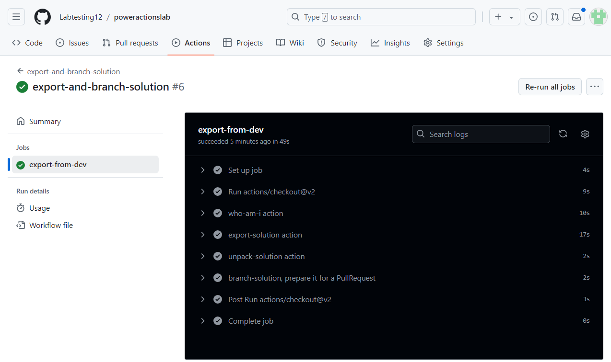

**Lab 9: Automatizzare la distribuzione della soluzione utilizzando
GitHub Actions per Microsoft Power Platform**

## **Attività 1: Creare la registrazione dell'app**

1.  Accedere al portale di Microsoft Azure utilizzando
    <https://portal.azure.com/#home> con le credenziali del tenant di
    Office 365.

2.  Seleziona **Get started**.

> 

3.  Selezionare **Skip** nella pagina "**How do you plan to use
    Azure**".

> 

4.  Selezionare **Skip** la pagina "**Now, let’s show you around
    Azure**".

> 

5.  Nella **Home** page del portale digitare **Microsoft Entra ID**
    nella casella di ricerca e selezionarlo dall'elenco di servizi
    suggerito di seguito.

> 

6.  Nel riquadro di spostamento a sinistra espandere **Manage** e quindi
    selezionare **App registrations**.

> 

7.  Selezionare **+ New registration** nella pagina **App
    registrations**.

> 

8.  Nella pagina **App** **registrations** immettere le informazioni di
    registrazione dell'applicazione come descritto nella tabella.

[TABLE]

> 

9.  Selezionare **Register** per creare la registrazione
    dell'applicazione.

> 

10. Viene visualizzata la pagina di panoramica della registrazione
    dell'app. Aggiungere un segreto client selezionando **Certificates &
    secrets** nel riquadro di spostamento a sinistra. Selezionare la
    scheda **Client** **secrets** e quindi selezionare **+New client
    secret**.

> 

11. Aggiungere una **description** specifica per il segreto client: **My
    sample client secret**. Selezionare una **expiration** per il
    segreto come **Recommended: 180 days (6 months)** e quindi
    selezionare **Add**.

> 

12. Salvare il **secret’s value and ID** nel Blocco note per utilizzarlo
    nel codice dell'applicazione client. Questo valore segreto non viene
    mai più visualizzato dopo aver lasciato questa pagina.

> **Importante:** non uscire dalla pagina del segreto client fino a
> quando non hai copiato il valore del segreto (non l'ID) poiché non
> avrai più accesso al valore del segreto.
>
> 

## **Attività 2: Creare un nuovo utente dell'app**

Segui questi passaggi per creare un utente dell'app e associarlo alla
registrazione dell'app.

1.  Accedi all'interfaccia di amministrazione [di Power Platform
    https://admin.powerplatform.microsoft.com/](https://admin.powerplatform.microsoft.com/)
    utilizzando le credenziali del tenant di Office 365.

2.  Selezionare **Environments** nel riquadro di spostamento a sinistra,
    quindi selezionare l'ambiente **Dev One** nell'elenco per
    visualizzare le informazioni sull'ambiente.

> 

3.  Seleziona il collegamento **See all** in **S2S apps** sul lato
    destro della pagina.

> 

4.  Seleziona + **New app user**.

> 

5.  Nel riquadro a discesa **Create a new app user** selezionare **+ Add
    an app**.

> 

6.  Inizia a digitare il nome della registrazione della tua app -
    **Mytestingapp** nel campo di ricerca, quindi selezionalo
    (selezionalo) nell'elenco dei risultati. Quindi, seleziona **Add**.

> 

7.  Tornando al menu a discesa **Create a new app user**, selezionare la
    **Business Unit** di destinazione dall'elenco a discesa. Selezionare
    **pencil icon** davanti a **Security roles** selezionare **System
    Administrator** per l'utente dell'app (noto anche come principio di
    servizio) e selezionare **Save.**

> 

8.  Seleziona **Create**.

> 

9.  Il nuovo utente dell'applicazione dovrebbe essere visualizzato
    nell'elenco visualizzato degli utenti dell'applicazione.

> 

## **Attività 3: Creare un'app basata su modello**

Segui i passaggi seguenti per creare un'app basata su modello.

1.  Nel browser, vai a
    [https://make.powerapps.com](https://make.powerapps.com/) e accedi
    con le tue credenziali. Fai clic sul menu a discesa del selettore
    dell'ambiente nell'intestazione e seleziona l'ambiente di sviluppo.

> 

2.  Fare clic sull' area **Solutions** nel riquadro di spostamento a
    sinistra, quindi fare clic sul pulsante **New solution** per creare
    una nuova soluzione.

> 

3.  Immettere il **Display name** della soluzione come **GitHub Lab**,
    **Name** - **GitHubLab**. Seleziona **+New publisher** in Editore.

> 

4.  Ai fini di questo lab, immettere **"GitHub Lab"** per il **display
    name**, **"GitHubLab"** per il **name** e **"gitlab"** come
    **prefix**, quindi scegliere **Save** e **Close**.

> 

5.  Nel pannello della nuova soluzione selezionare **publisher - GitHub
    Lab,** appena creato e fare clic su **Create** per creare una nuova
    soluzione non gestita nell'ambiente.

> 

6.  La nuova soluzione sarà vuota e sarà necessario aggiungervi dei
    componenti. In questo lab creeremo una tabella personalizzata. Fai
    clic sul menu a discesa **+ New** nella barra di navigazione in alto
    e seleziona **Table \> Set advanced properties.**

> 

7.  Inserisci un **display name – Time Off Request**, il nome plurale
    verrà generato per te. Fare clic su **Save** per creare la tabella.

> 

8.  Una volta creata la tabella, seleziona la Tabella dalla navigazione
    breadcrumb per tornare alla visualizzazione della soluzione e
    aggiungere un altro componente.

> 

9.  Fai clic sul menu a discesa + **New**, quindi su **App** e infine su
    **Model-driven app.**

> 

10. Inserisci un nome per app – **Time Off Requests**, quindi fai clic
    sul pulsante **Create**.

> 

11. Nella finestra di progettazione dell'applicazione fare clic su **+
    Add page**.

> 

12. Seleziona **Dataverse table**.

> 

13. Seleziona **Time Off Request**, seleziona la casella di controllo
    **Show in navigation**. Seleziona **Add**.

> 

14. Fai clic su **Publish**, una volta completata l'azione di
    pubblicazione, fai clic su **Play**.

> 

15. Questo ti porterà all'applicazione in modo che tu possa vedere come
    appare. Puoi utilizzare l'applicazione e chiudere la scheda quando
    sei soddisfatto.

> 

## **Attività 4: Creare un account GitHub**

**Nota:** se disponi di un account GitHub esistente, puoi saltare questa
attività e passare all'attività successiva.

1.  Vai su [https://github.com](https://github.com/) e fai clic su
    **Sign up** o **Start a free trial**(o accedi se hai già un
    account).

> 

2.  Inserisci il suoi **e-mail** **id** e fai clic su **Continue**.

> 

3.  Conserva la password generata automaticamente o crea una password
    personalizzata, quindi fai clic su **Continue**.

> 

4.  Inserisci il **Username** **– Labtesting1** e quindi fai clic su
    **Continue**. Se il nome utente specificato non è disponibile,
    inserisci un nome utente diverso.

> 

5.  Seleziona **Continue**.

> 

6.  Nella pagina "Verify your account", seleziona **Verify**.

> 

7.  Completa il processo di verifica e utilizza il codice di avvio
    ricevuto sul suoi ID e-mail.

8.  Seleziona **Sign in** nella finestra "**Sign in to GitHub**"
    visualizzata.

> 

9.  Seleziona **Skip personalization**.

> 

## **Attività 5: Creazione di un nuovo segreto per l'autenticazione dell'entità servizio**

1.  Dopo aver creato l'account, creare un repository selezionando
    **Create repository**.

> 
>
> Potresti vedere la seguente schermata di destinazione alternativa:
>
> 

2.  Crea il suoi nuovo repository e chiamalo '**poweractionslab**'.
    Assicurarsi di selezionare **Add a README file** per avviare il
    repository e scegliere **Create repository**.

> 

3.  Accedere al repository e fare clic su **Settings**.

> 

4.  Nel riquadro sinistro espandere **Secrets and variables** e quindi
    fare clic su **Actions**.

> 

5.  Scorrere verso il basso e quindi selezionare **New repository
    secret**.

> 

6.  Nella pagina Segreti assegnare al segreto il nome
    '**PowerPlatformSPN**'. Usare il valore del segreto client dalla
    registrazione dell'applicazione creata in Microsoft Entra (salvata
    nel Blocco note) e immetterlo nel campo **Secret**, quindi
    selezionare **Add secret**. Al segreto client verrà fatto
    riferimento nei file YML usati per definire i flussi di lavoro
    GitHub più avanti in questo lab.

> 

Il segreto client è ora archiviato in modo sicuro come segreto GitHub.

## **Attività 6: Creare un flusso di lavoro per esportare e decomprimere il file della soluzione in un nuovo ramo**

1.  Fare clic su **Actions** nella tavolozza orizzontale sopra.

> 

2.  Fare clic su **Configure** nella casella **Simple Workflow** nella
    sezione Suggerimenti per questo repository.

> 

3.  Verrà avviato un nuovo file YAML con un flusso di lavoro di base per
    iniziare a utilizzare le azioni GitHub.

> 

4.  Elimina il contenuto creato in precedenza, incolla il contenuto dal
    [file
    export-and-branch-solution-with-spn-auth.yml](https://github.com/microsoft/powerplatform-actions-lab/blob/main/sample-workflows/export-and-branch-solution-with-spn-auth.yml).
    Aprire il collegamento indicato nella nuova scheda della macchina
    virtuale.

> 

5.  **Rename** il file in **export-and-branch-solution.yml**.

> 

6.  Aggiorna \<ENVIRONMENTURL\> on line no 28 con l'URL dell'ambiente di
    sviluppo da cui vuoi esportare.

> 
>
> Per ottenere l'URL dell'ambiente, vai **Power Platform Admin center**.
> Seleziona **Environments** dal menu di navigazione a sinistra, fai
> clic su **Dev One** e quindi copia l'URL dell'ambiente.
>
> 

7.  **Paste** dell **Environment URL** nel file yml. Assicurati di
    aggiungere https://. Il suoi URL dovrebbe essere nel formato
    indicato, https://orgfc5xxxfd.crm.dynamics.com

> 

8.  Aggiornare \<APPID\> e \<TENANT ID\> con i valori. Per ottenere
    questi due valori, passare al portale di Azure e quindi selezionare
    **Home** \> **Microsoft Entra ID** \>APP Registrazione, quindi
    selezionare la scheda **All applications** e quindi selezionare
    **Mytestingapp**.

> 
>
> 

9.  Incollare i valori sulle righe n. 29 e 30.

> 

10. Sulla riga n. 12 del codice, modificare il valore predefinito ALMLab
    in GitHubLab, che in questo caso è il nome della nostra soluzione.
    Assicurati di non lasciare spazio e scrivilo correttamente come
    dato. Se hai dato un nome diverso alla tua soluzione, scrivilo qui.

> 

11. A questo punto è possibile eseguire il commit delle modifiche.
    Selezionare **Commit changes** e quindi nel riquadro Conferma
    modifiche visualizzato selezionare **Commit** **changes**.

> 
>
> Congratulazioni, hai appena creato il suoi primo flusso di lavoro
> GitHub utilizzando le seguenti azioni:

- **Chi sono**: garantisce che tu possa connetterti correttamente
  all'ambiente da cui stai esportando.

- **Esporta soluzione**: esporta il file della soluzione dall'ambiente
  di sviluppo.

- **Decomprimere la soluzione**: il file della soluzione esportato dal
  server è un file compresso (zip) con file di configurazione
  consolidata. Questi file iniziali non sono adatti per la gestione del
  codice sorgente in quanto non sono strutturati in modo da consentire
  ai sistemi di gestione del codice sorgente di eseguire correttamente
  le differenze sui file e acquisire le modifiche di cui si desidera
  eseguire il commit nel controllo del codice sorgente. È necessario
  "decomprimere" i file della soluzione per renderli adatti
  all'archiviazione e all'elaborazione del controllo del codice
  sorgente.

- **Soluzione diramazione**: crea una nuova diramazione per archiviare
  la soluzione esportata.

## **Attività 7: Testare il flusso di lavoro di esportazione e decompressione**

1.  Successivamente, per verificare l'esecuzione del flusso di lavoro,
    selezionare **Actions** dalla tavolozza orizzontale precedente,
    selezionare il flusso di lavoro **export-and-branch-solution**
    elencato in **All workflows** nel riquadro a sinistra.

> 

2.  Seleziona **Run workflow** e di nuovo scegli **Run workflow**. Se
    hai un nome di soluzione diverso da "GitHubLab", modifica il valore
    qui, ma lascia gli altri valori così come sono.

> 

3.  Dopo 5-10 secondi il flusso di lavoro verrà avviato e sarà possibile
    selezionare il flusso di lavoro in esecuzione per monitorare
    l'avanzamento.

> 
>
> 

4.  Al termine del flusso di lavoro, verificare che sia stato creato un
    nuovo ramo con la soluzione decompressa nella cartella
    **solutions/GitHubLab**. Passare alla scheda ***Code***.

> 

5.  Espandi l'elenco a discesa **Branches**.

> 

6.  Selezionare il ramo: **GitHubLab-xxxx-xxxx** creato dall'azione.

> 

7.  Verificare che la cartella **solutions/GitHubLab** sia stata creata
    nel nuovo ramo

> 

8.  Per creare una richiesta pull per unire le modifiche nel ramo
    principale, fare clic su **Contribute** e nel riquadro a comparsa
    fare clic su ***Open Pull request***

9.  Nella schermata *Apri una richiesta pull*, mantieni il titolo così
    com'è, quindi fai clic su **Create pull request*.***

> 

10. La schermata si aggiornerà mostrando la richiesta pull appena
    creata. Man mano che la richiesta pull viene creata, verrà fornita
    una conferma che dimostri che il nostro ramo non ha conflitti con il
    ramo principale.

> 

11. Questa conferma significa che le modifiche possono essere unite
    automaticamente nel ramo principale. Fare clic su **Merge pull
    request.**

> 

12. Fai clic su **Confirm merge**.

> 

13. Facoltativamente, fare clic su **Delete branch** per ripulire il
    ramo ora defunto.

> 

14. Fare clic su **Code**.

> 

15. Si torna al ramo predefinito (principale) e si verifica che la
    soluzione sia ora disponibile anche lì.

> 
