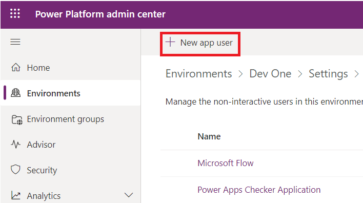
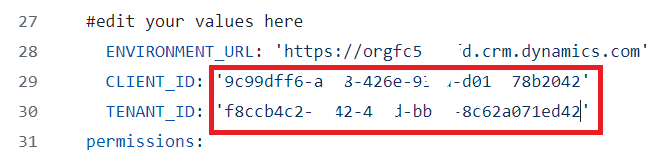

**Laboratório 9: Automatizar a implementação de soluções usando o GitHub
Actions para Microsoft Power Platform**

## **Tarefa 1: Criar o registro do aplicativo**

1.  Entre no portal do Microsoft Azure usando
    [<https://portal.azure.com/#home>](https://portal.azure.com/#home)
    com suas credenciais de locatário do Office 365.

2.  Selecione **Get started**.

> 

3.  Selecione **Skip** na página ‘How do you plan to use Azure’.

> 

4.  Selecione **Skip** na página ‘Now, let’s show you around Azure’.

> 

5.  Na página **Home** do portal, digite **Microsoft Entra ID** na caixa
    de pesquisa e selecione-o na lista de serviços sugeridos abaixo.

> 

6.  No painel de navegação esquerdo, expanda **Manage** e selecione
    **App registrations**.

> 

7.  Selecione **+ New registration** na página de **App registrations**.

> 

8.  Na página **App registrations**, insira as informações de registro
    do seu aplicativo, conforme descrito na tabela.

[TABLE]

> 

9.  Selecione **Register** para criar o registro do aplicativo.

> 

10. A página de visão geral do registro do aplicativo é exibida.
    Adicione um segredo do cliente selecionando **Certificates &
    secrets** no painel de navegação esquerdo. Selecione a aba **Client
    secrets** e, em seguida, **+ New client secret**.

> 

11. Adicione uma **description** para o seu segredo do cliente – **My
    sample client secret**. Selecione uma **expiration** para o segredo
    como **Recommended: 180 days (6 months)** e, em seguida, selecione
    **Add**.

> 

12. Salve o **secret's value and ID** no bloco de notas para usar no
    código do seu aplicativo cliente. Este valor secreto nunca mais será
    exibido depois que você sair desta página.

> **Importante:** Não saia da página segredo do cliente antes de copiar
> o valor do segredo (e não o ID), pois você não terá acesso a esse
> valor novamente.
>
> 

## **Tarefa 2: Criar um novo usuário de aplicativo**

Siga estas etapas para criar um usuário de aplicativo e o vincular ao
registro do aplicativo.

1.  Faça login no centro de administração do Power
    Platform Platform <https://admin.powerplatform.microsoft.com/>
    usando suas credenciais de locatário do Office 365.

2.  Selecione **Environments** no painel de navegação esquerdo e, em
    seguida, selecione o ambiente **Dev One** na lista para exibir as
    informações do ambiente.

> 

3.  Selecione o link **See all** em **S2S apps** no lado direito da
    página.

> 

4.  Selecione + **New app user**.

> 

5.  No painel lateral **Create a new app user,** selecione **+ Add an
    app**.

> 

6.  Comece a digitar o nome do registro do seu aplicativo -
    **Mytestingapp** no campo de pesquisa e selecione (check) na lista
    de resultados. Em seguida, selecione **Add**.

> 

7.  De volta ao painel lateral **Create a new app user,** selecione a
    **Business unit** no menu suspenso. Selecione o **ícone de lápis**
    ao lado de **Security roles**, selecione **System Administrator**
    para o usuário do aplicativo (também conhecido como princípio de
    serviço) e selecione **Save.** 

> 

8.  Selecione **Create**.

> 

9.  Você deverá ver o novo usuário do aplicativo na lista exibida de
    usuários de aplicativo.

> 

## **Tarefa 3: Construir um aplicativo orientado por modelos**

Siga as etapas abaixo para criar um aplicativo orientado por modelo.

1.  No seu navegador, acesse
    [https://make.powerapps.com](https://make.powerapps.com/) e faça
    login com suas credenciais. Clique no menu suspenso do seletor de
    ambientes no cabeçalho e selecione seu ambiente de desenvolvimento.

> 

2.  Clique na área **Solutions** na navegação à esquerda e, em seguida,
    clique no botão **New solution** para criar uma nova solução.

> 

3.  Insira o **Display name** da solução como **GitHub Lab** e o
    **name** – **GitHubLab**. Selecione **+ New publisher** em
    Publisher.

> 

4.  Para os propósitos deste laboratório, insira **'GitHub Lab'** para
    **display name**, **'GitHubLab'** para **name** e **'gitlab'** como
    **prefix** e, em seguida, escolha **Save** e **Close**.

> 

5.  No novo painel de solução, selecione o **publisher – GitHub Lab**
    que você acabou de criar e clique em **Create** para criar uma nova
    solução não gerenciada no ambiente.

> 

6.  Sua nova solução estará vazia e você precisará adicionar
    componentes. Neste laboratório, criaremos uma tabela personalizada.
    Clique no menu suspenso **+ New** na barra de navegação superior e
    selecione **Table \> Set advanced properties.**

> 

7.  Insira um **display name – Time Off Request,** o nome no plural será
    gerado para você. Clique em **Save** para criar a tabela.

> 

8.  Depois que a tabela for criada, selecione Table na navegação de
    localização para voltar à visualização da solução e adicionar outro
    componente.

> 

9.  Clique no menu suspenso **+ New**, depois em **App** e, por fim,
    clique em **Model-driven app**.

> 

10. Digite um nome para o aplicativo – **Time Off Requests** e clique no
    botão **Create**.

> 

11. No designer do aplicativo, clique em **+ Add page**.

> 

12. Selecione a **Dataverse table**.

> 

13. Selecione **Time Off Request**, marque a caixa de seleção **Show in
    navigation**. Selecione **Add**.

> 

14. Clique em **Publish** e, quando a ação de publicação estiver
    concluída, clique em **Play**.

> 

15. Isso o levará a aplicação para que você possa ver como ele fica.
    Você pode usar a aplicação e fechar a aba quando estiver satisfeito.

> 

## **Tarefa 4: Criar uma conta no GitHub**

**Observação:** Se você já tiver uma conta no GitHub, poderá pular esta
tarefa e passar para a próxima.

1.  Acesse [https://github.com](https://github.com/) e clique em **Sign
    up** ou **Start a free trial** (ou faça login se você já tiver uma
    conta).

> 

2.  Digite seu **email id** e clique em **Continue**.

> 

3.  Mantenha a senha gerada automaticamente ou crie sua própria senha e
    clique em **Continue**.

> 

4.  Digite o **Username – Labtesting1** e clique em **Continue**. Se o
    nome de usuário fornecido não estiver disponível, digite um nome de
    usuário diferente.

> 

5.  Selecione **Continue**.

> 

6.  Na página ‘Verify your account’, selecione **Verify**.

> 

7.  Conclua o processo de verificação e use o código de lançamento
    recebido no seu e-mail.

8.  Selecione **Sign in** na janela ‘Sign in to GitHub’ que aparece.

> 

9.  Selecione **Skip personalization**.

> 

## **Tarefa 5: Criando um novo segredo para autenticação com Service Principal**

1.  Depois de criar sua conta, crie um repositório selecionando **Create
    repository**.

> 
>
> Você verá a seguinte tela como alternativa:
>
> 

2.  Crie seu novo repositório e nomeie '**poweractionslab**'.
    Certifique-se de selecionar **Add a README file** para iniciar o
    repositório e escolha **Create repository**.

> 

3.  Navegue até seu repositório e clique em **Settings**.

> 

4.  No painel esquerdo, expanda **Secrets and variables** e clique em
    **Actions**.

> 

5.  Role para baixo e selecione **New repository secret**.

> 

6.  Na página Segredos, nomeie o segredo como '**PowerPlatformSPN**'.
    Use o valor do segredo do cliente do registro do aplicativo criado
    no Microsoft Entra (que você salvou no bloco de notas), insira-o no
    campo **Secret** e selecione **Add secret**. O segredo do cliente
    será referenciado nos arquivos YML usados para definir os fluxos de
    trabalho do GitHub posteriormente neste laboratório.

> 

O segredo do cliente agora está armazenado com segurança como um segredo
do GitHub.

## **Tarefa 6: Criar um fluxo de trabalho para exportar e descompactar o arquivo de solução em um novo branch**

1.  Clique em **Actions** na barra horizontal acima.

> 

2.  Clique em **Configure** na caixa **Simple workflow**, na seção
    sugerida para este repositório.

> 

3.  Isso iniciará um novo arquivo YAML com um fluxo de trabalho básico
    para ajudar você a começar a usar as ações do GitHub.

> 

4.  Exclua o conteúdo pré-criado e cole o conteúdo do arquivo
    [export-and-branch-solution-with-spn-auth.yml](https://github.com/microsoft/powerplatform-actions-lab/blob/main/sample-workflows/export-and-branch-solution-with-spn-auth.yml).
    Abra o link fornecido na nova aba da VM.

> 

5.  **Rename** o arquivo para **export-and-branch-solution.yml**.

> 

6.  Atualize \<ENVIRONMENTURL\> na linha 28 com a URL do ambiente de
    desenvolvimento do qual você deseja exportar.

> 
>
> Para obter a URL do ambiente, acesse o **Power Platform Admin
> center**. Selecione **Environments** na barra de navegação à esquerda,
> clique em **Dev One** e copie a URL do ambiente.
>
> 

7.  **Paste** a **Environment URL** no arquivo yml. Certifique-se de
    adicionar https://. Sua URL deve estar no formato fornecido -
    https://orgfc5xxxfd.crm.dynamics.com

> 

8.  Atualize \<APPID\> e \<TENANT ID\> com seus valores. Para obter
    esses dois valores, acesse o portal do Azure e selecione **Home** \>
    **Microsoft Entra ID** \> **App** Registro**,** selecione a aba
    **All applications** e, em seguida, **Mytestingapp**.

> 
>
> 

9.  Cole os valores nas linhas 29 e 30.

> 

10. Na linha 12 do código, altere o valor padrão ALMLab para GitHubLab,
    que é o nome da nossa solução neste caso. Certifique-se de não
    deixar espaços e escreva-o corretamente como fornecido. Se você deu
    um nome diferente para a sua solução , escreva-o aqui.

> 

11. Agora você está pronto para confirmar suas alterações. Selecione
    **Commit changes** e, no painel Confirmar alterações que se abre,
    selecione **Commit changes**.

> 
>
> Parabéns, você acabou de criar seu primeiro fluxo de trabalho do
> GitHub usando as seguintes ações:

- **Quem sou eu**: Garante que você possa se conectar com sucesso ao
  ambiente do qual está exportando.

- **Exportar solução** : Exporta o arquivo de solução do seu ambiente de
  desenvolvimento.

- **Descompactar Solução** : O arquivo de solução exportado do servidor
  é um arquivo compactado (zip) com arquivos de configuração
  consolidados. Esses arquivos iniciais não são adequados para o
  gerenciamento de código-fonte, pois não são estruturados para que os
  sistemas de gerenciamento de código-fonte possam diferenciar
  adequadamente os arquivos e capturar as alterações que você deseja
  enviar para o controle de origem. Você precisa ‘unpack’ os arquivos de
  solução para torná-los adequados para armazenamento e processamento no
  controle de origem.

- **Solução de Branch**: Cria uma nova branch para armazenar a solução
  exportada.

## **Tarefa 7: Testar o fluxo de trabalho de exportação e descompactação**

1.  Em seguida, para testar se o fluxo de trabalho é executado,
    selecione **Actions** na barra horizontal acima e selecione o fluxo
    de trabalho de **export-and-branch-solution** listado em **All
    workflows** no painel lateral esquerdo.

> 

2.  Selecione **Run workflow** e, novamente, escolha **Run workflow**.
    Se o nome da solução for diferente de 'GitHubLab', altere o valor,
    mas deixe os outros valores como estão.

> 

3.  Após 5 a 10 segundos, o fluxo de trabalho será iniciado e você
    poderá selecionar o fluxo de trabalho em execução para monitorar o
    progresso.

> 
>
> 

4.  Após a conclusão do fluxo de trabalho, confirme se uma nova branch
    foi criada com a solução descompactada na pasta
    **solutions/GitHubLab**. Navegue até** **a aba ***Code***.

> 

5.  Expanda o menu suspenso **Branches**.

> 

6.  Selecione o branch – **GitHubLab-xxxx-xxxx** que foi criado pela
    ação.

> 

7.  Valide se a pasta **solutions/GitHubLab** foi criada na nova branch

> 

8.  Para criar uma solicitação de pull para mesclar as alterações no
    branch principal, clique em **Contribute** e no flyout clique
    em** ***Open Pull request*.

> 

9.  Na tela *Open Pull request*, mantenha o título como está e clique em
    **Create pull request*.***

> 

10. A tela será atualizada mostrando a pull request recém- criada. Assim
    que a pull request for criada, será fornecida uma confirmação
    indicando que nossa branch não tem conflito com a branch principal.

> 

11. Esta confirmação significa que as alterações podem ser mescladas
    automaticamente na branch principal. Clique em **Merge pull
    request.** 

> 

12. Clique em **Confirm merge**.

> 

13. Opcionalmente, clique em excluir branch para limpar o branch
    extinto.

> 

14. Clique em **Code**.

> 

15. Você será direcionado de volta para o branch padrão (principal) e
    validará se a solução agora está disponível lá também.

> 
