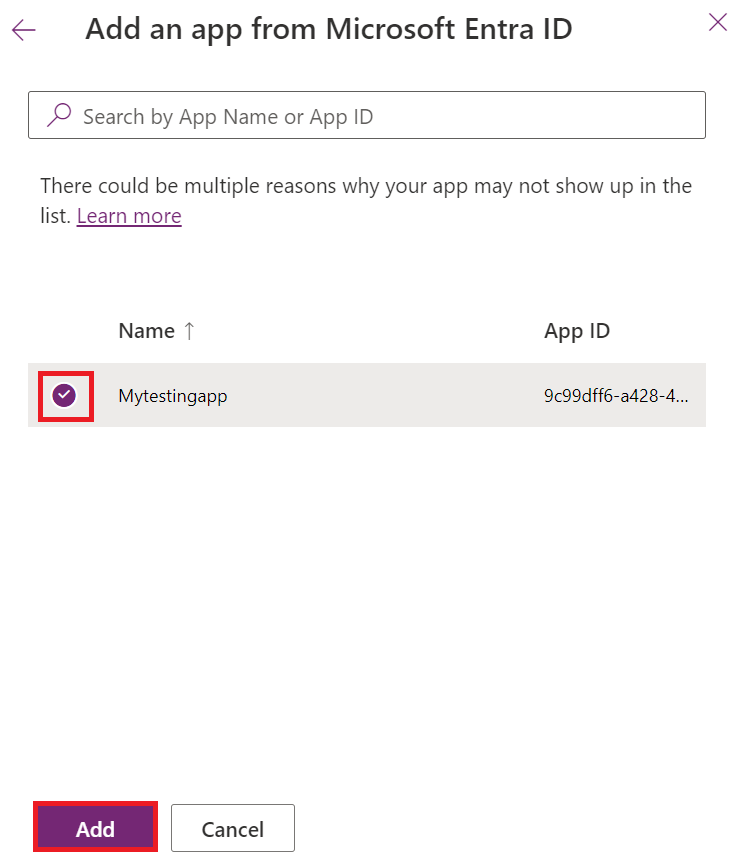

**Laboratorio 9: Automatice el solution deployment con GitHub Actions
para Microsoft Power Platform**

## **Tarea 1: Cree el registro de la aplicación**

1.  Inicie sesión en Microsoft Azure portal
    mediante <https://portal.azure.com/#home> con los Office 365 tenant
    credentials.

2.  Seleccione **Get started**.

> 

3.  Seleccione **Skip** en la página ‘How do you plan to use Azure’.

> 

4.  Seleccione **Skip** en la página ‘Now, let’s show you around Azure’.

> 

5.  En la página **Home** del portal, tecle **Microsoft Entra ID** en el
    search box y selecciónelo desde la lista de sugerencias.

> 

6.  En el panel de navegación, expanda **Manage** y seleccione **App
    registrations**.

> 

7.  Seleccione **+ New registration** en la página **App
    registrations**.

> 

8.  En la página **App registrations**, introduzca la información de
    registro de su aplicación como se ve en la tabla.

[TABLE]

> 

9.  Seleccione **Register** para crear el application registration.

> 

10. Se ve la página de app registration overview. Agregue un client
    secret al seleccionar el **Certificates & secrets** en el panel de
    navegación izquierdo. Seleccione la pestaña **Client secrets** y
    seleccione **+New client secret**.

> 

11. Agregue un **description** para su client secret – **My sample
    client secret**. Seleccione un **expiration** para el secret como
    **Recommended: 180 days (6 months)** y seleccione **Add**.

> 

12. Gurade el **secret's value and ID** en el notepad para usarlo client
    application code. Este secret value no se ve nunca más una vez que
    salga de la página.

> **Importante:** no navegue fuera de la página client secret hasta que
> no haya copiado el secret value (no el ID) como no tendrá acceso al
> secret value de nuevo.
>
> 

## **Tarea 2: Cree un usuario de aplicación nuevo**

Siga estos pasos para crear un usuario de aplicación y vincularlo al
registro de la aplicación.

1.  Inicie sesión en Power Platform admin
    center <https://admin.powerplatform.microsoft.com/> con sus Office
    365 tenant credentials.

2.  Seleccione **Environments** en el panel de navegación izquierdo, y
    seleccione el **Dev One** environment en la lista para mostrar la
    información del entorno.

> 

3.  Seleccione el enlace **See all** en **S2S apps** en la parte derecha
    de la página.

> 

4.  Seleccione + **New app user**.

> 

5.  En el **Create a new app user** slide-out, seleccione **+ Add an
    app**.

> 

6.  Empiece a escribir el nombre del registro de su aplicación -
    **Mytestingapp** en el search field, y selecciónelo dentro de los
    resultados. Luego, seleccione **Add**.

> 

7.  Vuelva a la **Create a new app user** slide-out, seleccione
    el **Business unit** final desde el drop-down. Seleccione el ícono
    **pencil** delante de **Security roles**, seleccione **System
    Administrator** para el usuario de la aplicación (también conocodo
    como un service principle) y seleccione **Save.** 

> 

8.  Seleccione **Create**.

> 

9.  Debe ver su nuevo application user en la lista de los usuarios de
    aplicación.

> 

## **Tarea 3: Construya un model-driven app**

Siga los pasos que se indican a continuación para crear un model-driven
app.

1.  En su navegador, navegue
    a [https://make.powerapps.com](https://make.powerapps.com/) e inicie
    sesión con sus credenciales. Haga clic en el menú de environment
    selector en el header y seleccione su development environment.

> 

2.  Haga clic en el área **Solutions** en la navegación izquierda, haga
    clic en el botón **New solution** para crear una solución nueva.

> 

3.  Introduzca la solución **Display name** como **GitHub Lab**,
    **Name** – **GitHubLab**. Seleccione **+New publisher** en
    Publisher.

> 

4.  Para los properties del lab, introduzca **'GitHub Lab'** para
    el **display name**, **'GitHubLab'** para **name**, y **‘gitlab’**
    como **prefix**, y elija **Save y Close**.

> 

5.  En el panel de solución nuevo, seleccione el **publisher – GitHub
    Lab** que creó **Create** para crear una nueva unmanaged solution en
    el entorno.

> 

6.  La nueva solución estará vacía y deberá agregarle componentes. En
    este laboratorio crearemos una tabla personalizada. Haga clic en el
    dropdown **+ New** desde la navegación en la parte superior y
    seleccione **Table \> Set advanced properties.**

> 

7.  Introduzca un **display name – Time Off Request**, se generará un
    plural name will be generated para usted. Haga clic en **Save** para
    crear la tabla.

> 

8.  Una vez que se crea la tabla, seleccione el Table desde breadcrumb
    navigation para volver a la vista de solución y agregar otro
    componente.

> 

9.  Haga clic en el dropdown **+ New**, y luego **App**, y por
    fin **Model-driven app**.

> 

10. Introduzca un nombre de la aplicación – **Time Off Requests**, y
    haga clic en el botón **Create**.

> 

11. En el application designer, haga clic en **+ Add page**.

> 

12. Seleccione **Dataverse table**.

> 

13. Seleccione **Time Off Request**, seleccione el checkbox **Show in
    navigation**. Seleccione **Add**.

> 

14. Haga clic en **Publish**, y una vez que está completo, haga clic
    en **Play**.

> 

15. Esto lo llevará a la aplicación para que pueda ver cómo se ve. Puede
    usar la aplicación y cerrar la pestaña cuando esté satisfecho.

> 

## **Tarea 4: Cree una cuenta GitHub**

**Ojo:** Si ya tiene una cuenta de GitHub, puede omitir esta tarea y
pasar a la siguiente tarea.

1.  Vaya a [https://github.com](https://github.com/) y haga clic
    en **Sign up** o **Start a free trial** (o inicie sesión si tiene
    una cuenta existente).

> 

2.  Introduzca su **email id** y haga clic en **Continue**.

> 

3.  Conserve la contraseña generada automáticamente o cree su propia
    contraseña y, a continuación, haga clic en **Continue**.

> 

4.  Introduzca el **Username – Labtesting1** y haga clic en
    **Continue**. Si el nombre de usuario dado no está disponible,
    ingrese un nombre de usuario diferente.

> 

5.  Seleccione **Continue**.

> 

6.  En la página ‘Verify your account’, seleccione **Verify**.

> 

7.  Complete el proceso de verificación y use el código de lanzamiento
    que se recibe en su identificación de email.

8.  Seleccione **Sign in** en la ventana ‘Sign in to GitHub’ que
    aparece.

> 

9.  Seleccione **Skip personalization**.

> 

## **Tarea 5: Crear un nuevo secret para Service Principal Authentication**

1.  Una vez que haya creado su cuenta, cree un repositorio
    seleccionando **Create repository**.

> 
>
> Es posible que vea la siguiente landing screen alternativo:
>
> 

2.  Cree su nuevo repositorio y nómbrelo '**poweractionslab**'.
    Asegúrese de seleccionar **Add a README file** para iniciar el
    repositorio y elegir **Create repository**.

> 

3.  Navegue a su repositorio y haga clic en **Settings**.

> 

4.  Desde el panel izquierdo, expanda **Secrets and variables**, y
    seleccione **Actions**.

> 

5.  Desplácese hacia abajo y, a continuación, seleccione **New
    repository secret**.

> 

6.  En la página Secrets, nómbre el secret '**PowerPlatformSPN**'.
    Utilice el valor secreto de cliente del registro de la aplicación
    creado en Microsoft Entra (que ha guardado en el Bloc de notas) y
    escríbalo en el campo **Secret**, y seleccione **Add secret**. Se
    hará referencia al secreto de cliente en los archivos YML que se
    usan para definir los flujos de trabajo de GitHub más adelante en
    este laboratorio.

> 

El client secret ahora está almacenado como GitHub secret.

## **Tarea 6: Cree un workflow para exportar y abrir el solution file a un nuevo branch**

1.  Haga clic en **Actions** desde el panel superior.

> 

2.  Haga clic en **Configure** en la casilla **Simple workflow** en las
    sugerencias para la sección repository.

> 

3.  Esto iniciará un nuevo archivo YAML con un flujo de trabajo básico
    para ayudarlo a comenzar GitHub actions.

> 

4.  Elimine el contenido precreado, pegue el contenido
    de [export-and-branch-solution-with-spn-auth.yml](https://github.com/microsoft/powerplatform-actions-lab/blob/main/sample-workflows/export-and-branch-solution-with-spn-auth.yml) file.
    Abra el enlace dado en la nueva pestaña en el VM.

> 

5.  **Renombre** el archivo a **export-and-branch-solution.yml**.

> 

6.  Actualice \<ENVIRONMENTURL\> en la línea 28 con el URL para el
    development environment de lo que quiere exportar.

> 
>
> Para obtener Environment URL, vaya a **Power Platform Admin center**.
> Seleccione **Environments** desde la navegación izquierda, haga clic
> en **Dev One** y copie Environment URL.
>
> 

7.  **Pegue** el **Environment URL** en el yml file. Asegure que
    https://. Su URL debe estar en el formato dado -
    https://orgfc5xxxfd.crm.dynamics.com

> 

8.  Actualice \<APPID\> y \<TENANT ID\> con sus valores. Para obtener
    estos dos valores, vaya a Azure Portal y, a continuación, seleccione
    **Home** \> **Microsoft Entra ID** \> **App** registration y
    seleccione **All applications** y seleccione **Mytestingapp**.

> 
>
> 

9.  Pegue los valores de las líneas 29 y 30.

> 

10. En la línea n.º 12 del código, cambie el valor predeterminado ALMLab
    a GitHubLab, que es el nombre de nuestra solución en este caso.
    Asegúrese de no dejar ningún espacio y escríbelo correctamente como
    se indica. Si le ha dado un nombre diferente a su solución,
    escríbalo aquí.

> 

11. Ahora está listo para confirmar los cambios. Seleccione **Commit
    changes** y en el panel Commit changes que abre, seleccione **Commit
    changes**.

> 
>
> Enhorabuena, acaba de crear su primer flujo de trabajo de GitHub con
> las siguientes acciones:

- **Who Am I**: Ensures that you can successfully connect to the
  environment you are exporting from.

- **Export Solution**: Exports the solution file from your development
  environment.

- **Unpack Solution**: The solution file that is exported from the
  server is a compressed (zip) file with consolidated configuration
  files. These initial files are not suitable for source code management
  as they are not structured to make it feasible for source code
  management systems to properly do differencing on the files and
  capture the changes you want to commit to source control. You need to
  'unpack' the solution files to make them suitable for source control
  storage and processing.

- **Branch Solution**: Creates a new branch to store the exported
  solution.

## **Tarea 7: Pruebe el export y abra el workflow**

1.  A continuación, Para probar que se ejecuta el flujo de trabajo,
    seleccione **Actions** desde el panel superior, seleccione
    **export-and-branch-solution** workflow enlistado en **All
    workflows** en el panel izquierdo.

> 

2.   Seleccione **Run workflow** y elija **Run workflow**. Si tiene un
    nombre de solución diferente a 'GitHubLab', cambie el valor aquí,
    pero deje los demás valores como están.

> 

3.  Después de 5 a 10 segundos, se iniciará el flujo de trabajo y puede
    seleccionar el flujo de trabajo en ejecución para supervisar el
    progreso.

> 
>
> 

4.  Una vez completado el flujo de trabajo, valide que se haya creado
    una nueva branch con la solución desempaquetada en la carpeta
    **solutions/GitHubLab**. Navegue a la pestaña** *Code***. 

> 

5.  Expanda el** Branches **drop-down.

> 

6.  Seleccione el branch – **GitHubLab-xxxx-xxxx** que fue creado por la
    acción.

> 

7.  Valide que se creó la carpeta **solutions/GitHubLab** en el nuevo
    branch

> 

8.  Para crear un Pull request para unir los cambios en el branch
    principal, haga clic en** Contribute** y en el menú flotante, haga
    clic en** ***Open Pull request*.

> 

9.  En la pantalla *Open a Pull request*, mantenga el title y haga clic
    en** Create pull request*.***

> 

10. La pantalla se actualizará mostrando en pull request de cambios
    recién creada. A medida que se crea el pull request, se
    proporcionará una confirmación que muestra que nuestra rama no tiene
    ningún conflicto con la branch principal.

> 

11. Esta confirmación significa que los cambios se pueden fusionar
    automáticamente en la branch principal. Haga clic en** Merge pull
    request.** 

> 

12. Haga clic en** Confirm merge**.

> 

13. Opcionalmente, haga clic en delete branch para limpiar la branch
    ahora inactiva.

> 

14. Haga clic en **Code**.

> 

15. Ha vuelto al default (main) branch y validado la solución disponible
    ahí.

> 
