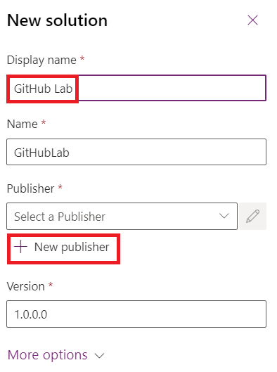

**实验 9：使用适用于 Microsoft Power Platform 的 GitHub Actions
自动部署解决方案**

## **任务 1：创建应用程序注册**

1.  使用  <https://portal.azure.com/#home> 和 Office 365 租户凭据登录到
    Microsoft Azure 门户。

2.  选择 **Get started**（开始）。

> 

3.  在“您计划如何使用 Azure” 页面上选择 “**Skip** ”。

> 

4.  在“现在，让我们带你了解 Azure”页面上选择 “**Skip**”。

> 

5.  在门户的**主**页上，在搜索框中键入 **Microsoft Entra
    ID**，然后从下面建议的服务列表中选择它。

> 

6.  在左侧导航窗格中，展开 **Manage** （管理），然后选择 **App
    registrations** （应用程序注册）。

> 

7.  在 **App registrations** 页面上选择 **+ New registration**。

> 

8.  在 **App registrations** （应用程序注册）
    页面上，输入应用程序的注册信息，如表中所述。

[TABLE]

> 

9.  选择 **Register** （注册） 以创建应用程序注册。.

> 

10. 此时将显示应用程序注册概述页面。通过在左侧导航窗格中选择**Certificates
    & secrets** 来添加客户端密钥。选择 **Client secrets** （客户端密钥）
    选项卡，然后选择 **+ New client secret**（新建客户端密钥）。

> 

11. 为您的客户端密钥添加给定**描述** – **My sample client
    secret**（我的示例客户端密钥）。选择密钥的**过期时间**，如
    **Recommended： 180 days （6 months）** （建议：180 天（6
    个月）），然后选择 **Add** （添加）。

> 

12. 将 **secret's value and ID**
    保存在记事本中，以便在客户端应用程序代码中使用。离开此页面后，此密钥值将不再显示。

> **重要提示：**在复制密钥值（而不是
> ID）之前，请勿离开客户端密钥页面，因为您将无法再次访问密钥值。
>
> 

## **任务 2：创建新的应用程序用户**

按照以下步骤创建应用程序用户并将其绑定到您的应用程序注册。

1.  使用您的 Office 365
    租户凭据 <https://admin.powerplatform.microsoft.com/> 登录到 Power
    Platform 管理中心。

2.  在左侧导航窗格中选择 **Environments**，然后在列表中选择 **Dev One**
    环境以显示环境信息。

> 

3.  选择页面右侧 **S2S 应用程序**下的 **See all** 链接。

> 

4.  选择 + **New app user**。

> 

5.  在 **Create a new app user** （创建新应用用户） 滑出时，选择 **+ Add
    an app**。

> 

6.  开始在搜索字段中键入应用程序注册的名称 -
    **Mytestingapp**，然后在结果列表中选择（选中）它。接下来，选择
    **Add**（添加）。

> 

7.  返回 **Create a new app user** 滑出，从下拉列表中选择目标 **Business
    unit**。选择 **Security roles** 前面的 **pencil
    icon**，为应用用户选择 **System Administrator**
    （也称为服务主体），然后选择 **Save** 。 

> 

8.  选择 **Create**。

> 

9.  您应该在显示的应用程序用户列表中看到新的应用程序用户。

> 

## **任务 3：构建模型驱动应用**

按照以下步骤构建模型驱动应用。

1.  在浏览器中，导航到 [https://make.powerapps.com](https://make.powerapps.com/) 并使用您的凭据登录。单击标题中的环境选择器下拉列表，然后选择您的开发环境。

> 

2.  单击左侧导航栏中的 **Solutions** 区域，然后单击 **New solution**
    按钮以创建新解决方案。

> 

3.  输入解决方案的 **Display name** （显示名称） 作为 **GitHub Lab，
    Name – GitHubLab**。在 Publisher 下选择 **+New publisher**。

> 

4.  对于此实验室，请输入 “**GitHub Lab**” 作为**显示名称**，输入
    “**GitHubLab**” 作为**名称**，输入 “**gitlab**”
    作为**前缀**，然后选择 **Save** and **Close （**保存并关闭）。

> 

5.  在新解决方案面板上，选择 **publisher – GitHub Lab**
    您刚刚创建的，然后单击 **Create** （创建）
    以在环境中创建新的非托管解决方案。

> 

6.  您的新解决方案将为空，您需要向其添加组件。在本实验中，我们将创建一个自定义表。单击顶部导航栏中的
    **+ New** 下拉列表，然后选择 **Table \> Set advanced properties**。

> 

7.  输入**显示名称 – Time Off Request**，将为您生成复数名称。单击
    **Save** 创建表。

> 

8.  创建表后，选择 Table from breadcrumb
    导航以返回到解决方案视图以添加另一个组件。

> 

9.  单击 **+ New** 下拉列表，然后单击 **App**，最后单击 **Model-driven
    app**。

> 

10. 输入应用程序名称 – **Time Off Requests**，然后单击 **Create** 按钮。

> 

11. 在应用程序设计器中，单击 **+ Add page**。

> 

12. 选择 **Dataverse table**。

> 

13. 选择 **Time Off Request**，选中 **Show in navigation** 复选框。选择
    **Add**。

> 

14. 单击 **Publish**，发布作完成后，单击 **Play**。

> 

15. 这将带您进入应用程序，以便您查看它的外观。您可以使用该应用程序并在满意时关闭选项卡。

> 

## **任务 4：创建 GitHub 帐户**

**注意：**如果您已有 GitHub 帐户，则可以跳过此任务并转到下一个任务。

1.  转到  [https://github.com](https://github.com/) 并单击 **Sign up**
    （注册） 或 **Start a free trial** （（如果您已有账户，请登录）。

> 

2.  输入您的**电子邮件 ID**，然后单击 **Continue** （继续）。

> 

3.  保留自动生成的密码或创建自己的密码，然后单击 **Continue** （继续）。

> 

4.  输入**用户名** – **Labtesting1**，然后单击 **Continue**
    （继续）。如果给定的用户名不可用，则输入不同的用户名。

> 

5.  选择 **Continue**（继续）。

> 

6.  在“验证您的帐号”页面上，选择 **Verify**。

> 

7.  完成验证过程并使用通过电子邮件 ID 收到的启动代码。

8.  在出现的 'Sign in to GitHub' 窗口中选择 **Sign in** （登录）。

> 

9.  选择 **Skip personalization** （跳过个性化）。

> 

## **任务 5：为服务主体身份验证创建新密钥**

1.  创建账户后，通过 **Select Create repository** （创建存储库）
    创建存储库。

> 
>
> 您可能会看到以下备用着陆屏幕：
>
> 

2.  创建新存储库并将其命名为 **'poweractionslab'**。确保选择 **Add a
    README file** （添加自述文件） 以启动存储库，然后选择 **Create
    repository** （创建存储库）。

> 

3.  导航到您的存储库，然后单击 **Settings**（设置）。

> 

4.  在左侧窗格中，展开 **Secrets and variables**（密钥和变量），然后单击
    **Actions**（作）。

> 

5.  向下滚动，然后选择 **New repository secret** （新建存储库密钥）。

> 

6.  在 Secrets （机密） 页面上，将机密命名为
    '**PowerPlatformSPN**'。使用在 Microsoft Entra
    中创建的应用程序注册中的客户端密码值（您已保存在记事本中），将其输入到
    **Secret** 字段中，然后选择 **Add
    secret**。在本实验的后面部分，用于定义 GitHub 工作流程的 YML
    文件中将引用客户端密钥。

> 

客户端密钥现在安全地存储为 GitHub 密钥。

## **任务 6：创建工作流以将解决方案文件导出并解压缩到新分支**

1.  单击上述水平调色板中的 **Actions**。

> 

2.  单击 **Configure** 在 **Simple workflow** 框下的 Recommended for
    this repository 部分。

> 

3.  这将启动一个新的 YAML 文件，其中包含一个基本工作流，以帮助您开始使用
    GitHub作。

> 

4.  删除预先创建的内容，粘贴 [export-and-branch-solution-with-spn-auth.yml](https://github.com/microsoft/powerplatform-actions-lab/blob/main/sample-workflows/export-and-branch-solution-with-spn-auth.yml) 文件中的内容。在
    VM 上的新选项卡中打开给定的链接。

> 

5.  将文件**重命名**为 **export-and-branch-solution.yml。**

> 

6.  在\<ENVIRONMENTURL\>第 28 行更新，其中包含要从中导出的开发环境的
    URL。

> 
>
> 要获取环境 URL，请转到 **Power Platform 管理中心**。从左侧导航中选择
> **Environments**，单击 **Dev One**，然后复制 环境 URL。
>
> 

7.  将 **Environment URL 粘贴**到 yml 文件中。确保添加 https://。您的
    URL 应采用给定格式 **-** https://orgfc5xxxfd.crm.dynamics.com

> 

8.  更新\<APPID\>和 \<TENANT ID\> 使用您的值。若要获取这两个值，请转到
    Azure 门户，然后选择 “**Home \> Microsoft Entra ID \> App** 注册”
    ，然后选择 “**All applications**” 选项卡，然后选择
    “**Mytestingapp**” 。

> 
>
> 

9.  将值粘贴到第 29 行和第 30 行。.

> 

10. 在代码的第 12 行，将默认值 ALMLab 更改为
    GitHubLab，在本例中为我们的解决方案名称。确保你没有留下任何空间，并按照给定的方式正确书写。如果您为解决方案指定了不同的名称，请在此处写下该名称。

> 

11. 现在，您可以提交更改了。选择 “**Commit changes**” ，然后在打开的
    “提交更改” 窗格中，选择 “**Commit changes**” 。

> 
>
> 恭喜，您刚刚使用以下作创建了您的第一个 GitHub 工作流程：

- **我是谁：**确保您可以成功连接到要从中导出的环境。

- **Export Solution：**从开发环境中导出解决方案文件。

- **解压缩解决方案：**从服务器导出的解决方案文件是包含合并配置文件的压缩
  （zip）
  文件。这些初始文件不适合源代码管理，因为它们的结构不便于源代码管理系统正确地对文件进行差分处理并捕获要提交到源代码管理的更改。您需要“解压缩”解决方案文件，使其适合于源代码控制存储和处理。

- **Branch Solution：**创建一个新分支来存储导出的解决方案。

## **任务 7：测试导出和解包工作流**

1.  接下来，要测试工作流是否运行，请从上面的水平调色板中选择 **Actions**
    ，然后选择左侧窗格上 **All workflows** 下列出的
    **export-and-branch-solution** 工作流。

> 

2.   选择 **Run workflow** （运行工作流程），然后再次选择 **Run
    workflow**
    （运行工作流程）。如果您的解决方案名称与“GitHubLab”不同，请更改此处的值，但保持其他值不变。

> 

3.  5-10 秒后，工作流将启动，您可以选择正在运行的工作流来监控进度。

> 
>
> 

4.  工作流程完成后，验证是否已创建一个新分支，并将解决方案解压缩到
    **solutions/GitHubLab** 文件夹。导航到 **Code** （代码） 选项卡。 

> 

5.  展开 **Branches** 下拉列表。

> 

6.  选择由作创建的分支 — **GitHubLab-xxxx-xxxx**。

> 

7.  验证是否已在新分支中创建 **solutions/GitHubLab** 文件夹h

> 

8.  要创建拉取请求以将更改合并到主分支中，请单击 “**Contribute** ”
    ，然后在浮出控件中单击 “打开拉取请求”。

> 

9.  在 Open a Pull request（打开拉取请求）屏幕上，保持标题不变，然后单击
    **Create pull request**（创建拉取请求）。

> 

10. 屏幕将更新，显示新创建的拉取请求。创建拉取请求后，将提供确认，表明我们的分支与主分支没有冲突。

> 

11. 此确认意味着更改可以自动合并到 main 分支中。单击 **Merge pull
    request**（合并拉取请求）。 

> 

12. 单击** Confirm merge**。

> 

13. （可选）单击 delete branch （删除分支） 以清理现已失效的分支。

> 

14. 单击 **Code** （代码）。

> 

15. 您将导航回默认 （main） 分支，并验证解决方案现在也在那里可用。

> 
