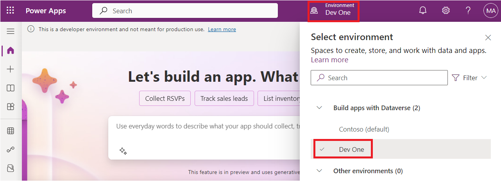
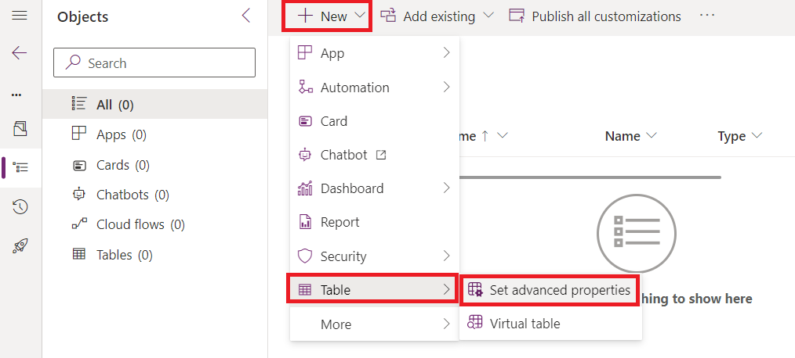
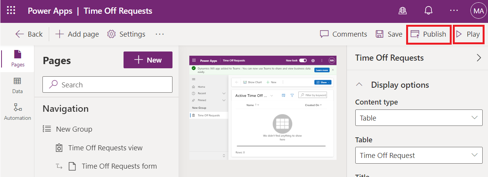

**ラボ９：GitHub Actions を使用して Microsoft Power Platform
のソリューション展開を自動化する**

## **タスク１：アプリ登録を作成する**

1.  <https://portal.azure.com/#home>にアクセスし、Office 365
    テナントの資格情報で Microsoft Azure portalにサインインします。

2.  **Get started**を選択します。

> 

3.  「How do you plan to use Azure」ページに**Skip**を選択します。

> 

4.  「Now, let’s show you around Azure」ページに**Skip**を選択します。

> 

5.  ポータルの**Home** ページで検索ボックスに「**Microsoft Entra
    ID**」と入力し、候補のサービス一覧から選択します。

> 

6.  左側のナビゲーションペインで**Manage**を展開し、**App
    registrations**を選択します。

> 

7.  **App registrations** ページで**+ New registration** を選択します。

> 

8.  **App
    registrations**で、表に記載されている通りにアプリケーションの登録情報を入力します。

[TABLE]

> 

9.   **Register**を選択してアプリケーション登録を作成します。

> 

10. app
    registrationの概要ページが表示されます。左側のナビゲーションペインで「**Certificates
    &
    secrets**」を選択して、クライアントシークレットを追加します。「**Client
    secrets**」タブを選択し、次に「**+New client
    secret**」を選択します。 

> 

11. 「**My sample client
    secret」**というクライアントシークレットを**description**に追加し、**expiration**は「**Recommended:
    180 days (6 months)**」を選択して**Add**をクリックします。

> 

12. client application codeで使用するために、**secret's value and
    ID**をメモ帳に保存してください。このsecret's
    valueは、このページを離れると二度と表示されません。

> **注意：**secret
> value（IDではなく）をコピーするまでページを移動しないでください。後で値にアクセスすることはできません。
>
> 

## **タスク２：新しいアプリ ユーザーを作成する** 

次の手順でアプリユーザーを作成し、app registrationに紐づけます。

1.  Office 365 テナントの資格情報でPower Platform
    admin　center <https://admin.powerplatform.microsoft.com/>
    にサインインします。

2.  左側のナビゲーションペインで**Environments**を選択し、**Dev
    One**環境を選択して環境詳細を表示します。

> 

3.  ページ右側の**S2S apps**の下にある**See all** リンクを選択します。

> 

4.  \+ **New app user**を選択します。

> 

5.  **Create a new app user**スライドアウトで**+ Add an
    app**を選択します。

> 

6.  app
    registrationの名前に「**Mytestingapp**」を検索フィールドに入力し、結果リスト内でそれを選択します。次に、**Add**を選択します。

> 

7.  **Create a new app
    user**スライドアウトに戻り、ドロップダウンから対象の**Business
    unit**を選択します。**Security roles**の前にある**pencil
    icon**を選択し、アプリユーザー（サービスプリンシパルとも呼ばれる）に対して**System
    Administrator**を選択し、**Save**を選択します。 

> 

8.  **Create**を選択します。

> 

9.  表示されたapplication usersのリストに、新しいapplication
    userが表示されることを確認します。

> 

## **タスク３：モデル駆動型アプリを作成する** 

次の手順でモデル駆動型アプリを作成します。

1.  ブラウザでは、[https://make.powerapps.com](https://make.powerapps.com/) にアクセスし、資格情報でサインインします。画面上部の環境セレクターをクリックし、開発用環境を選択します。

> 

2.  左側のナビゲーションペインで**Solutions** をクリックし、新しいソリューションを作成には**New
    solution**をクリックします。

> 

3.  ソリューションの**Display name** に**GitHub
    Lab**を入力し、**Name**に –
    **GitHubLab**と入力します。[パブリッシャー](https://context.reverso.net/translation/japanese-english/%E3%83%91%E3%83%96%E3%83%AA%E3%83%83%E3%82%B7%E3%83%A3%E3%83%BC)
    の下に**+New publisher** を選択します。

> 

4.  このラボの目的のために、**display name**に「**GitHub
    Lab**」、**name**に「**GitHubLab**」、**prefix**に「**gitlab**」を入力し、**Save**と**Close**を選択します。

> 

5.  新しいソリューションパネルで、作成した**publisher**「**GitHub
    Lab**」を選択し、**Create**をクリックして新しいアンマネージドソリューションを環境に作成します。 

> 

6.  自分の新しいソリューションは空であり、コンポーネントを追加する必要があります。このラボではカスタムテーブルを作成します。上部のナビゲーションから
    **+ New**ドロップダウンをクリックし、**Table \> Set　advanced
    properties** を設定を選択します。

> 

7.  **display name** に**「Time Off
    Request」**を入力し、複数形の名前が生成されます。**Save**をクリックしてテーブルを作成します。

> 

8.  テーブル作成後、パンくずリストからテーブルをクリックして、他のコンポーネントを追加するためソリューションビューに戻ります。

> 

9.  ドロップダウンから**+ New** を選択し、**App**と**Model-driven
    app**にクリックします。

> 

10. アプリ名に**Time Off
    Requests**と入力し、**Create**をクリックします。

> 

11. アプリ デザイナーで**Add page**をクリックします。

> 

12. **Dataverse table**を選択します。

> 

13. **Time Off Request**を選択して、**Show in
    navigation**にチェックを入れ、**Add**をクリックします。

> 

14. **Publish**をクリックし、publish
    アクションが完了後、**Play**にクリックします。

> 

15. これによりアプリケーションに移動し、どのように見えるかを確認できます。アプリケーションを使用し、満足したらタブを閉じることができます。

> 

## **タスク4：GitHubアカウントを作成する**

**注意：**
すでにGitHubアカウントをお持ちの場合は、このタスクをスキップし、次のタスクに進んでください。

1.   [https://github.com](https://github.com/)にアクセスし、**Sign
    up** または**Start a free
    trial** (既存アカウントをお持ちの場合はサインインをクリック)
    をクリックします。

> 

2.  **email id**を入力し、**Continue**をクリックします。

> 

3.  自動生成されたパスワードをそのまま使うか、自分のパスワードを作成して、**Continue**をクリックします。

> 

4.  **Username**に「**Labtesting1**」と入力し、**Continue**をクリックします。usernameは既に使用されている場合は、別のusernameを入力してください。

> 

5.  **Continue**にクリックします。

> 

6.  「Verify your account」ページで**Verify**を選択します。

> 

7.  検証プロセスを完了し、メールアドレスで受け取った発射コードを使用します。

8.  表示されたウィンドウ「Sign in to GitHub」画面で**Sign
    in**を選択します。.

> 

9.  **Skip personalization**にクリックします。

> 

## **タスク５：サービスプリンシパル認証用のシークレットを作成する**

1.  アカウント作成後、**Create
    repository**にクリックしてリポジトリを作成します。

> 
>
> 次の代替ランディング画面が表示される場合があります：
>
> 

2.  自分で新しいリポジトリを作成して、名前を「**poweractionslab**」とし、リポジトリを開始するために**Add
    a README file**を選択し、**Create repository**を選択します。

> 

3.  作成したリポジトリに移動し、**Settings**をクリックします。

> 

4.  左側のペインから**Secrets and
    variables**を展開し、**Actions**をクリックします。

> 

5.  下にスクロールして**New repository secret**を選択します。

> 

6.  シークレットページでは,
    シークレットのnameに「**PowerPlatformSPN**」。Microsoft
    Entraで作成したアプリケーション登録からのクライアントシークレット値（ノートパッドに保存されている）を使用して、**Secret** フィールドに入力し、**Add
    secret**にクリックします。クライアントシークレットは、このラボの後半でGitHubワークフローを定義するために使用されるYMLファイルに参照されます。

> 

これでクライアントシークレットが安全にGitHubシークレットとして保存されます。

## **タスク6：ソリューションファイルを新しいブランチにエクスポートして展開するワークフローを作成する**

1.  上部の水平パレットから **Actions**をクリックします。.

> 

2.  ボックスにあるこのリポジトリセクションに提案された**Simple
    workflow**ボックスにある**Configure**をクリックします。

> 

3.  これにより、GitHubアクションを使い始めるための基本的なワークフローを持つ新しいYAMLファイルが始まります。

> 

4.  事前に作成されたコンテンツを削除し、[export-and-branch-solution-with-spn-auth.yml](https://github.com/microsoft/powerplatform-actions-lab/blob/main/sample-workflows/export-and-branch-solution-with-spn-auth.yml) ファイルからコンテンツを貼り付けます。指定されたリンクをVMの新しいタブで開きます。

> 

5.  ファイルを**Rename**して「**export-and-branch-solution.yml**」を付けます。

> 

6.  エクスポートしたい開発環境のURLで28行目の\<ENVIRONMENTURL\>を更新してください。

> 
>
> 環境 URLを取得するには、**Power Platform Admin
> center**にアクセスし、左ナビゲーションから**Environments**を選択して**Dev
> One**をクリックして、Environment URLをコピーします。
>
> 

7.  yml file に**Environment URL**を**Paste** にします。https://
    から始まる形式を注意し、例えば「<https://orgfc5xxxfd.crm.dynamics.com>」であることを確認してください。

> 

8.  \<APPID\> と\<TENANT
    ID\> を自分の値に置き換えます。これらの値は、Azure
    ポータルにアクセスし、**Home** \> **Microsoft Entra ID** \> **App**
    registrationを選択して、すべての**All applications**タブで
    **Mytestingapp**を選択して取得します。

> 
>
> 

9.  取得した値を 29行目と30行目に貼り付けます。

> 

10. コードの12行目で、デフォルトの値ALMLabを今回のソリューション名のGitHubLabに変更します。スペースを入れずに正確に記述してください。別のソリューション名を使用している場合は、そちらを記述します。

> 

11. 変更の準備ができたら、**Commit changes**を選択し、表示されたCommit
    changes paneで**Commit changes**を選択します。

> 
>
> おめでとうございます、次のアクションを使用して最初のGitHubワークフローを作成しました：

- **Who Am I**: エクスポート元の環境に正常に接続できることを保証します。

- **Export Solution**:
  開発環境からソリューションファイルをエクスポートします。

- **Unpack Solution**:
  サーバーからエクスポートされるソリューションファイルは、統合された設定ファイルを含む圧縮（zip）ファイルです。これらの初期ファイルは、ソースコード管理に適していません。なぜなら、ソースコード管理システムがファイルの差分を適切に把握し、ソース管理にコミットしたい変更をキャプチャできるように構造化されていないのです。ソリューションファイルを「unpack」する必要がありますので、ソース管理のための保存と処理に適するようにします。

- **Branch Solution**:
  エクスポートされたソリューションを保存するための新しいブランチを作成します。

## **タスク７：エクスポートおよびアンパックワークフローのテスト**

1.  次に、ワークフローが実行されるかをテストするために、上部の水平パレットから**Actions**を選択し、左側のペインの**All
    workflows**の下に表示されている**export-and-branch-solution**ワークフローを選択します。

> 

2.  **Run workflow**を選択し、再度**Run
    workflow**をクリックします。ソリューション名が「GitHubLab」と異なる場合は、ここで値を変更しますが、他の値はそのままにします。  
    

3.  約5〜10秒後にワークフローが開始され、進行状況を確認するために実行中のワークフローを選択できます。

> 
>
> 

4.  ワークフローが完了したら、ソリューションが
    **solutions/GitHubLab**フォルダーに展開されて新しいブランチが作成されたかを確認します。***Code***タブに移動します。 

> 

5.  **Branches**ドロップダウンを展開します。

> 

6.  アクションによって作成された**GitHubLab-xxxx-xxxx**という名前のブランチを選択します。

> 

7.  新しいブランチに**solutions/GitHubLab**フォルダーが作成されていることを確認します。

> 

8.  変更をメインブランチにマージするために Pull
    requestを作成するには、**Contribute**をクリックし、表示されるフライアウトで** ***Open
    Pull request*をクリックします。

> 

9.  *Open a Pull request* 画面では、タイトルをそのままにして**Create
    pull request**をクリックします。

> 

10. 画面が更新され、新たに作成されたPull requestが表示されます。Pull
    requestが作成されると、対象のブランチにメインブランチとのコンフリクトがないことが確認されます。

> 

11. この確認は、変更が自動的にメインブランチにマージできることを意味します。プルリクエストをマージをクリックします。**Merge
    pull request**にクリックします。

> 

12. **Confirm merge**を選択します。

> 

13. オプションとして、delete
    branchをクリックして、不要になったブランチをクリーンアップします。

> 

14. **Code**にクリックします。

> 

15. デフォルト（メイン）ブランチに戻され、そこで解決策が利用可能であることを確認します。

> 
