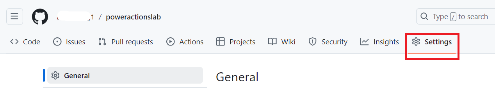
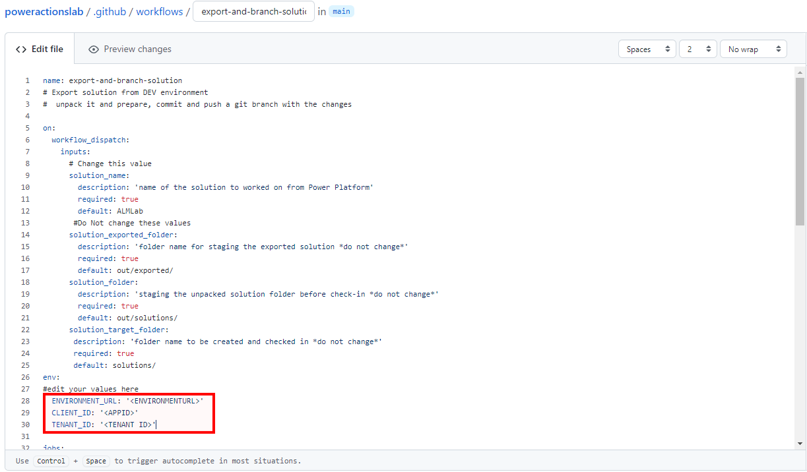
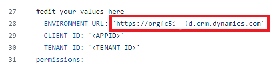
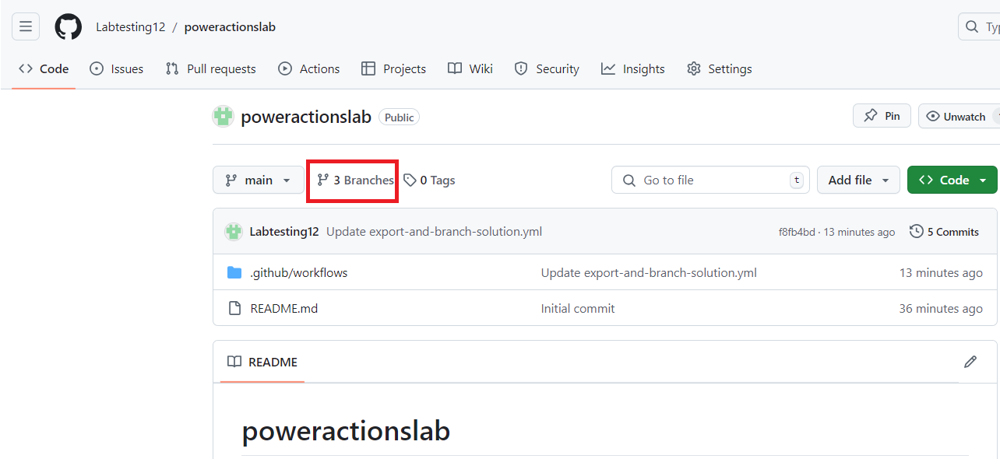
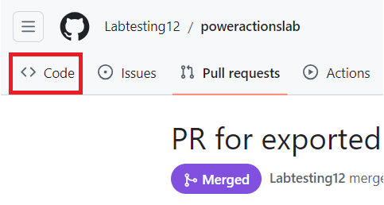

**Atelier 9 : Automatiser le déploiement de solutions à l'aide de GitHub
Actions pour Microsoft Power Platform**

## **Tâche 1 : Créer l'inscription de l'application**

1.  Connectez-vous au portail Microsoft Azure à l'aide [de
    https://portal.azure.com/#home](https://portal.azure.com/#home) avec
    vos informations d'identification de Office 365 tenant.

2.  Sélectionnez **Get started**.

> 

3.  Sélectionnez **Skip** sur la page ’Comment prévoyez-vous d'utiliser
    Azure’.

> 

4.  Sélectionnez **Skip** sur la page ‘Maintenant, nous allons vous
    faire visiter Azure ‘.

> 

5.  Sur **Home** page du portail, tapez **Microsoft Entra ID** dans la
    zone de recherche et sélectionnez-le dans la liste de services
    suggérée ci-dessous.

> 

6.  Dans le volet de navigation de gauche, développez **Manage** , puis
    sélectionnez **App registrations**.

> 

7.  Sélectionnez **+ New registration**  sur la page **App
    registrations** .

> 

8.  Sur la page **App registrations** , entrez les informations
    d'inscription de votre application comme décrit dans le tableau.

[TABLE]

> 

9.  Sélectionnez **Register**  pour créer l'inscription de
    l'application.

> 

10. La page de présentation de l'inscription de l'application s'affiche.
    Ajoutez une clé secrète client en sélectionnant **Certificates &
    secrets**  dans le volet de navigation de gauche. Sélectionnez
    l'onglet **Client secrets**, puis sélectionnez **+New client
    secret**.

> 

11. Ajoutez une **description** donnée pour votre clé secrète client –
    **My sample client secret**. Sélectionnez une date **d'expiration**
    pour la clé secrète comme **Recommended: 180 days (6 months),** puis
    sélectionnez **Add**.

> 

12. Enregistrez la **secret's value and ID**  dans le bloc-notes pour
    l'utiliser dans le code de votre application cliente. Cette valeur
    secrète ne s'affiche plus jamais une fois que vous avez quitté cette
    page.

> **Important :** Ne quittez pas la page de clé secrète du client tant
> que vous n'avez pas copié la valeur de secret (et non l'ID), car vous
> n'aurez plus accès à la valeur de secret.
>
> 

## **Tâche 2 : Créer un nouvel utilisateur de l'application**

Suivez ces étapes pour créer un utilisateur d'application et le lier à
votre inscription d'application.

1.  Connectez-vous au centre d'administration [Power Platform admin
    center 
    https://admin.powerplatform.microsoft.com/](%20Power%20Platform%20admin%20center %20https://admin.powerplatform.microsoft.com/)
    l'aide de vos informations d'identification de Office 365 tenant.

2.  Sélectionnez **Environnements** dans le volet de navigation de
    gauche, puis sélectionnez l' environnement **Dev One** dans la liste
    pour afficher les informations d'environnement.

> 

3.  Sélectionnez le lien **See all** sous **S2S apps** sur le côté droit
    de la page.

> 

4.  Sélectionnez + **New app user**.

> 

5.  Dans le menu déroulant **Create a new app user** , sélectionnez **+
    Add an app**.

> 

6.  Commencez à taper le nom de votre inscription d'application -
    **Mytestingapp** dans le champ de recherche, puis sélectionnez-le
    (cochez-le) dans la liste des résultats. Ensuite, sélectionnez
    **Add**.

> 

7.  De retour dans le menu déroulant **Create a new app user** ,
    sélectionnez le **Business unit**  cible dans la liste déroulante.
    Sélectionnez **pencil icon** devant les **Security roles**,,
    sélectionnez **System Administrator** pour l'utilisateur de
    l'application (également appelé principe de service) et sélectionnez
    **Save.**

> 

8.  Sélectionnez **Create**.

> 

9.  Vous devez voir votre nouvel utilisateur d'application dans la liste
    affichée des utilisateurs de l'application.

> 

## **Tâche 3 : Créer une application pilotée par modèle**

Suivez les étapes ci-dessous pour créer une application pilotée par
modèle.

1.  Dans votre navigateur, accédez à
    [https://make.powerapps.com](https://make.powerapps.com/) et
    connectez-vous avec vos informations d'identification. Cliquez sur
    la liste déroulante du sélecteur d'environnement dans l'en-tête et
    sélectionnez votre environnement de développement.

> 

2.  Cliquez sur la zone **Solutions** dans le volet de navigation de
    gauche, puis cliquez sur le bouton **New solution** pour créer une
    solution.

> 

3.  Entrez le **Display name** de la solution **GitHub Lab**, **Name**–
    **GitHubLab**. Sélectionnez **+New publisher** sous Éditeur.

> 

4.  Pour les besoins de cet atelier, entrez **‘ GitHub Lab ‘**pour le
    **Display name**, **‘ GitHubLab ‘** pour **Name** et **‘gitlab ‘**
    comme **prefix**, puis choisissez **Save** et **Close**.

> 

5.  Dans le panneau Nouvelle solution, sélectionnez le **publisher –
    GitHub Lab** que vous venez de créer et cliquez sur **Créer** pour
    créer une solution non gérée dans l'environnement.

> 

6.  Votre nouvelle solution sera vide et vous devrez y ajouter des
    composants. Dans cet atelier, nous allons créer une table
    personnalisée. Cliquez sur la liste déroulante **+ New**  dans la
    barre de navigation supérieure et sélectionnez **Table \> Set
    advanced properties.**

> 

7.  Entrez un **display name – Time Off Request**, le nom au pluriel
    sera généré pour vous. Cliquez sur **Save** pour créer le tableau.

> 

8.  Une fois votre table créée, sélectionnez la table dans la navigation
    du fil d'Ariane pour revenir à la vue de la solution et ajouter un
    autre composant.

> 

9.  Cliquez sur la liste déroulante + **New**, puis sur **App**, puis
    sélectionnez sur **Model-driven app**..

> 

10. Entrez un nom d'application – **Time Off Requests**, puis cliquez
    sur le bouton **Create**.

> 

11. Dans le concepteur d'applications, cliquez sur **+ Add page**.

> 

12. Sélectionnez **Dataverse Table**.

> 

13. Sélectionnez **Time Off Request**, cochez la case **Show in
    navigation**. Sélectionnez **Add**.

> 

14. Cliquez sur **Publish**, une fois l'action de publication terminée,
    cliquez sur **Play**.

> 

15. Cela vous amènera à l'application afin que vous puissiez voir à quoi
    elle ressemble. Vous pouvez utiliser l'application et fermer
    l'onglet lorsque vous êtes satisfait.

> 

## **Tâche 4 : Créer un compte GitHub**

**Remarque :** Si vous avez déjà un compte GitHub, vous pouvez ignorer
cette tâche et passer à la tâche suivante.

1.  Allez dans [https://github.com](https://github.com/) et cliquez sur
    **Sign up**  ou **Start a free trial**  (ou connectez-vous si vous
    avez un compte existant).

> 

2.  Entrez votre **email id** , puis cliquez sur **Continue**.

> 

3.  Conservez le mot de passe généré automatiquement ou créez votre
    propre mot de passe, puis cliquez sur **Continue**.

> 

4.  Entrez le nom **Username – Labtesting1**, puis cliquez sur
    **Continue**. Si le nom d'utilisateur donné n'est pas disponible,
    entrez un autre nom d'utilisateur.

> 

5.  Sélectionnez **Continue**.

> 

6.  Sur la page ‘Vérifier votre compte ‘, sélectionnez **Verify**.

> 

7.  Terminez le processus de vérification et utilisez le code de
    lancement qui est reçu sur votre adresse e-mail.

8.  Sélectionnez **Sign in** dans la fenêtre ‘ Se connecter à GitHub ‘
    qui s'affiche.

> 

9.  Sélectionnez **Skip personalization**.

> 

## **Tâche 5 : Création d'un nouveau code secret pour l'authentification du principal de service**

1.  Après avoir créé votre compte, créez un référentiel en sélectionnant
    **Create repository**.

> 
>
> L'écran d'accueil alternatif suivant peut s'afficher :
>
> 

2.  Créez votre nouveau dépôt et nommez-le ‘ **poweractionslab** ‘.
    Veillez à sélectionner **Add a README file** pour lancer le dépôt,
    puis choisissez **Create repository**..

> 

3.  Accédez à votre référentiel et cliquez sur **Settings**.

> 

4.  Dans le volet latéral gauche, développez **Secrets and variables**,
    puis cliquez sur **Actions**.

> 

5.  Faites défiler l'écran vers le bas, puis sélectionnez **New
    repository secret**.

> 

6.  Sur la page Secrets, nommez le secret '**PowerPlatformSPN**'.
    Utilisez la valeur de clé secrète client de l'inscription de
    l'application créée dans Microsoft Entra (que vous avez enregistrée
    dans le bloc-notes) et entrez-la dans le champ **Secret**, puis
    sélectionnez **Add secret**. La clé secrète client sera référencée
    dans les fichiers YML utilisés pour définir les flux de travail
    GitHub plus loin dans cet atelier.

> 

La clé secrète client est désormais stockée en toute sécurité en tant
que clé secrète GitHub.

## **Tâche 6 : Créer un workflow pour exporter et décompresser le fichier de solution dans une nouvelle branche**

1.  Cliquez sur **Actions** dans la palette horizontale ci-dessus.

> 

2.  Cliquez sur **Configure** dans la zone **Simple workflow**  sous la
    section suggérée pour ce référentiel.

> 

3.  Cela démarrera un nouveau fichier YAML avec un flux de travail de
    base pour vous aider à démarrer avec GitHub actions.

> 

4.  Supprimez le contenu pré-créé, collez-le à partir du fichier
    [export-and-branch-solution-with-spn-auth.yml](https://github.com/microsoft/powerplatform-actions-lab/blob/main/sample-workflows/export-and-branch-solution-with-spn-auth.yml).
    Ouvrez le lien indiqué dans le nouvel onglet de la machine
    virtuelle.

> 

5.  **Rename** le fichier en **export-and-branch-solution.yml**.

> 

6.  Mettez à jour \<ENVIRONMENTURL\> en ligne n° 28 avec l'URL de
    l'environnement de développement à partir duquel vous souhaitez
    exporter.

> 
>
> Pour obtenir l'URL de l'environnement, accédez au **Power Platform
> Admin center**. Sélectionnez **Environments** dans le volet de
> navigation de gauche, cliquez sur **Dev One,** puis copiez l'URL de
> l'environnement.
>
> 

7.  **Paste** de **Environment URL** dans le fichier yml. Assurez-vous
    d'ajouter https://. Your URL should be in the given format -
    https://orgfc5xxxfd.crm.dynamics.com

> 

8.  Mettez à jour \<APPID\> et \<TENANT ID\> avec vos valeurs. Pour
    obtenir ces deux valeurs, accédez au portail Azure, puis
    sélectionnez **Home** \> **Microsoft Entra ID** \> **App** puis
    sélectionnez l'onglet **All applications**, puis sélectionnez
    **Mytestingapp**.

> 
>
> 

9.  Collez les valeurs sur les lignes n° 29 et 30.

> 

10. Sur la ligne n° 12 du code, remplacez la valeur par défaut ALMLab
    par GitHubLab qui est le nom de notre solution dans ce cas.
    Assurez-vous de ne pas laisser d'espace et d'écrire correctement
    comme indiqué. Si vous avez donné un nom différent à votre solution,
    écrivez-le ici.

> 

11. Vous êtes maintenant prêt à valider vos modifications. Sélectionnez
    **Commit changes**, puis dans le volet Valider les modifications qui
    s'ouvre, sélectionnez **Commit changes**.

> 
>
> Félicitations, vous venez de créer votre premier workflow GitHub à
> l'aide des actions suivantes :

- **Who Am I** : Garantit que vous pouvez vous connecter à
  l'environnement à partir duquel vous exportez.

- **Export solution** : exporte le fichier de solution à partir de votre
  environnement de développement.

- **Unpack Solution**: : le fichier solution exporté à partir du serveur
  est un fichier compressé (zip) avec des fichiers de configuration
  consolidés. Ces fichiers initiaux ne conviennent pas à la gestion du
  code source, car ils ne sont pas structurés de manière à ce que les
  systèmes de gestion du code source puissent correctement différencier
  les fichiers et capturer les modifications que vous souhaitez valider
  dans le contrôle de code source. Vous devez ‘unpack' les fichiers de
  solution pour les rendre adaptés au contrôle de source, au stockage et
  au traitement.

- **Solution de branche** : crée une nouvelle branche pour stocker la
  solution exportée.

## **Tâche 7 : Tester le workflow d'exportation et de décompression**

1.  Ensuite, pour vérifier que le flux de travail s'exécute,
    sélectionnez **Actions** dans la palette horizontale ci-dessus,
    sélectionnez **export-and-branch-solution** workflow répertorié sous
    **All workflows** le volet latéral gauche.

> 

2.  Sélectionnez **Run workflow**, puis à nouveau Exécuter le **Run
    workflow**. Si vous avez un nom de solution différent de
    ‘GitHubLab’, modifiez la valeur ici, mais laissez les autres valeurs
    telles quelles.

> 

3.  Au bout de 5 à 10 secondes, le flux de travail démarre et vous
    pouvez sélectionner le flux de travail en cours d'exécution pour
    surveiller la progression.

> 
>
> 

4.  Une fois le flux de travail terminé, vérifiez qu'une nouvelle
    branche a été créée avec la solution décompressée dans le
    **solutions/GitHubLab**. Accédez à l' onglet ***Code***.

> 

5.  Développez la liste déroulante **Branches.**

> 

6.  Sélectionnez la branche – **GitHubLab-xxxx-xxxx** qui a été créée
    par l'action.

> 

7.  Vérifiez que le dossier **solutions/GitHubLab** a été créé dans la
    nouvelle branche

> 

8.  Pour créer une demande de tirage afin de fusionner les modifications
    dans la branche principale, cliquez sur **Contribute,** puis dans le
    menu volant, cliquez sur Ouvrir la *demande de tirage*.

> 

9.  Sur l' écran *Ouvrir une demande de tirage*, conservez le titre tel
    quel, puis cliquez sur **Create pull request*.***

> 

10. L'écran se met à jour et affiche la demande de tirage nouvellement
    créée. Au fur et à mesure de la création de la demande de tirage,
    une confirmation sera fournie montrant que notre branche n'a aucun
    conflit avec la branche principale.

> 

11. Cette confirmation signifie que les modifications peuvent être
    fusionnées automatiquement dans la branche principale. Cliquez sur
    **Merge pull request .**

> 

12. Cliquez sur **Confirm merge**.

> 

13. Si vous le souhaitez, cliquez sur Supprimer la branche pour nettoyer
    la branche désormais défunte.

> 

14. Cliquez sur **Code**.

> 

15. Vous êtes redirigé vers la branche par défaut (principale) et
    vérifiez que la solution est maintenant disponible là également.

> 
